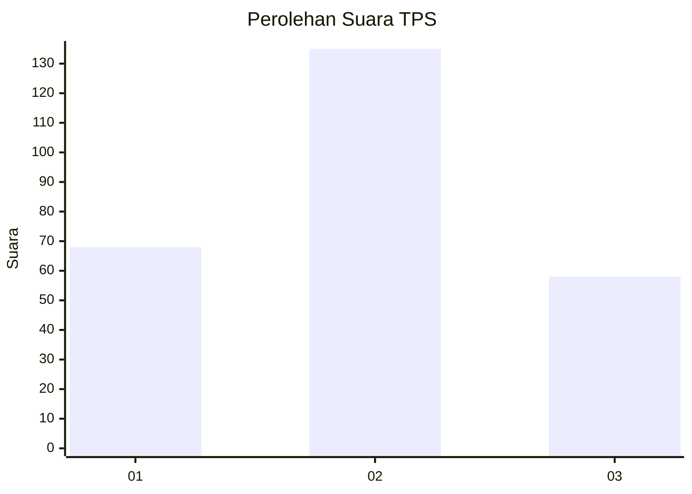
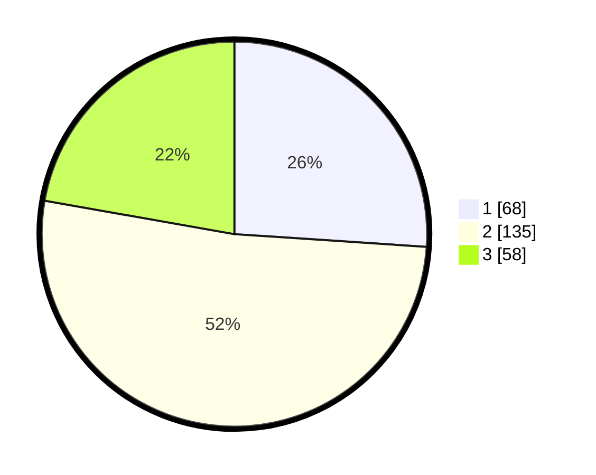

# Hasil

## Grafik

## Tabel

| No. | Nama Paslon    | Suara | Suara (raw) | Persentase |
|:--- |:-------------- | -----:| -----------:| ----------:|
| 1   | ANIES MUHAIMIN | 68    | [68][p-1]   | 26,05      |
| 2   | PRABOWO GIBRAN | 135   | [135][p-2]  | 51,72      |
| 3   | GANJAR MAHFUD  | 58    | [58][p-3]   | 22,22      |

[p-1]: https://github.com/gigit-pemilu/pemilu-2024-33-jawa-tengah/blob/main/pilpres/hitung-suara/sub/33-jawa-tengah/sub/25-batang/sub/11-batang/sub/1015-kauman/sub/046-tps/sub/paslon-1.txt
[p-2]: https://github.com/gigit-pemilu/pemilu-2024-33-jawa-tengah/blob/main/pilpres/hitung-suara/sub/33-jawa-tengah/sub/25-batang/sub/11-batang/sub/1015-kauman/sub/046-tps/sub/paslon-2.txt
[p-3]: https://github.com/gigit-pemilu/pemilu-2024-33-jawa-tengah/blob/main/pilpres/hitung-suara/sub/33-jawa-tengah/sub/25-batang/sub/11-batang/sub/1015-kauman/sub/046-tps/sub/paslon-3.txt

## Foto C Plano

https://sirekap-obj-formc.kpu.go.id/7625/pemilu/ppwp/33/25/11/10/15/3325111015046-20240214-222047--e3239a79-5ffd-4c18-bdf3-3ba910ce6e5a.jpg

https://sirekap-obj-formc.kpu.go.id/7625/pemilu/ppwp/33/25/11/10/15/3325111015046-20240214-223511--a8905b37-b863-428b-94b2-8cf5fa0f7d22.jpg

https://sirekap-obj-formc.kpu.go.id/7625/pemilu/ppwp/33/25/11/10/15/3325111015046-20240214-223423--24f9111e-2b94-4894-bed9-cbd8529eb447.jpg

## Metadata

| Key        | Value               |
| ---------- | ------------------- |
| Time Stamp | 2024-02-15 21:01:18 |

