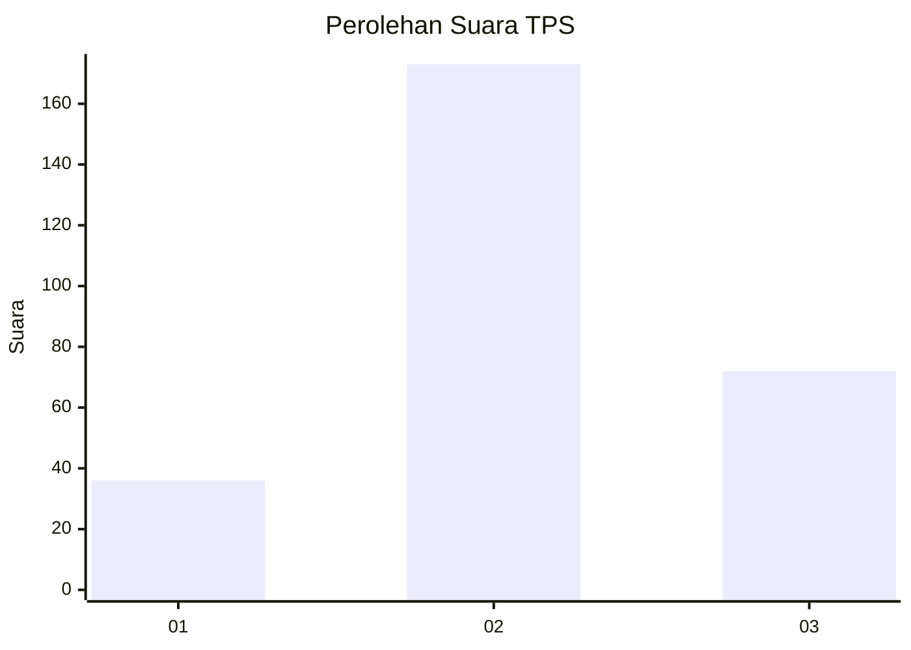
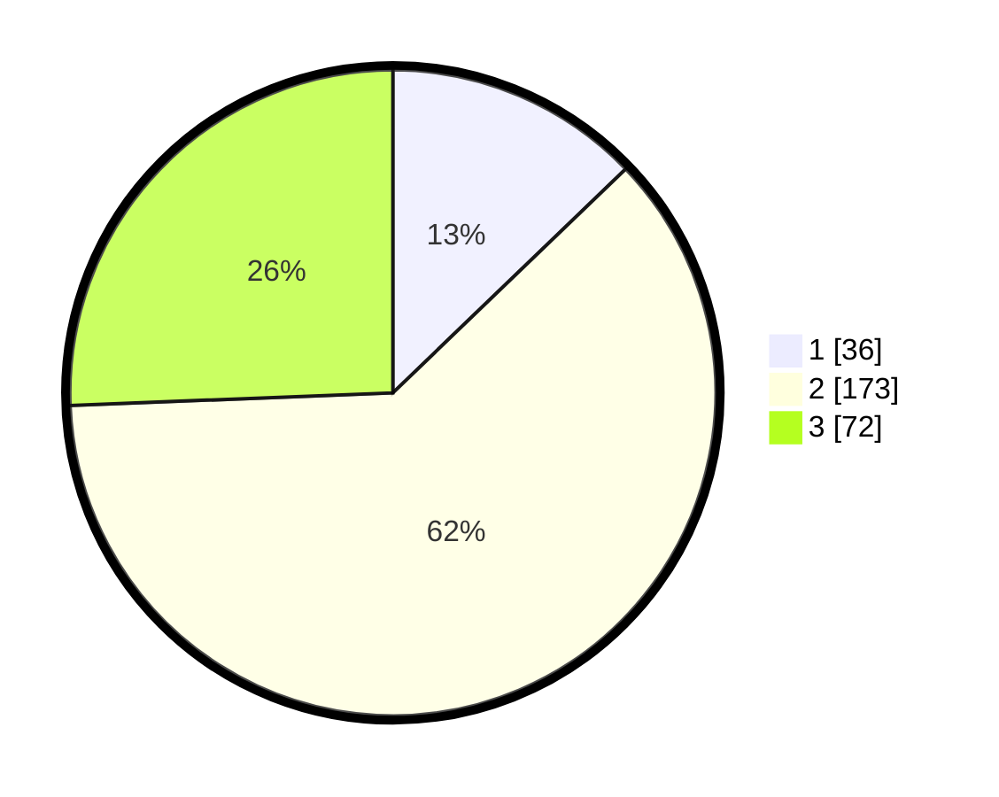

# Hasil

## Grafik

## Tabel

| No. | Nama Paslon    | Suara | Suara (raw) | Persentase |
|:--- |:-------------- | -----:| -----------:| ----------:|
| 1   | ANIES MUHAIMIN | 36    | [36][p-1]   | 12,81      |
| 2   | PRABOWO GIBRAN | 173   | [173][p-2]  | 61,57      |
| 3   | GANJAR MAHFUD  | 72    | [72][p-3]   | 25,62      |

[p-1]: https://github.com/gigit-pemilu/pemilu-2024-33-jawa-tengah/blob/main/pilpres/hitung-suara/sub/33-jawa-tengah/sub/25-batang/sub/11-batang/sub/1020-proyonanggan-selatan/sub/001-tps/sub/paslon-1.txt
[p-2]: https://github.com/gigit-pemilu/pemilu-2024-33-jawa-tengah/blob/main/pilpres/hitung-suara/sub/33-jawa-tengah/sub/25-batang/sub/11-batang/sub/1020-proyonanggan-selatan/sub/001-tps/sub/paslon-2.txt
[p-3]: https://github.com/gigit-pemilu/pemilu-2024-33-jawa-tengah/blob/main/pilpres/hitung-suara/sub/33-jawa-tengah/sub/25-batang/sub/11-batang/sub/1020-proyonanggan-selatan/sub/001-tps/sub/paslon-3.txt

## Foto C Plano

https://sirekap-obj-formc.kpu.go.id/2012/pemilu/ppwp/33/25/11/10/20/3325111020001-20240214-215324--1ff69524-1389-442d-8afb-dacd9914a7c9.jpg

https://sirekap-obj-formc.kpu.go.id/2012/pemilu/ppwp/33/25/11/10/20/3325111020001-20240214-215523--12f521aa-c09a-4f5d-8e23-d1c2edee111d.jpg

https://sirekap-obj-formc.kpu.go.id/2012/pemilu/ppwp/33/25/11/10/20/3325111020001-20240214-215720--e6e697be-60c8-4b29-92d0-b5c0c802b631.jpg

## Metadata

| Key        | Value               |
| ---------- | ------------------- |
| Time Stamp | 2024-02-15 23:29:50 |

