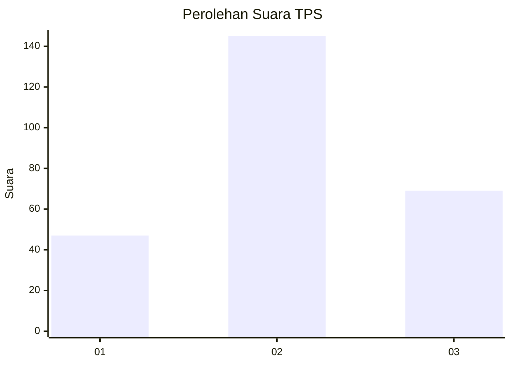
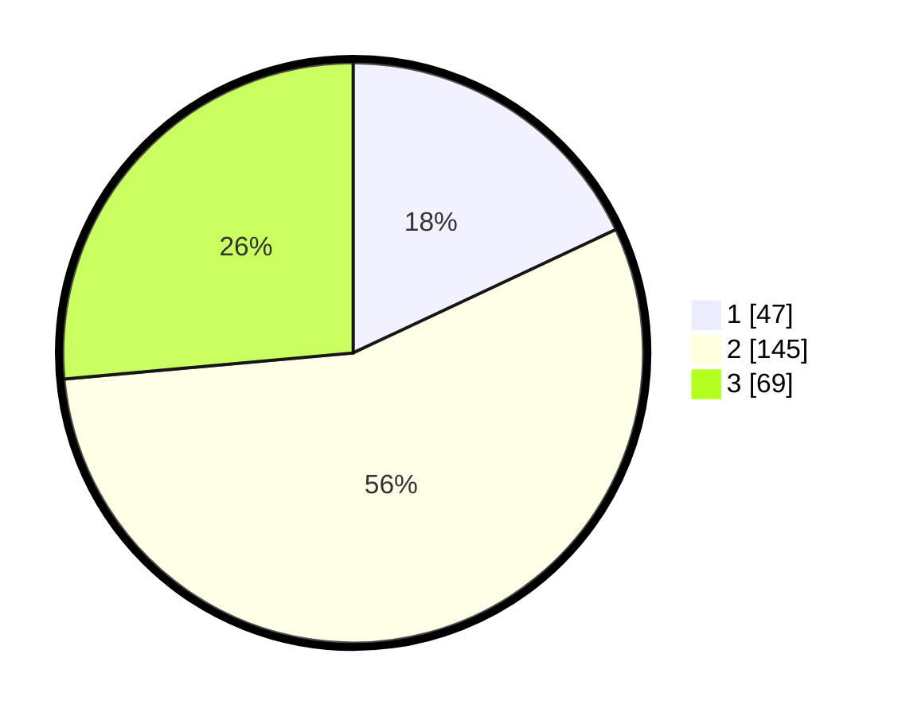

# Hasil

## Grafik

## Tabel

| No. | Nama Paslon    | Suara | Suara (raw) | Persentase |
|:--- |:-------------- | -----:| -----------:| ----------:|
| 1   | ANIES MUHAIMIN | 47    | [47][p-1]   | 18,01      |
| 2   | PRABOWO GIBRAN | 145   | [145][p-2]  | 55,56      |
| 3   | GANJAR MAHFUD  | 69    | [69][p-3]   | 26,44      |

[p-1]: https://github.com/gigit-pemilu/pemilu-2024-33-jawa-tengah/blob/main/pilpres/hitung-suara/sub/33-jawa-tengah/sub/25-batang/sub/11-batang/sub/1020-proyonanggan-selatan/sub/003-tps/sub/paslon-1.txt
[p-2]: https://github.com/gigit-pemilu/pemilu-2024-33-jawa-tengah/blob/main/pilpres/hitung-suara/sub/33-jawa-tengah/sub/25-batang/sub/11-batang/sub/1020-proyonanggan-selatan/sub/003-tps/sub/paslon-2.txt
[p-3]: https://github.com/gigit-pemilu/pemilu-2024-33-jawa-tengah/blob/main/pilpres/hitung-suara/sub/33-jawa-tengah/sub/25-batang/sub/11-batang/sub/1020-proyonanggan-selatan/sub/003-tps/sub/paslon-3.txt

## Foto C Plano

https://sirekap-obj-formc.kpu.go.id/d915/pemilu/ppwp/33/25/11/10/20/3325111020003-20240214-194201--58b4c3fd-17f1-4180-9d9a-97f7d07d5100.jpg

https://sirekap-obj-formc.kpu.go.id/d915/pemilu/ppwp/33/25/11/10/20/3325111020003-20240214-200442--ee1fd296-f71f-48e9-a8a7-b58a7b635655.jpg

https://sirekap-obj-formc.kpu.go.id/d915/pemilu/ppwp/33/25/11/10/20/3325111020003-20240214-200706--22ac4208-d7c2-4f5f-87dc-4d420d29c889.jpg

## Metadata

| Key        | Value               |
| ---------- | ------------------- |
| Time Stamp | 2024-02-16 01:00:27 |

