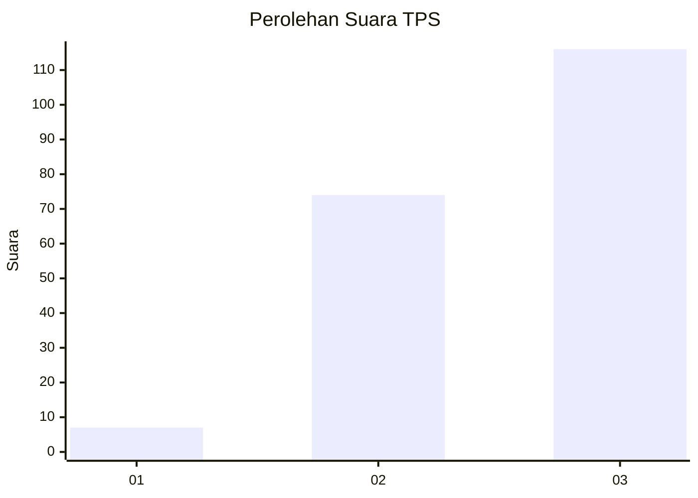
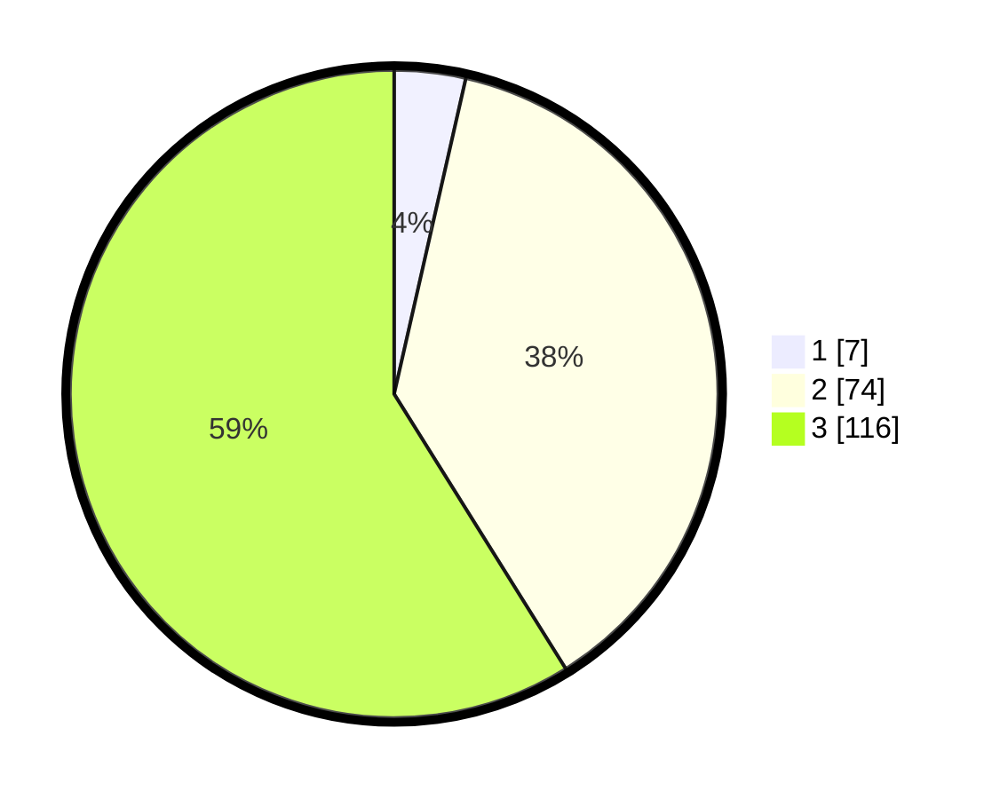

# Hasil

## Grafik

## Tabel

| No. | Nama Paslon    | Suara | Suara (raw) | Persentase |
|:--- |:-------------- | -----:| -----------:| ----------:|
| 1   | ANIES MUHAIMIN | 7     | [7][p-1]    | 3,55       |
| 2   | PRABOWO GIBRAN | 74    | [74][p-2]   | 37,56      |
| 3   | GANJAR MAHFUD  | 116   | [116][p-3]  | 58,88      |

[p-1]: https://github.com/gigit-pemilu/pemilu-2024/blob/main/pilpres/hitung-suara/sub/33-jawa-tengah/sub/25-batang/sub/11-batang/sub/1020-proyonanggan-selatan/sub/005-tps/sub/paslon-1.txt
[p-2]: https://github.com/gigit-pemilu/pemilu-2024/blob/main/pilpres/hitung-suara/sub/33-jawa-tengah/sub/25-batang/sub/11-batang/sub/1020-proyonanggan-selatan/sub/005-tps/sub/paslon-2.txt
[p-3]: https://github.com/gigit-pemilu/pemilu-2024/blob/main/pilpres/hitung-suara/sub/33-jawa-tengah/sub/25-batang/sub/11-batang/sub/1020-proyonanggan-selatan/sub/005-tps/sub/paslon-3.txt

## Foto C Plano

https://sirekap-obj-formc.kpu.go.id/b136/pemilu/ppwp/33/25/11/10/20/3325111020005-20240214-202339--a06c76fa-db2f-41fd-8167-721a1bd34b11.jpg

https://sirekap-obj-formc.kpu.go.id/b136/pemilu/ppwp/33/25/11/10/20/3325111020005-20240214-202558--f407d62f-7d96-4c98-a564-2037044f828f.jpg

https://sirekap-obj-formc.kpu.go.id/b136/pemilu/ppwp/33/25/11/10/20/3325111020005-20240214-202734--b8dd7308-990d-448c-b18a-f5ff89d8ef0a.jpg

## Metadata

| Key        | Value               |
| ---------- | ------------------- |
| Time Stamp | 2024-02-16 01:00:27 |

