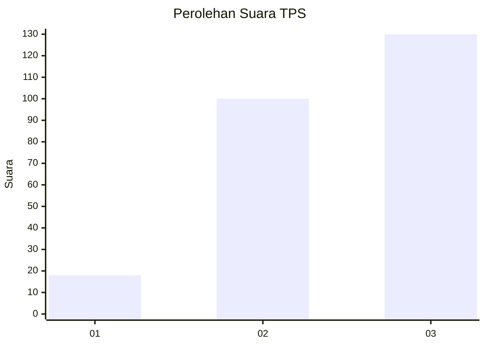
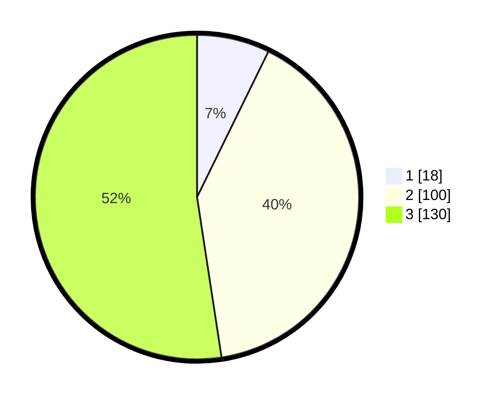

# Hasil

## Grafik

## Tabel

| No. | Nama Paslon    | Suara | Suara (raw) | Persentase |
|:--- |:-------------- | -----:| -----------:| ----------:|
| 1   | ANIES MUHAIMIN | 18    | [18][p-1]   | 7,26       |
| 2   | PRABOWO GIBRAN | 100   | [100][p-2]  | 40,32      |
| 3   | GANJAR MAHFUD  | 130   | [130][p-3]  | 52,42      |

[p-1]: https://github.com/gigit-pemilu/pemilu-2024-33-jawa-tengah/blob/main/pilpres/hitung-suara/sub/33-jawa-tengah/sub/25-batang/sub/11-batang/sub/1020-proyonanggan-selatan/sub/019-tps/sub/paslon-1.txt
[p-2]: https://github.com/gigit-pemilu/pemilu-2024-33-jawa-tengah/blob/main/pilpres/hitung-suara/sub/33-jawa-tengah/sub/25-batang/sub/11-batang/sub/1020-proyonanggan-selatan/sub/019-tps/sub/paslon-2.txt
[p-3]: https://github.com/gigit-pemilu/pemilu-2024-33-jawa-tengah/blob/main/pilpres/hitung-suara/sub/33-jawa-tengah/sub/25-batang/sub/11-batang/sub/1020-proyonanggan-selatan/sub/019-tps/sub/paslon-3.txt

## Foto C Plano

https://sirekap-obj-formc.kpu.go.id/f22c/pemilu/ppwp/33/25/11/10/20/3325111020019-20240214-205856--75f3fcee-76c6-4fc0-b3fe-97abeb2503f3.jpg

https://sirekap-obj-formc.kpu.go.id/f22c/pemilu/ppwp/33/25/11/10/20/3325111020019-20240214-202100--ed13feb3-47f5-45ba-9223-868ceaaaa6a4.jpg

https://sirekap-obj-formc.kpu.go.id/f22c/pemilu/ppwp/33/25/11/10/20/3325111020019-20240214-202138--af39d7cb-f7c7-40c0-9d4e-ac1d5b05a244.jpg

## Metadata

| Key        | Value               |
| ---------- | ------------------- |
| Time Stamp | 2024-02-16 01:00:27 |

