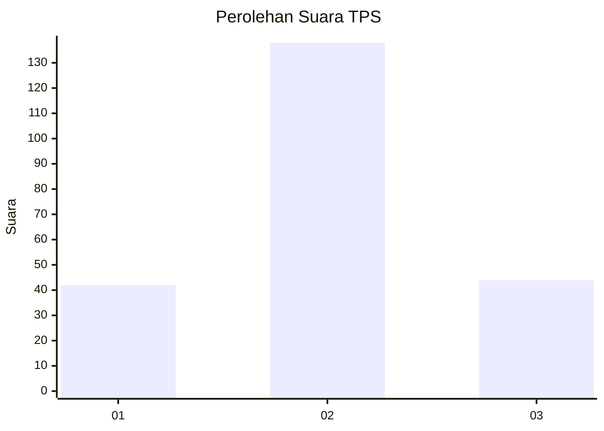
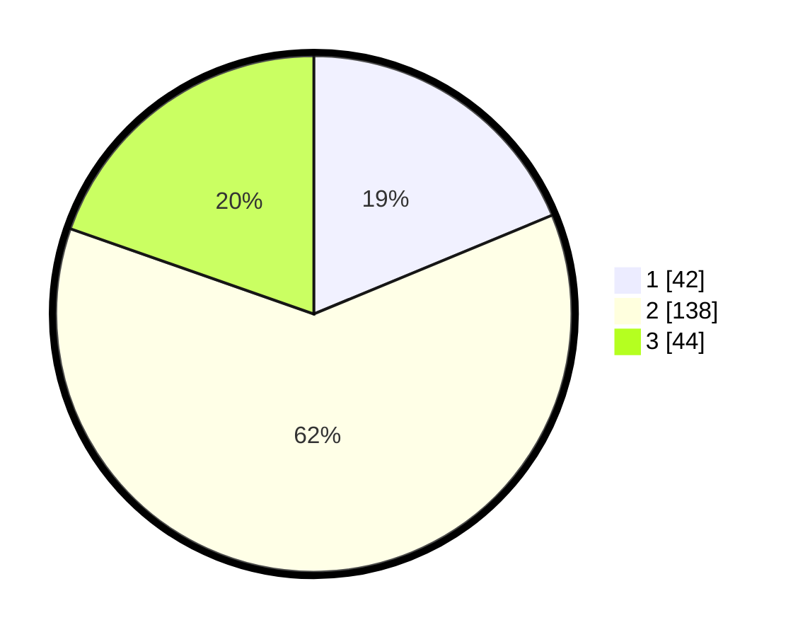

# Hasil

## Grafik

## Tabel

| No. | Nama Paslon    | Suara | Suara (raw) | Persentase |
|:--- |:-------------- | -----:| -----------:| ----------:|
| 1   | ANIES MUHAIMIN | 42    | [42][p-1]   | 18,75      |
| 2   | PRABOWO GIBRAN | 138   | [138][p-2]  | 61,61      |
| 3   | GANJAR MAHFUD  | 44    | [44][p-3]   | 19,64      |

[p-1]: https://github.com/gigit-pemilu/pemilu-2024/blob/main/pilpres/hitung-suara/sub/33-jawa-tengah/sub/25-batang/sub/11-batang/sub/2001-rowobelang/sub/009-tps/sub/paslon-1.txt
[p-2]: https://github.com/gigit-pemilu/pemilu-2024/blob/main/pilpres/hitung-suara/sub/33-jawa-tengah/sub/25-batang/sub/11-batang/sub/2001-rowobelang/sub/009-tps/sub/paslon-2.txt
[p-3]: https://github.com/gigit-pemilu/pemilu-2024/blob/main/pilpres/hitung-suara/sub/33-jawa-tengah/sub/25-batang/sub/11-batang/sub/2001-rowobelang/sub/009-tps/sub/paslon-3.txt

## Foto C Plano

https://sirekap-obj-formc.kpu.go.id/850f/pemilu/ppwp/33/25/11/20/01/3325112001009-20240215-010502--151a8a22-2191-41a1-8c58-caae19098cde.jpg

https://sirekap-obj-formc.kpu.go.id/850f/pemilu/ppwp/33/25/11/20/01/3325112001009-20240215-010437--5eec3a92-763e-42ec-9646-8e27b813fae1.jpg

https://sirekap-obj-formc.kpu.go.id/850f/pemilu/ppwp/33/25/11/20/01/3325112001009-20240215-010457--d6adf9a8-f74c-461a-a2a0-d78c6a37b7f5.jpg

## Metadata

| Key        | Value               |
| ---------- | ------------------- |
| Time Stamp | 2024-02-16 01:00:27 |

