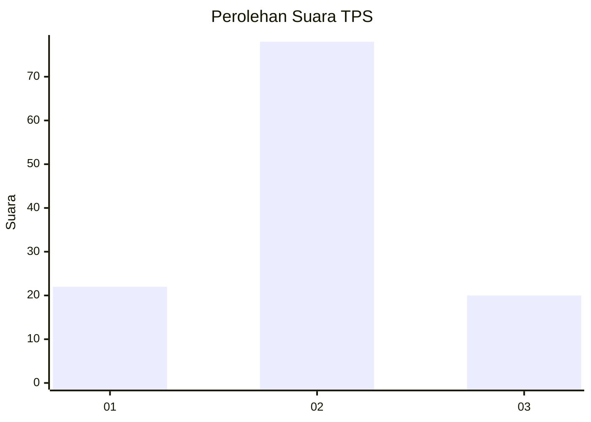
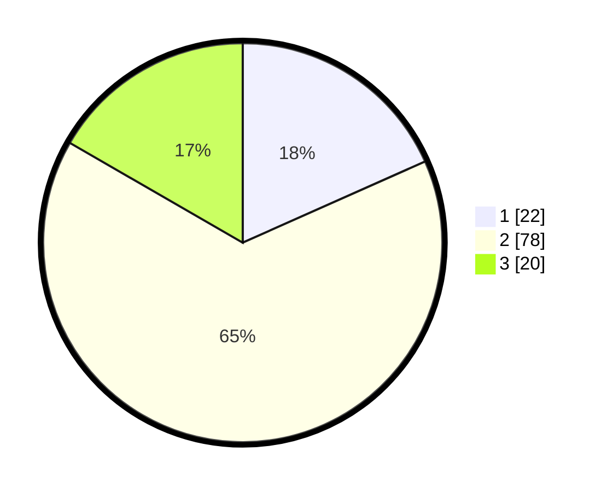

# Hasil

## Grafik

## Tabel

| No. | Nama Paslon    | Suara | Suara (raw) | Persentase |
|:--- |:-------------- | -----:| -----------:| ----------:|
| 1   | ANIES MUHAIMIN | 22    | [22][p-1]   | 18,33      |
| 2   | PRABOWO GIBRAN | 78    | [78][p-2]   | 65,00      |
| 3   | GANJAR MAHFUD  | 20    | [20][p-3]   | 16,67      |

[p-1]: https://github.com/gigit-pemilu/pemilu-2024/blob/main/pilpres/hitung-suara/sub/33-jawa-tengah/sub/25-batang/sub/11-batang/sub/2001-rowobelang/sub/010-tps/sub/paslon-1.txt
[p-2]: https://github.com/gigit-pemilu/pemilu-2024/blob/main/pilpres/hitung-suara/sub/33-jawa-tengah/sub/25-batang/sub/11-batang/sub/2001-rowobelang/sub/010-tps/sub/paslon-2.txt
[p-3]: https://github.com/gigit-pemilu/pemilu-2024/blob/main/pilpres/hitung-suara/sub/33-jawa-tengah/sub/25-batang/sub/11-batang/sub/2001-rowobelang/sub/010-tps/sub/paslon-3.txt

## Foto C Plano

https://sirekap-obj-formc.kpu.go.id/21d9/pemilu/ppwp/33/25/11/20/01/3325112001010-20240214-141945--73708555-5b3a-4245-bbe8-9e5ffc085969.jpg

https://sirekap-obj-formc.kpu.go.id/21d9/pemilu/ppwp/33/25/11/20/01/3325112001010-20240214-141523--b72ade5f-d45f-4893-ab70-0d0d886ba464.jpg

https://sirekap-obj-formc.kpu.go.id/21d9/pemilu/ppwp/33/25/11/20/01/3325112001010-20240214-141121--2cce67af-43c7-47c2-97a1-876100e183b2.jpg

## Metadata

| Key        | Value               |
| ---------- | ------------------- |
| Time Stamp | 2024-02-15 23:29:50 |

