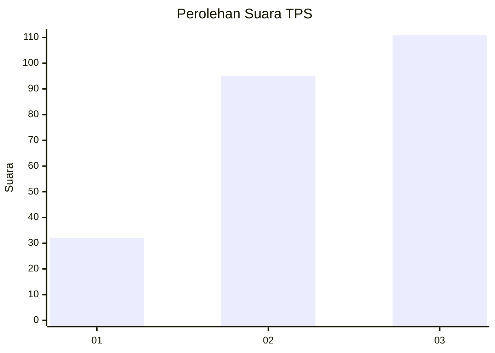
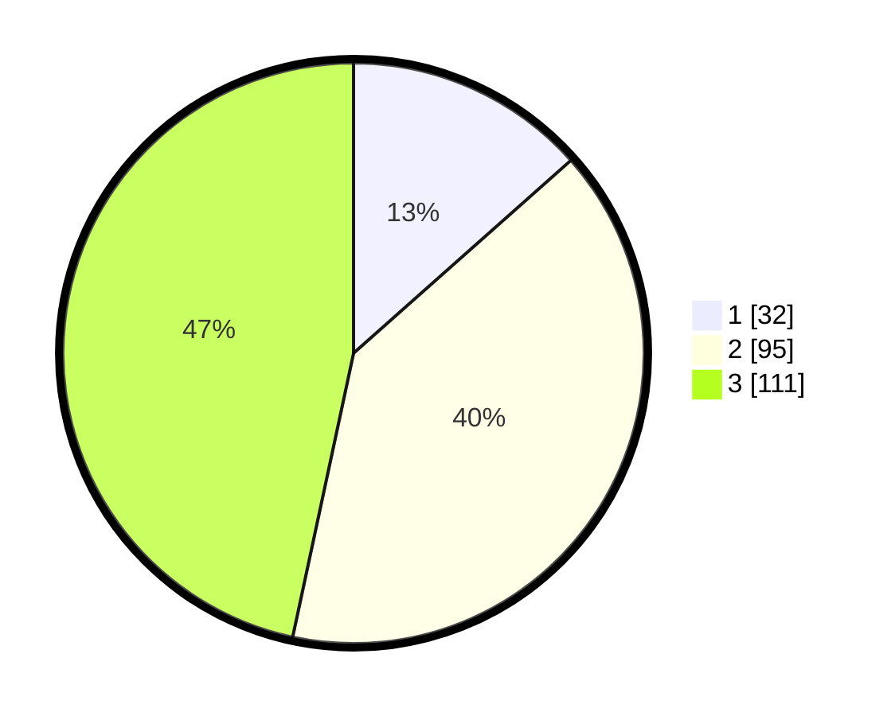

# Hasil

## Grafik

## Tabel

| No. | Nama Paslon    | Suara | Suara (raw) | Persentase |
|:--- |:-------------- | -----:| -----------:| ----------:|
| 1   | ANIES MUHAIMIN | 32    | [32][p-1]   | 13,45      |
| 2   | PRABOWO GIBRAN | 95    | [95][p-2]   | 39,92      |
| 3   | GANJAR MAHFUD  | 111   | [111][p-3]  | 46,64      |

[p-1]: https://github.com/gigit-pemilu/pemilu-2024/blob/main/pilpres/hitung-suara/sub/33-jawa-tengah/sub/25-batang/sub/11-batang/sub/2002-cepokokuning/sub/004-tps/sub/paslon-1.txt
[p-2]: https://github.com/gigit-pemilu/pemilu-2024/blob/main/pilpres/hitung-suara/sub/33-jawa-tengah/sub/25-batang/sub/11-batang/sub/2002-cepokokuning/sub/004-tps/sub/paslon-2.txt
[p-3]: https://github.com/gigit-pemilu/pemilu-2024/blob/main/pilpres/hitung-suara/sub/33-jawa-tengah/sub/25-batang/sub/11-batang/sub/2002-cepokokuning/sub/004-tps/sub/paslon-3.txt

## Foto C Plano

https://sirekap-obj-formc.kpu.go.id/fc0f/pemilu/ppwp/33/25/11/20/02/3325112002004-20240214-203522--230d143b-c0ac-4127-8375-8070e9a70496.jpg

https://sirekap-obj-formc.kpu.go.id/fc0f/pemilu/ppwp/33/25/11/20/02/3325112002004-20240214-203753--dc512007-7ba5-480e-bbce-e331b1212804.jpg

https://sirekap-obj-formc.kpu.go.id/fc0f/pemilu/ppwp/33/25/11/20/02/3325112002004-20240214-203846--b9dde58f-d637-48ec-8c36-d42ebf1861ef.jpg

## Metadata

| Key        | Value               |
| ---------- | ------------------- |
| Time Stamp | 2024-02-15 23:29:50 |

