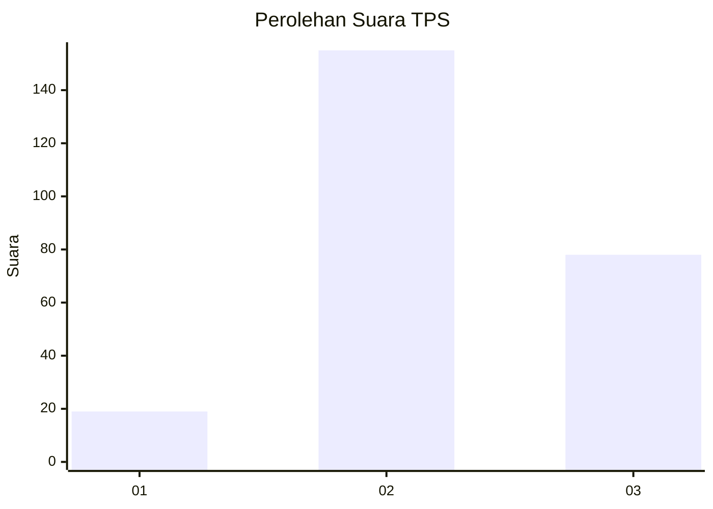
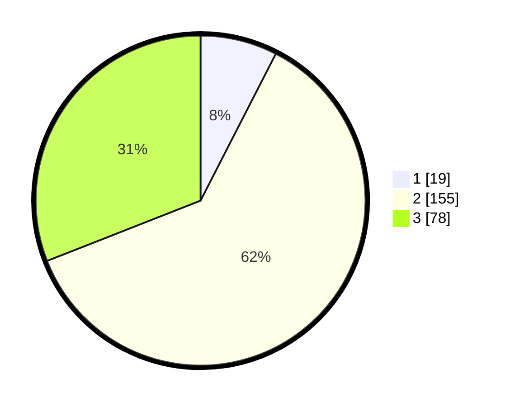

# Hasil

## Grafik

## Tabel

| No. | Nama Paslon    | Suara | Suara (raw) | Persentase |
|:--- |:-------------- | -----:| -----------:| ----------:|
| 1   | ANIES MUHAIMIN | 19    | [19][p-1]   | 7,54       |
| 2   | PRABOWO GIBRAN | 155   | [155][p-2]  | 61,51      |
| 3   | GANJAR MAHFUD  | 78    | [78][p-3]   | 30,95      |

[p-1]: https://github.com/gigit-pemilu/pemilu-2024/blob/main/pilpres/hitung-suara/sub/33-jawa-tengah/sub/25-batang/sub/11-batang/sub/2003-pasekaran/sub/001-tps/sub/paslon-1.txt
[p-2]: https://github.com/gigit-pemilu/pemilu-2024/blob/main/pilpres/hitung-suara/sub/33-jawa-tengah/sub/25-batang/sub/11-batang/sub/2003-pasekaran/sub/001-tps/sub/paslon-2.txt
[p-3]: https://github.com/gigit-pemilu/pemilu-2024/blob/main/pilpres/hitung-suara/sub/33-jawa-tengah/sub/25-batang/sub/11-batang/sub/2003-pasekaran/sub/001-tps/sub/paslon-3.txt

## Foto C Plano

https://sirekap-obj-formc.kpu.go.id/a1d9/pemilu/ppwp/33/25/11/20/03/3325112003001-20240215-024231--8fe54b12-3f54-4e48-b728-d9ee76839910.jpg

https://sirekap-obj-formc.kpu.go.id/a1d9/pemilu/ppwp/33/25/11/20/03/3325112003001-20240215-024434--5f7b29a7-17d0-4f04-8e40-333a0d163eaf.jpg

https://sirekap-obj-formc.kpu.go.id/a1d9/pemilu/ppwp/33/25/11/20/03/3325112003001-20240215-024615--5b40d90b-31b7-4aea-aed2-158f82e0f31a.jpg

## Metadata

| Key        | Value               |
| ---------- | ------------------- |
| Time Stamp | 2024-02-16 00:00:26 |

