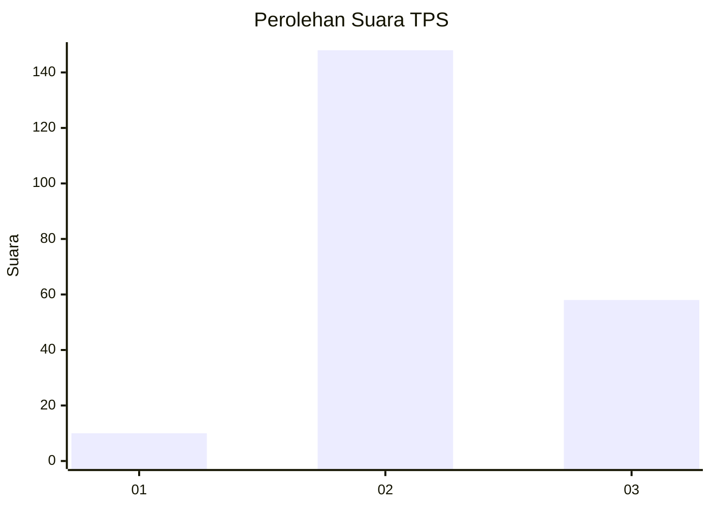

# Hasil

## Grafik

## Tabel

| No. | Nama Paslon    | Suara | Suara (raw) | Persentase |
|:--- |:-------------- | -----:| -----------:| ----------:|
| 1   | ANIES MUHAIMIN | 10    | [10][p-1]   | 4,63       |
| 2   | PRABOWO GIBRAN | 148   | [148][p-2]  | 68,52      |
| 3   | GANJAR MAHFUD  | 58    | [58][p-3]   | 26,85      |

[p-1]: https://github.com/gigit-pemilu/pemilu-2024/blob/main/pilpres/hitung-suara/sub/33-jawa-tengah/sub/25-batang/sub/11-batang/sub/2005-kecepak/sub/003-tps/sub/paslon-1.txt
[p-2]: https://github.com/gigit-pemilu/pemilu-2024/blob/main/pilpres/hitung-suara/sub/33-jawa-tengah/sub/25-batang/sub/11-batang/sub/2005-kecepak/sub/003-tps/sub/paslon-2.txt
[p-3]: https://github.com/gigit-pemilu/pemilu-2024/blob/main/pilpres/hitung-suara/sub/33-jawa-tengah/sub/25-batang/sub/11-batang/sub/2005-kecepak/sub/003-tps/sub/paslon-3.txt

## Foto C Plano

https://sirekap-obj-formc.kpu.go.id/b5b4/pemilu/ppwp/33/25/11/20/05/3325112005003-20240215-061518--f76a81a9-7e34-44ff-863d-8cafc1f94349.jpg

https://sirekap-obj-formc.kpu.go.id/b5b4/pemilu/ppwp/33/25/11/20/05/3325112005003-20240215-061527--44e36a0a-5513-47b6-8284-db8ee9d7b820.jpg

https://sirekap-obj-formc.kpu.go.id/b5b4/pemilu/ppwp/33/25/11/20/05/3325112005003-20240215-061533--c821da8b-d7d6-4b93-86ca-eaf2f20ae016.jpg

## Metadata

| Key        | Value               |
| ---------- | ------------------- |
| Time Stamp | 2024-02-16 08:30:27 |

