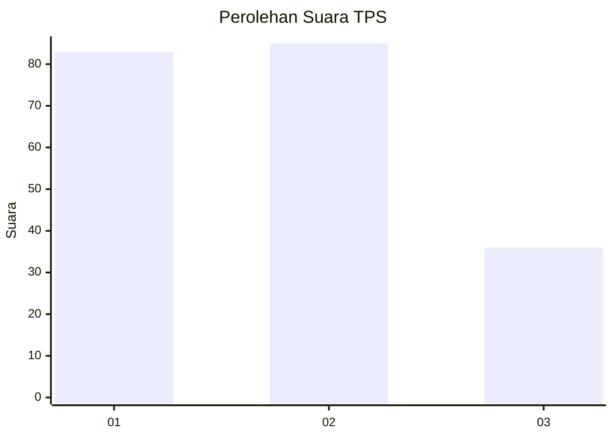
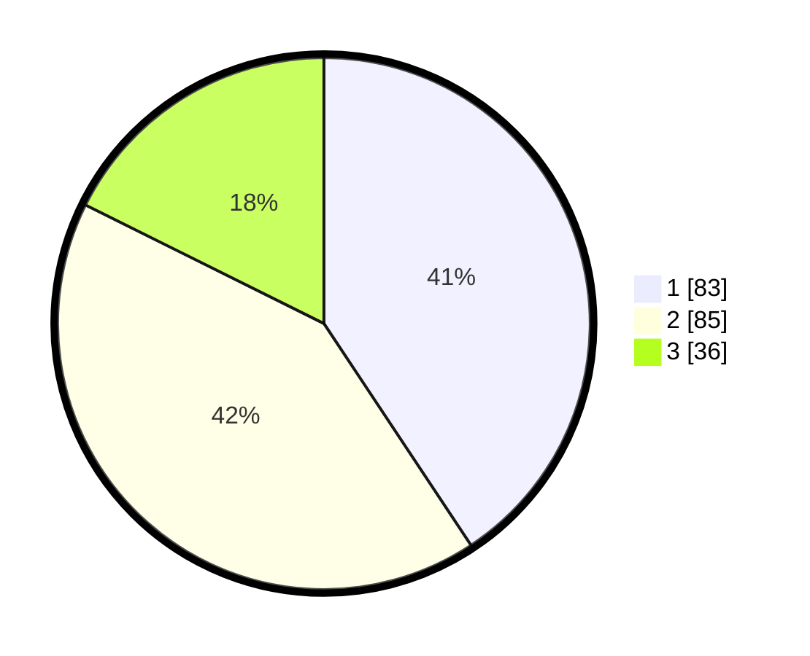

# Hasil

## Grafik

## Tabel

| No. | Nama Paslon    | Suara | Suara (raw) | Persentase |
|:--- |:-------------- | -----:| -----------:| ----------:|
| 1   | ANIES MUHAIMIN | 83    | [83][p-1]   | 40,69      |
| 2   | PRABOWO GIBRAN | 85    | [85][p-2]   | 41,67      |
| 3   | GANJAR MAHFUD  | 36    | [36][p-3]   | 17,65      |

[p-1]: https://github.com/gigit-pemilu/pemilu-2024/blob/main/pilpres/hitung-suara/sub/33-jawa-tengah/sub/25-batang/sub/11-batang/sub/2008-kalipucang-wetan/sub/005-tps/sub/paslon-1.txt
[p-2]: https://github.com/gigit-pemilu/pemilu-2024/blob/main/pilpres/hitung-suara/sub/33-jawa-tengah/sub/25-batang/sub/11-batang/sub/2008-kalipucang-wetan/sub/005-tps/sub/paslon-2.txt
[p-3]: https://github.com/gigit-pemilu/pemilu-2024/blob/main/pilpres/hitung-suara/sub/33-jawa-tengah/sub/25-batang/sub/11-batang/sub/2008-kalipucang-wetan/sub/005-tps/sub/paslon-3.txt

## Foto C Plano

https://sirekap-obj-formc.kpu.go.id/160e/pemilu/ppwp/33/25/11/20/08/3325112008005-20240214-201341--e7019a44-6749-40c3-ae02-f9aed2f5ad5f.jpg

https://sirekap-obj-formc.kpu.go.id/160e/pemilu/ppwp/33/25/11/20/08/3325112008005-20240214-201342--3dcd2b75-a1ef-456d-980f-64e10b8b79bd.jpg

https://sirekap-obj-formc.kpu.go.id/160e/pemilu/ppwp/33/25/11/20/08/3325112008005-20240214-201421--4712c7ec-6877-4203-aece-e28f7d061752.jpg

## Metadata

| Key        | Value               |
| ---------- | ------------------- |
| Time Stamp | 2024-02-16 00:00:26 |

