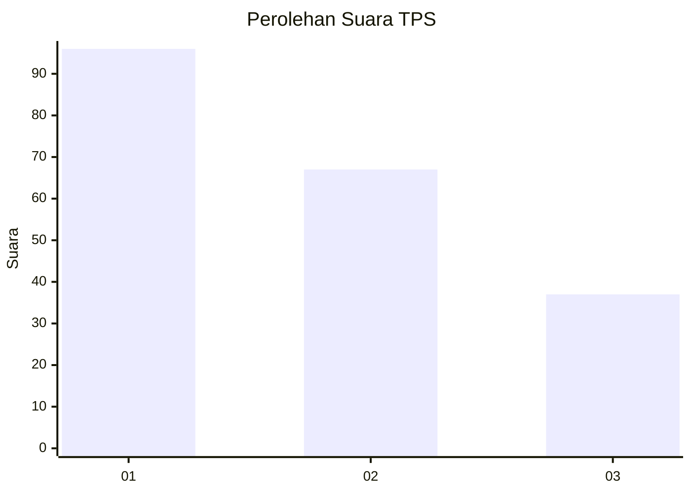
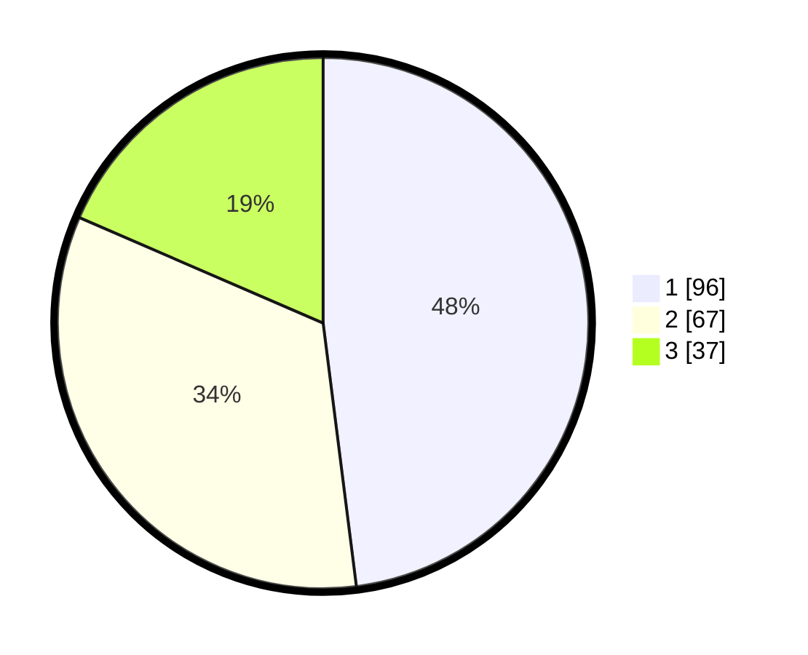

# Hasil

## Grafik

## Tabel

| No. | Nama Paslon    | Suara | Suara (raw) | Persentase |
|:--- |:-------------- | -----:| -----------:| ----------:|
| 1   | ANIES MUHAIMIN | 96    | [96][p-1]   | 48,00      |
| 2   | PRABOWO GIBRAN | 67    | [67][p-2]   | 33,50      |
| 3   | GANJAR MAHFUD  | 37    | [37][p-3]   | 18,50      |

[p-1]: https://github.com/gigit-pemilu/pemilu-2024/blob/main/pilpres/hitung-suara/sub/33-jawa-tengah/sub/25-batang/sub/11-batang/sub/2008-kalipucang-wetan/sub/006-tps/sub/paslon-1.txt
[p-2]: https://github.com/gigit-pemilu/pemilu-2024/blob/main/pilpres/hitung-suara/sub/33-jawa-tengah/sub/25-batang/sub/11-batang/sub/2008-kalipucang-wetan/sub/006-tps/sub/paslon-2.txt
[p-3]: https://github.com/gigit-pemilu/pemilu-2024/blob/main/pilpres/hitung-suara/sub/33-jawa-tengah/sub/25-batang/sub/11-batang/sub/2008-kalipucang-wetan/sub/006-tps/sub/paslon-3.txt

## Foto C Plano

https://sirekap-obj-formc.kpu.go.id/193e/pemilu/ppwp/33/25/11/20/08/3325112008006-20240215-004512--1160ce8b-6a13-4b31-85ef-c13768d8600f.jpg

https://sirekap-obj-formc.kpu.go.id/193e/pemilu/ppwp/33/25/11/20/08/3325112008006-20240215-004702--81e70126-e642-4ffd-a468-b390283b9f29.jpg

https://sirekap-obj-formc.kpu.go.id/193e/pemilu/ppwp/33/25/11/20/08/3325112008006-20240215-004809--f2096ebe-ac5c-4d2c-9b88-4c8b7817795e.jpg

## Metadata

| Key        | Value               |
| ---------- | ------------------- |
| Time Stamp | 2024-02-16 08:30:27 |

