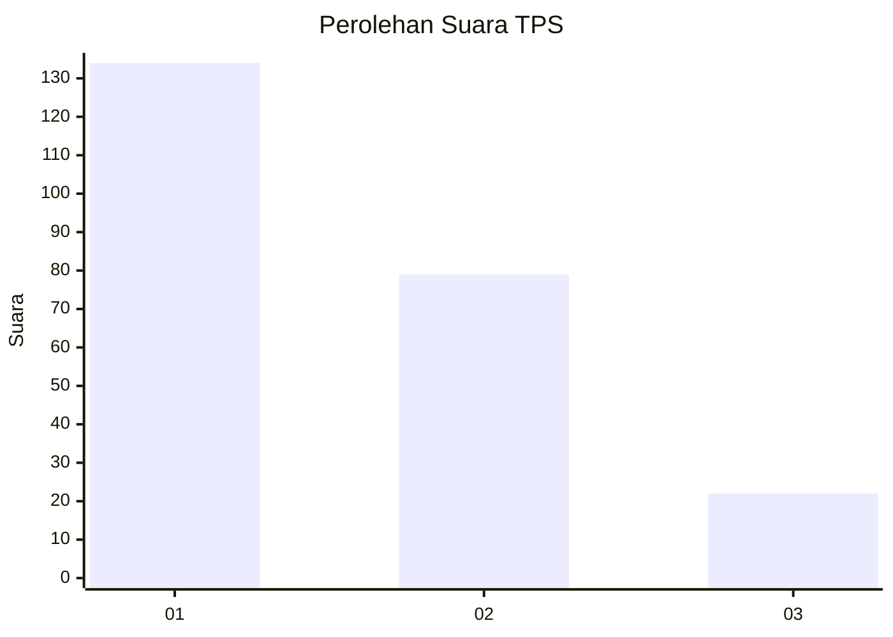
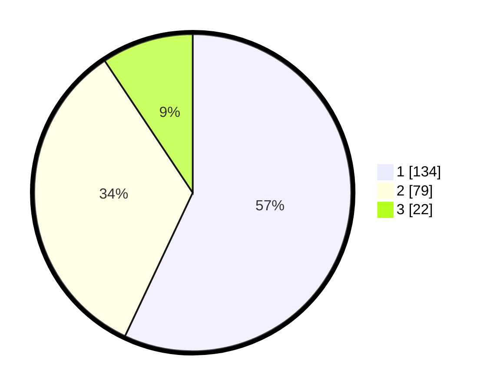

# Hasil

## Grafik

## Tabel

| No. | Nama Paslon    | Suara | Suara (raw) | Persentase |
|:--- |:-------------- | -----:| -----------:| ----------:|
| 1   | ANIES MUHAIMIN | 134   | [134][p-1]  | 57,02      |
| 2   | PRABOWO GIBRAN | 79    | [79][p-2]   | 33,62      |
| 3   | GANJAR MAHFUD  | 22    | [22][p-3]   | 9,36       |

[p-1]: https://github.com/gigit-pemilu/pemilu-2024/blob/main/pilpres/hitung-suara/sub/33-jawa-tengah/sub/25-batang/sub/11-batang/sub/2008-kalipucang-wetan/sub/007-tps/sub/paslon-1.txt
[p-2]: https://github.com/gigit-pemilu/pemilu-2024/blob/main/pilpres/hitung-suara/sub/33-jawa-tengah/sub/25-batang/sub/11-batang/sub/2008-kalipucang-wetan/sub/007-tps/sub/paslon-2.txt
[p-3]: https://github.com/gigit-pemilu/pemilu-2024/blob/main/pilpres/hitung-suara/sub/33-jawa-tengah/sub/25-batang/sub/11-batang/sub/2008-kalipucang-wetan/sub/007-tps/sub/paslon-3.txt

## Foto C Plano

https://sirekap-obj-formc.kpu.go.id/0815/pemilu/ppwp/33/25/11/20/08/3325112008007-20240215-010936--5334e87c-dcaa-465f-87c4-d2542f09b46e.jpg

https://sirekap-obj-formc.kpu.go.id/0815/pemilu/ppwp/33/25/11/20/08/3325112008007-20240215-011254--3a0dace0-2348-4e09-b8f2-2a3a5ce03dfa.jpg

https://sirekap-obj-formc.kpu.go.id/0815/pemilu/ppwp/33/25/11/20/08/3325112008007-20240215-011452--88d95b96-5d8f-44fb-a97f-fbdb71df4851.jpg

## Metadata

| Key        | Value               |
| ---------- | ------------------- |
| Time Stamp | 2024-02-16 00:00:26 |

