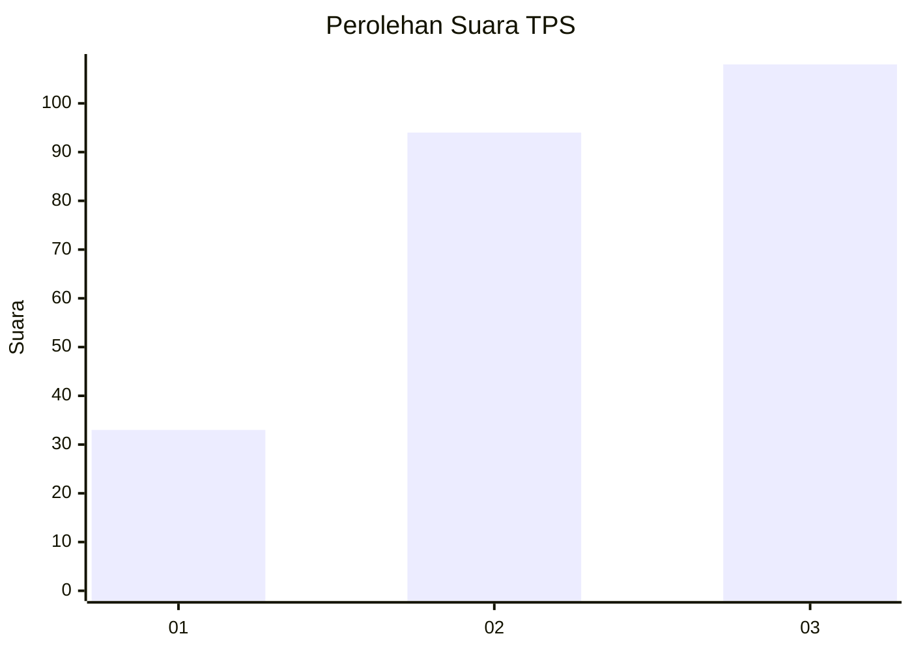
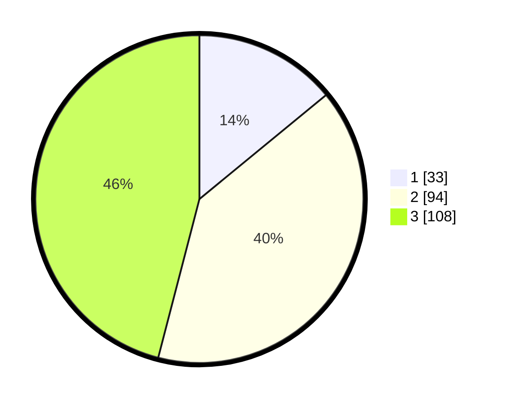

# Hasil

## Grafik

## Tabel

| No. | Nama Paslon    | Suara | Suara (raw) | Persentase |
|:--- |:-------------- | -----:| -----------:| ----------:|
| 1   | ANIES MUHAIMIN | 33    | [33][p-1]   | 14,04      |
| 2   | PRABOWO GIBRAN | 94    | [94][p-2]   | 40,00      |
| 3   | GANJAR MAHFUD  | 108   | [108][p-3]  | 45,96      |

[p-1]: https://github.com/gigit-pemilu/pemilu-2024-33-jawa-tengah/blob/main/pilpres/hitung-suara/sub/33-jawa-tengah/sub/25-batang/sub/11-batang/sub/2011-denasri-kulon/sub/002-tps/sub/paslon-1.txt
[p-2]: https://github.com/gigit-pemilu/pemilu-2024-33-jawa-tengah/blob/main/pilpres/hitung-suara/sub/33-jawa-tengah/sub/25-batang/sub/11-batang/sub/2011-denasri-kulon/sub/002-tps/sub/paslon-2.txt
[p-3]: https://github.com/gigit-pemilu/pemilu-2024-33-jawa-tengah/blob/main/pilpres/hitung-suara/sub/33-jawa-tengah/sub/25-batang/sub/11-batang/sub/2011-denasri-kulon/sub/002-tps/sub/paslon-3.txt

## Foto C Plano

https://sirekap-obj-formc.kpu.go.id/1563/pemilu/ppwp/33/25/11/20/11/3325112011002-20240214-211812--e9c11f53-5514-4810-80ed-6087c34cc391.jpg

https://sirekap-obj-formc.kpu.go.id/1563/pemilu/ppwp/33/25/11/20/11/3325112011002-20240214-211923--69a04d4c-b660-4f5d-890e-bbd04e0a09e9.jpg

https://sirekap-obj-formc.kpu.go.id/1563/pemilu/ppwp/33/25/11/20/11/3325112011002-20240214-212018--47ab4d1c-0675-4470-afa7-0afa2dcc73a0.jpg

## Metadata

| Key        | Value               |
| ---------- | ------------------- |
| Time Stamp | 2024-02-16 00:00:26 |

