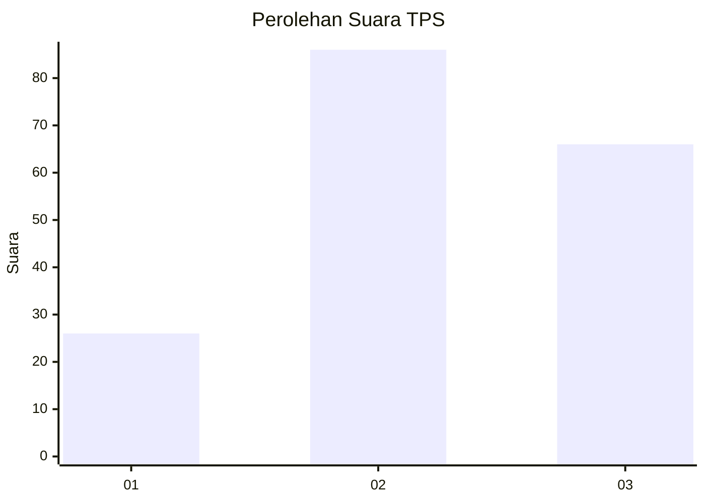
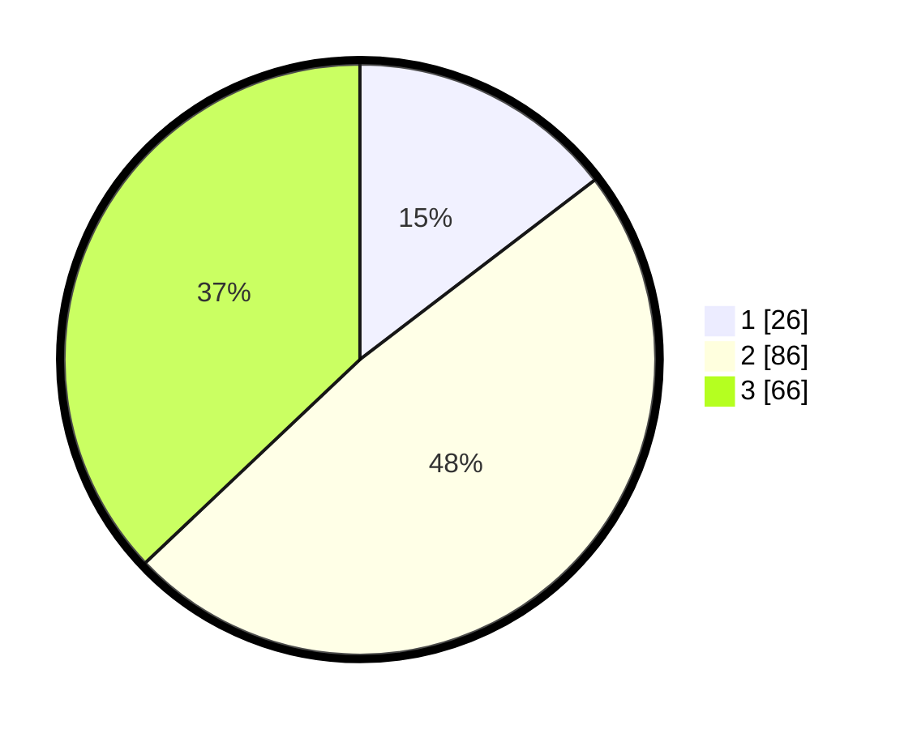

# Hasil

## Grafik

## Tabel

| No. | Nama Paslon    | Suara | Suara (raw) | Persentase |
|:--- |:-------------- | -----:| -----------:| ----------:|
| 1   | ANIES MUHAIMIN | 26    | [26][p-1]   | 14,61      |
| 2   | PRABOWO GIBRAN | 86    | [86][p-2]   | 48,31      |
| 3   | GANJAR MAHFUD  | 66    | [66][p-3]   | 37,08      |

[p-1]: https://github.com/gigit-pemilu/pemilu-2024/blob/main/pilpres/hitung-suara/sub/33-jawa-tengah/sub/25-batang/sub/12-warungasem/sub/2001-pandansari/sub/001-tps/sub/paslon-1.txt
[p-2]: https://github.com/gigit-pemilu/pemilu-2024/blob/main/pilpres/hitung-suara/sub/33-jawa-tengah/sub/25-batang/sub/12-warungasem/sub/2001-pandansari/sub/001-tps/sub/paslon-2.txt
[p-3]: https://github.com/gigit-pemilu/pemilu-2024/blob/main/pilpres/hitung-suara/sub/33-jawa-tengah/sub/25-batang/sub/12-warungasem/sub/2001-pandansari/sub/001-tps/sub/paslon-3.txt

## Foto C Plano

https://sirekap-obj-formc.kpu.go.id/baab/pemilu/ppwp/33/25/12/20/01/3325122001001-20240214-235503--271ce7ff-6e2f-4a89-8d73-9aadb32d44df.jpg

https://sirekap-obj-formc.kpu.go.id/baab/pemilu/ppwp/33/25/12/20/01/3325122001001-20240215-001436--5c9af10a-52b8-4381-8d7f-22e049e0b9c4.jpg

https://sirekap-obj-formc.kpu.go.id/baab/pemilu/ppwp/33/25/12/20/01/3325122001001-20240215-001635--8924f9c9-8dd9-475c-a316-759d8da3a57d.jpg

## Metadata

| Key        | Value               |
| ---------- | ------------------- |
| Time Stamp | 2024-02-15 21:30:27 |

