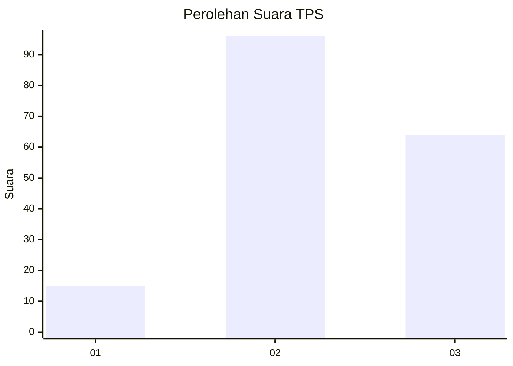
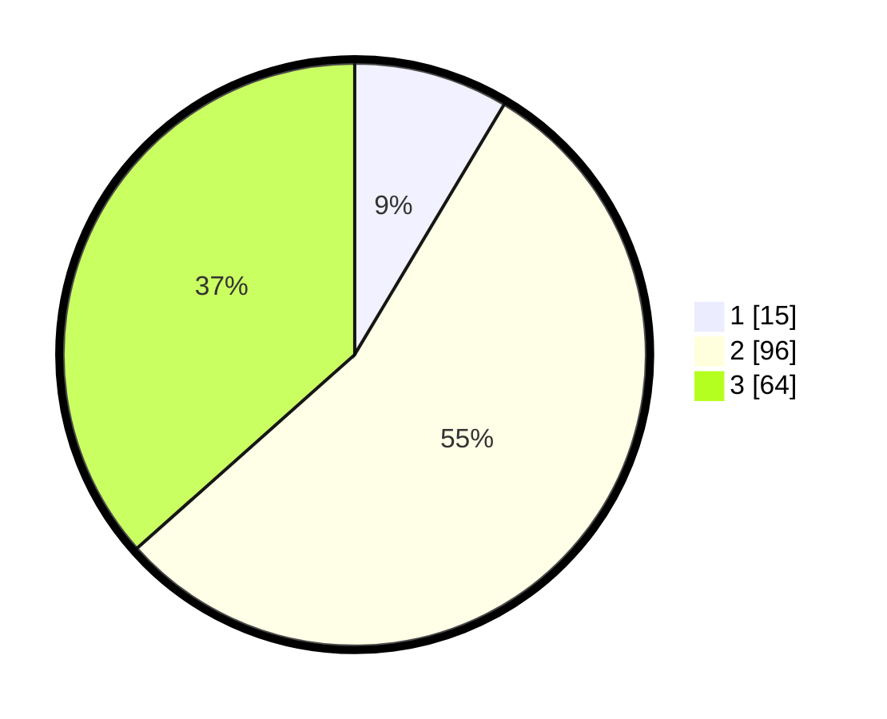

# Hasil

## Grafik

## Tabel

| No. | Nama Paslon    | Suara | Suara (raw) | Persentase |
|:--- |:-------------- | -----:| -----------:| ----------:|
| 1   | ANIES MUHAIMIN | 15    | [15][p-1]   | 8,57       |
| 2   | PRABOWO GIBRAN | 96    | [96][p-2]   | 54,86      |
| 3   | GANJAR MAHFUD  | 64    | [64][p-3]   | 36,57      |

[p-1]: https://github.com/gigit-pemilu/pemilu-2024/blob/main/pilpres/hitung-suara/sub/33-jawa-tengah/sub/25-batang/sub/12-warungasem/sub/2001-pandansari/sub/003-tps/sub/paslon-1.txt
[p-2]: https://github.com/gigit-pemilu/pemilu-2024/blob/main/pilpres/hitung-suara/sub/33-jawa-tengah/sub/25-batang/sub/12-warungasem/sub/2001-pandansari/sub/003-tps/sub/paslon-2.txt
[p-3]: https://github.com/gigit-pemilu/pemilu-2024/blob/main/pilpres/hitung-suara/sub/33-jawa-tengah/sub/25-batang/sub/12-warungasem/sub/2001-pandansari/sub/003-tps/sub/paslon-3.txt

## Foto C Plano

https://sirekap-obj-formc.kpu.go.id/af62/pemilu/ppwp/33/25/12/20/01/3325122001003-20240214-233339--b4e4a250-bb3c-439f-af09-bc56026597a5.jpg

https://sirekap-obj-formc.kpu.go.id/af62/pemilu/ppwp/33/25/12/20/01/3325122001003-20240214-231650--8a278402-b605-467d-a32f-1d725ba61112.jpg

https://sirekap-obj-formc.kpu.go.id/af62/pemilu/ppwp/33/25/12/20/01/3325122001003-20240214-231833--f31e37c7-6684-4aab-b941-22679dc36d83.jpg

## Metadata

| Key        | Value               |
| ---------- | ------------------- |
| Time Stamp | 2024-02-15 21:30:27 |

