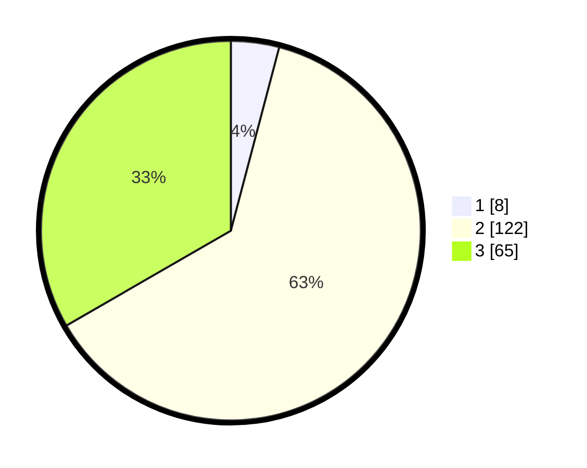

# Hasil

## Grafik

## Tabel

| No. | Nama Paslon    | Suara | Suara (raw) | Persentase |
|:--- |:-------------- | -----:| -----------:| ----------:|
| 1   | ANIES MUHAIMIN | 8     | [8][p-1]    | 4,10       |
| 2   | PRABOWO GIBRAN | 122   | [122][p-2]  | 62,56      |
| 3   | GANJAR MAHFUD  | 65    | [65][p-3]   | 33,33      |

[p-1]: https://github.com/gigit-pemilu/pemilu-2024-33-jawa-tengah/blob/main/pilpres/hitung-suara/sub/33-jawa-tengah/sub/25-batang/sub/12-warungasem/sub/2001-pandansari/sub/005-tps/sub/paslon-1.txt
[p-2]: https://github.com/gigit-pemilu/pemilu-2024-33-jawa-tengah/blob/main/pilpres/hitung-suara/sub/33-jawa-tengah/sub/25-batang/sub/12-warungasem/sub/2001-pandansari/sub/005-tps/sub/paslon-2.txt
[p-3]: https://github.com/gigit-pemilu/pemilu-2024-33-jawa-tengah/blob/main/pilpres/hitung-suara/sub/33-jawa-tengah/sub/25-batang/sub/12-warungasem/sub/2001-pandansari/sub/005-tps/sub/paslon-3.txt

## Foto C Plano

https://sirekap-obj-formc.kpu.go.id/0d49/pemilu/ppwp/33/25/12/20/01/3325122001005-20240214-221138--97761b02-632b-4e40-8fa3-f467f4d3699e.jpg

https://sirekap-obj-formc.kpu.go.id/0d49/pemilu/ppwp/33/25/12/20/01/3325122001005-20240214-221339--4f905637-0bda-4a0c-98be-a014d2cc4643.jpg

https://sirekap-obj-formc.kpu.go.id/0d49/pemilu/ppwp/33/25/12/20/01/3325122001005-20240215-000545--1d0f006d-e4f8-403d-9f0c-cbb8fc3c73a0.jpg

## Metadata

| Key        | Value               |
| ---------- | ------------------- |
| Time Stamp | 2024-02-15 21:30:27 |

