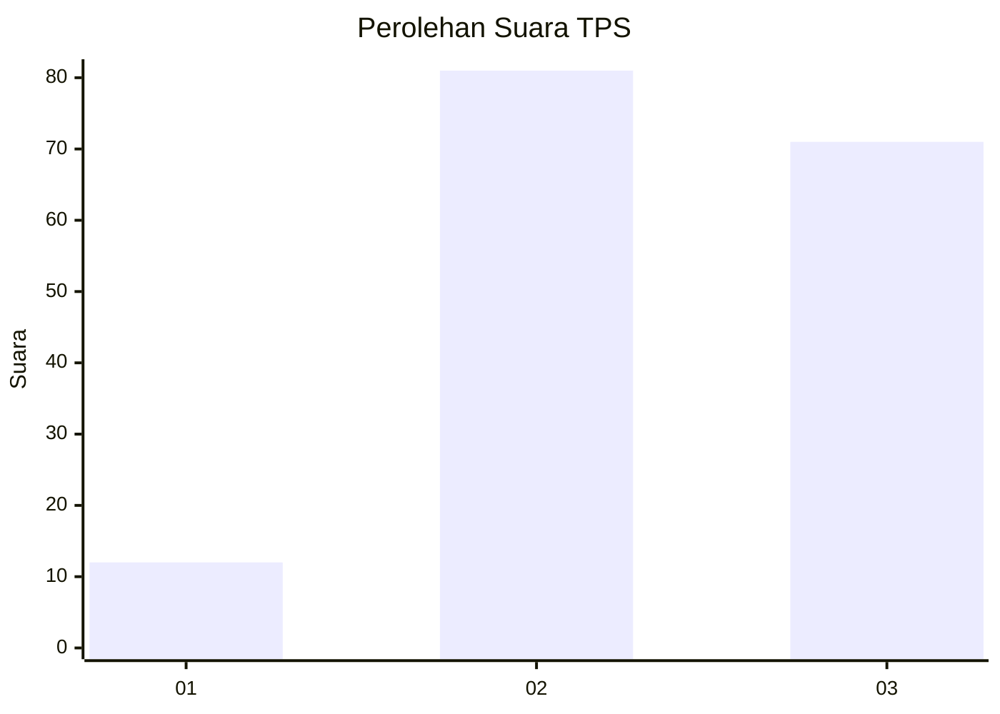
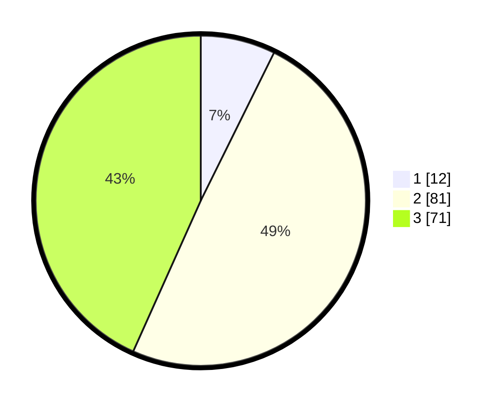

# Hasil

## Grafik

## Tabel

| No. | Nama Paslon    | Suara | Suara (raw) | Persentase |
|:--- |:-------------- | -----:| -----------:| ----------:|
| 1   | ANIES MUHAIMIN | 12    | [12][p-1]   | 7,32       |
| 2   | PRABOWO GIBRAN | 81    | [81][p-2]   | 49,39      |
| 3   | GANJAR MAHFUD  | 71    | [71][p-3]   | 43,29      |

[p-1]: https://github.com/gigit-pemilu/pemilu-2024/blob/main/pilpres/hitung-suara/sub/33-jawa-tengah/sub/25-batang/sub/12-warungasem/sub/2001-pandansari/sub/007-tps/sub/paslon-1.txt
[p-2]: https://github.com/gigit-pemilu/pemilu-2024/blob/main/pilpres/hitung-suara/sub/33-jawa-tengah/sub/25-batang/sub/12-warungasem/sub/2001-pandansari/sub/007-tps/sub/paslon-2.txt
[p-3]: https://github.com/gigit-pemilu/pemilu-2024/blob/main/pilpres/hitung-suara/sub/33-jawa-tengah/sub/25-batang/sub/12-warungasem/sub/2001-pandansari/sub/007-tps/sub/paslon-3.txt

## Foto C Plano

https://sirekap-obj-formc.kpu.go.id/7baf/pemilu/ppwp/33/25/12/20/01/3325122001007-20240214-230530--b077093f-dba2-4223-891e-8bf9107eb8cd.jpg

https://sirekap-obj-formc.kpu.go.id/7baf/pemilu/ppwp/33/25/12/20/01/3325122001007-20240214-230648--dcee3712-3e73-409a-9fca-dea013e6c45f.jpg

https://sirekap-obj-formc.kpu.go.id/7baf/pemilu/ppwp/33/25/12/20/01/3325122001007-20240214-230956--edf809c2-3183-4daa-95da-cded2026d04b.jpg

## Metadata

| Key        | Value               |
| ---------- | ------------------- |
| Time Stamp | 2024-02-16 08:30:27 |

