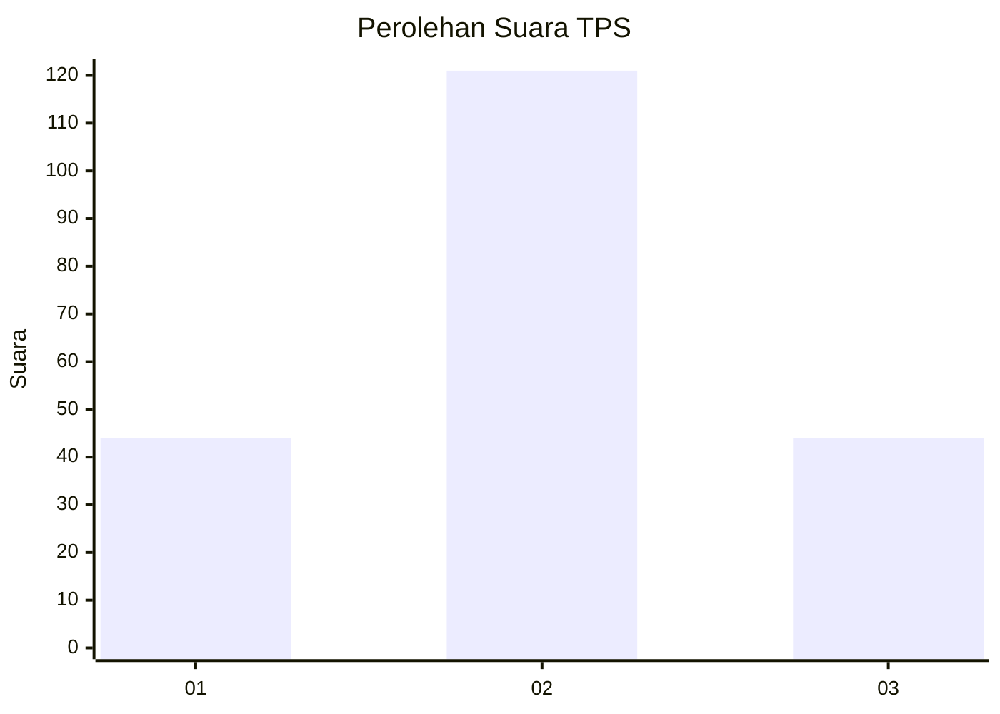
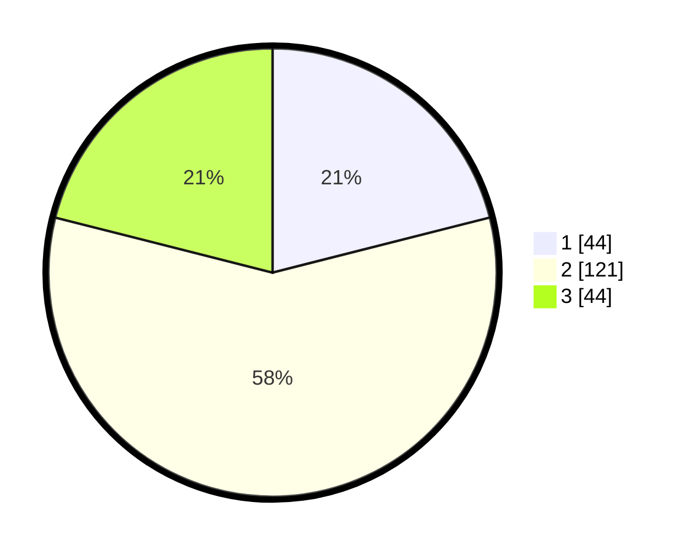

# Hasil

## Grafik

## Tabel

| No. | Nama Paslon    | Suara | Suara (raw) | Persentase |
|:--- |:-------------- | -----:| -----------:| ----------:|
| 1   | ANIES MUHAIMIN | 44    | [44][p-1]   | 21,05      |
| 2   | PRABOWO GIBRAN | 121   | [121][p-2]  | 57,89      |
| 3   | GANJAR MAHFUD  | 44    | [44][p-3]   | 21,05      |

[p-1]: https://github.com/gigit-pemilu/pemilu-2024/blob/main/pilpres/hitung-suara/sub/33-jawa-tengah/sub/25-batang/sub/12-warungasem/sub/2013-sawahjoho/sub/006-tps/sub/paslon-1.txt
[p-2]: https://github.com/gigit-pemilu/pemilu-2024/blob/main/pilpres/hitung-suara/sub/33-jawa-tengah/sub/25-batang/sub/12-warungasem/sub/2013-sawahjoho/sub/006-tps/sub/paslon-2.txt
[p-3]: https://github.com/gigit-pemilu/pemilu-2024/blob/main/pilpres/hitung-suara/sub/33-jawa-tengah/sub/25-batang/sub/12-warungasem/sub/2013-sawahjoho/sub/006-tps/sub/paslon-3.txt

## Foto C Plano

https://sirekap-obj-formc.kpu.go.id/58a1/pemilu/ppwp/33/25/12/20/13/3325122013006-20240214-222503--ff131b9e-5c07-4836-8cf4-d563d876801c.jpg

https://sirekap-obj-formc.kpu.go.id/58a1/pemilu/ppwp/33/25/12/20/13/3325122013006-20240214-222747--fa2b3cc5-4f45-464a-8c6a-6a566bfaeee3.jpg

https://sirekap-obj-formc.kpu.go.id/58a1/pemilu/ppwp/33/25/12/20/13/3325122013006-20240214-223144--4b371346-a48c-43be-8af2-f3ab302ee9d5.jpg

## Metadata

| Key        | Value               |
| ---------- | ------------------- |
| Time Stamp | 2024-02-16 08:30:27 |

