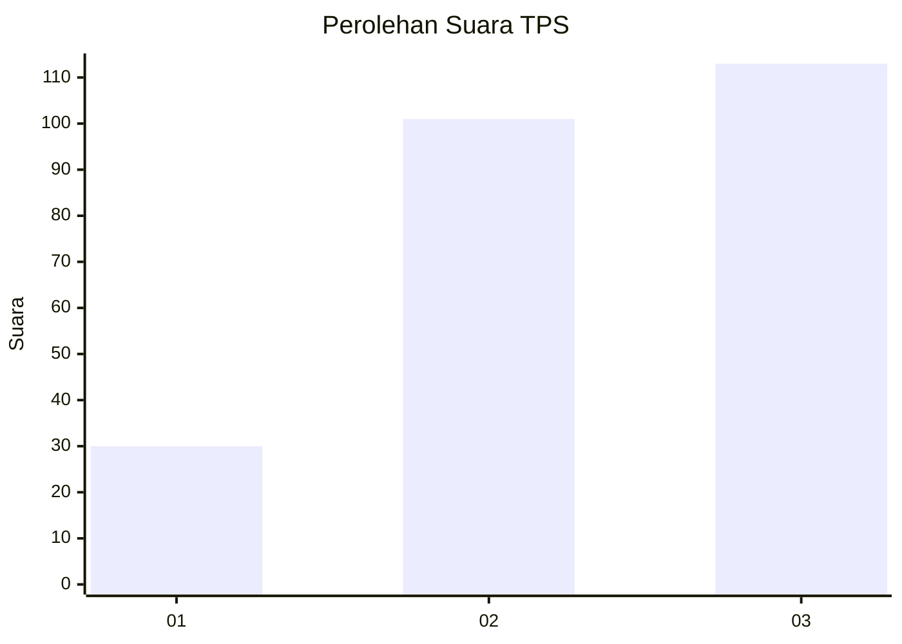
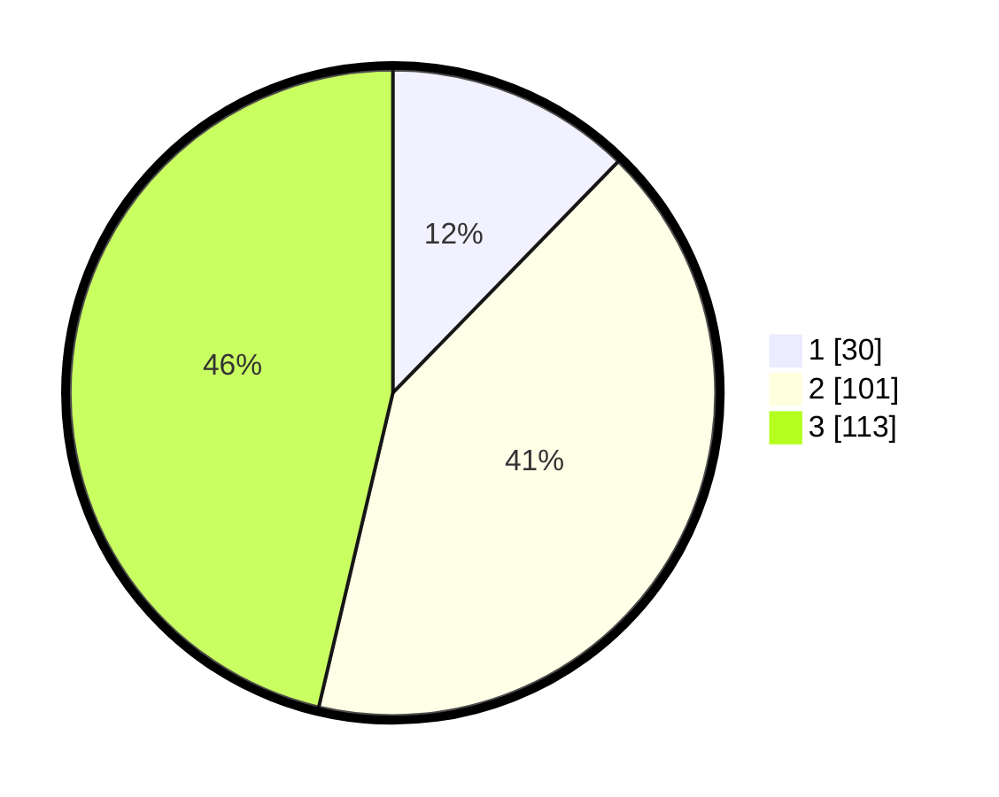

# Hasil

## Grafik

## Tabel

| No. | Nama Paslon    | Suara | Suara (raw) | Persentase |
|:--- |:-------------- | -----:| -----------:| ----------:|
| 1   | ANIES MUHAIMIN | 30    | [30][p-1]   | 12,30      |
| 2   | PRABOWO GIBRAN | 101   | [101][p-2]  | 41,39      |
| 3   | GANJAR MAHFUD  | 113   | [113][p-3]  | 46,31      |

[p-1]: https://github.com/gigit-pemilu/pemilu-2024-33-jawa-tengah/blob/main/pilpres/hitung-suara/sub/33-jawa-tengah/sub/25-batang/sub/12-warungasem/sub/2015-lebo/sub/008-tps/sub/paslon-1.txt
[p-2]: https://github.com/gigit-pemilu/pemilu-2024-33-jawa-tengah/blob/main/pilpres/hitung-suara/sub/33-jawa-tengah/sub/25-batang/sub/12-warungasem/sub/2015-lebo/sub/008-tps/sub/paslon-2.txt
[p-3]: https://github.com/gigit-pemilu/pemilu-2024-33-jawa-tengah/blob/main/pilpres/hitung-suara/sub/33-jawa-tengah/sub/25-batang/sub/12-warungasem/sub/2015-lebo/sub/008-tps/sub/paslon-3.txt

## Foto C Plano

https://sirekap-obj-formc.kpu.go.id/f69a/pemilu/ppwp/33/25/12/20/15/3325122015008-20240214-225408--13d78804-8cb9-4e30-8872-75cdb5c8a682.jpg

https://sirekap-obj-formc.kpu.go.id/f69a/pemilu/ppwp/33/25/12/20/15/3325122015008-20240214-225626--5d9167e1-23fb-45af-aa72-7e8684b9a08b.jpg

https://sirekap-obj-formc.kpu.go.id/f69a/pemilu/ppwp/33/25/12/20/15/3325122015008-20240214-225805--e1424b53-fb2b-4141-b657-d4a0f53e6631.jpg

## Metadata

| Key        | Value               |
| ---------- | ------------------- |
| Time Stamp | 2024-02-16 08:30:27 |

