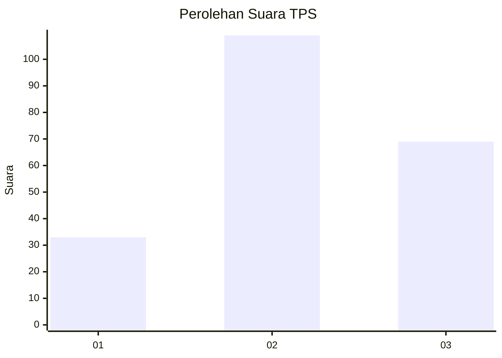
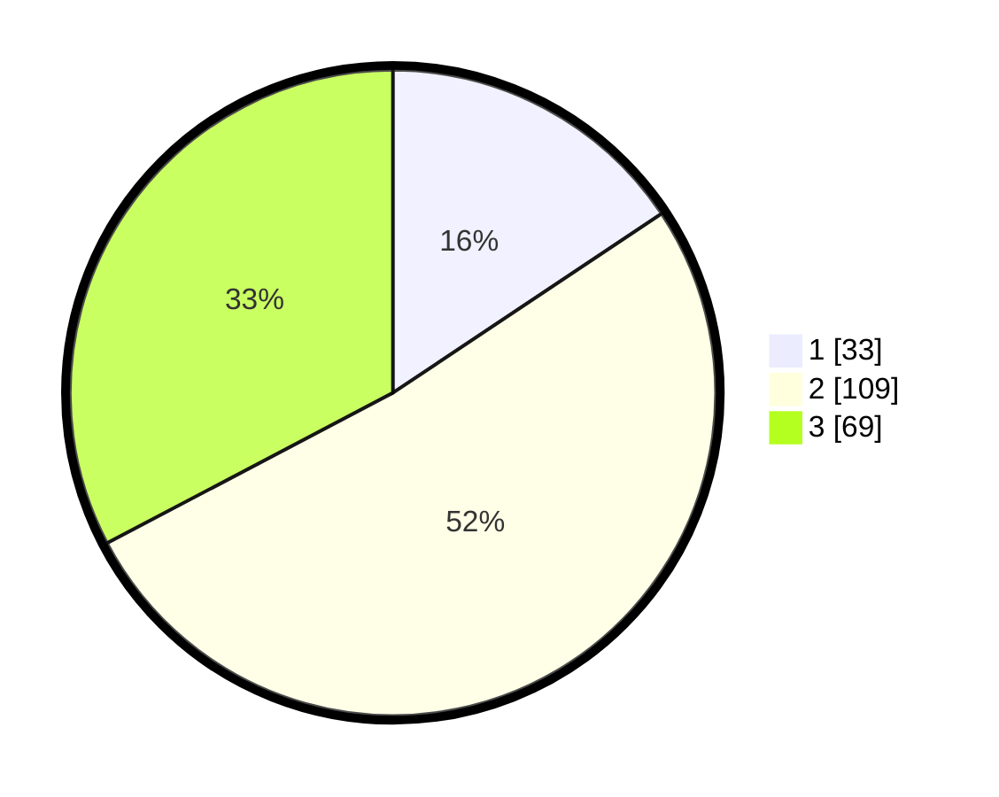

# Hasil

## Grafik

## Tabel

| No. | Nama Paslon    | Suara | Suara (raw) | Persentase |
|:--- |:-------------- | -----:| -----------:| ----------:|
| 1   | ANIES MUHAIMIN | 33    | [33][p-1]   | 15,64      |
| 2   | PRABOWO GIBRAN | 109   | [109][p-2]  | 51,66      |
| 3   | GANJAR MAHFUD  | 69    | [69][p-3]   | 32,70      |

[p-1]: https://github.com/gigit-pemilu/pemilu-2024/blob/main/pilpres/hitung-suara/sub/33-jawa-tengah/sub/25-batang/sub/13-kandeman/sub/2010-ujungnegoro/sub/005-tps/sub/paslon-1.txt
[p-2]: https://github.com/gigit-pemilu/pemilu-2024/blob/main/pilpres/hitung-suara/sub/33-jawa-tengah/sub/25-batang/sub/13-kandeman/sub/2010-ujungnegoro/sub/005-tps/sub/paslon-2.txt
[p-3]: https://github.com/gigit-pemilu/pemilu-2024/blob/main/pilpres/hitung-suara/sub/33-jawa-tengah/sub/25-batang/sub/13-kandeman/sub/2010-ujungnegoro/sub/005-tps/sub/paslon-3.txt

## Foto C Plano

https://sirekap-obj-formc.kpu.go.id/06a3/pemilu/ppwp/33/25/13/20/10/3325132010005-20240215-000626--b6d34b7f-e708-42ef-a500-4d5d0f3299af.jpg

https://sirekap-obj-formc.kpu.go.id/06a3/pemilu/ppwp/33/25/13/20/10/3325132010005-20240215-000906--701139c4-5dfa-4323-ac99-04d0dcd0cbfc.jpg

https://sirekap-obj-formc.kpu.go.id/06a3/pemilu/ppwp/33/25/13/20/10/3325132010005-20240215-001043--ff7a338f-c294-4546-ad9f-37a5804a9bf7.jpg

## Metadata

| Key        | Value               |
| ---------- | ------------------- |
| Time Stamp | 2024-02-15 22:30:27 |

