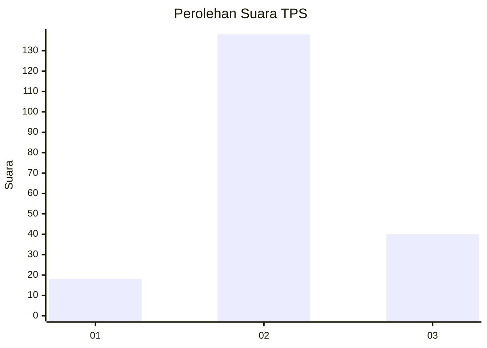
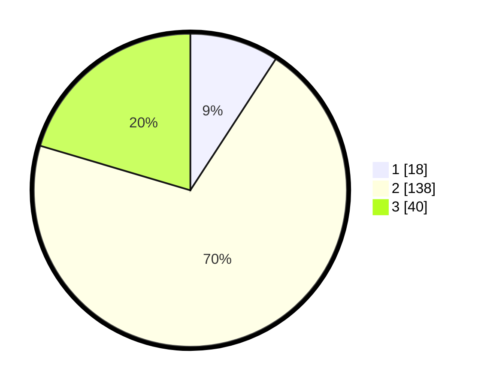

# Hasil

## Grafik

## Tabel

| No. | Nama Paslon    | Suara | Suara (raw) | Persentase |
|:--- |:-------------- | -----:| -----------:| ----------:|
| 1   | ANIES MUHAIMIN | 18    | [18][p-1]   | 9,18       |
| 2   | PRABOWO GIBRAN | 138   | [138][p-2]  | 70,41      |
| 3   | GANJAR MAHFUD  | 40    | [40][p-3]   | 20,41      |

[p-1]: https://github.com/gigit-pemilu/pemilu-2024/blob/main/pilpres/hitung-suara/sub/33-jawa-tengah/sub/25-batang/sub/13-kandeman/sub/2010-ujungnegoro/sub/006-tps/sub/paslon-1.txt
[p-2]: https://github.com/gigit-pemilu/pemilu-2024/blob/main/pilpres/hitung-suara/sub/33-jawa-tengah/sub/25-batang/sub/13-kandeman/sub/2010-ujungnegoro/sub/006-tps/sub/paslon-2.txt
[p-3]: https://github.com/gigit-pemilu/pemilu-2024/blob/main/pilpres/hitung-suara/sub/33-jawa-tengah/sub/25-batang/sub/13-kandeman/sub/2010-ujungnegoro/sub/006-tps/sub/paslon-3.txt

## Foto C Plano

https://sirekap-obj-formc.kpu.go.id/00a5/pemilu/ppwp/33/25/13/20/10/3325132010006-20240214-232800--05c15190-0f8b-4b5a-a84b-cd2fa6ef27be.jpg

https://sirekap-obj-formc.kpu.go.id/00a5/pemilu/ppwp/33/25/13/20/10/3325132010006-20240214-233144--148a3c80-2f90-4099-8a1b-f3d6559ff3ea.jpg

https://sirekap-obj-formc.kpu.go.id/00a5/pemilu/ppwp/33/25/13/20/10/3325132010006-20240214-233325--1a737cc3-d54c-4bf2-b284-8950a9cc82c4.jpg

## Metadata

| Key        | Value               |
| ---------- | ------------------- |
| Time Stamp | 2024-02-16 08:30:27 |

