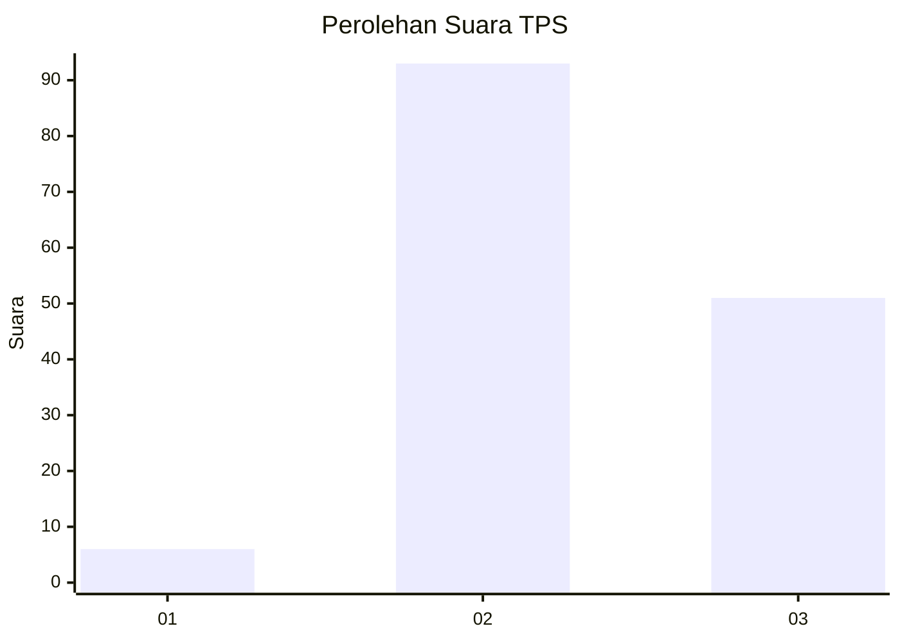
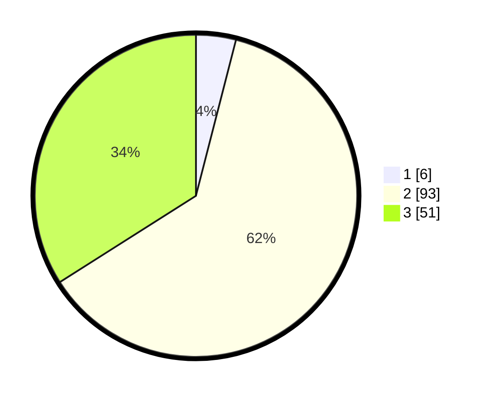

# Hasil

## Grafik

## Tabel

| No. | Nama Paslon    | Suara | Suara (raw) | Persentase |
|:--- |:-------------- | -----:| -----------:| ----------:|
| 1   | ANIES MUHAIMIN | 6     | [6][p-1]    | 4,00       |
| 2   | PRABOWO GIBRAN | 93    | [93][p-2]   | 62,00      |
| 3   | GANJAR MAHFUD  | 51    | [51][p-3]   | 34,00      |

[p-1]: https://github.com/gigit-pemilu/pemilu-2024-33-jawa-tengah/blob/main/pilpres/hitung-suara/sub/33-jawa-tengah/sub/25-batang/sub/14-pecalungan/sub/2001-pecalungan/sub/001-tps/sub/paslon-1.txt
[p-2]: https://github.com/gigit-pemilu/pemilu-2024-33-jawa-tengah/blob/main/pilpres/hitung-suara/sub/33-jawa-tengah/sub/25-batang/sub/14-pecalungan/sub/2001-pecalungan/sub/001-tps/sub/paslon-2.txt
[p-3]: https://github.com/gigit-pemilu/pemilu-2024-33-jawa-tengah/blob/main/pilpres/hitung-suara/sub/33-jawa-tengah/sub/25-batang/sub/14-pecalungan/sub/2001-pecalungan/sub/001-tps/sub/paslon-3.txt

## Foto C Plano

https://sirekap-obj-formc.kpu.go.id/3c72/pemilu/ppwp/33/25/14/20/01/3325142001001-20240214-205337--912cf9c1-be11-4c91-9a15-4e72d48a6b45.jpg

https://sirekap-obj-formc.kpu.go.id/3c72/pemilu/ppwp/33/25/14/20/01/3325142001001-20240214-202145--0f9e4d9d-81f6-4229-91d3-7831706525e6.jpg

https://sirekap-obj-formc.kpu.go.id/3c72/pemilu/ppwp/33/25/14/20/01/3325142001001-20240214-202259--9abd666c-82ae-4fef-aab5-adb71a819026.jpg

## Metadata

| Key        | Value               |
| ---------- | ------------------- |
| Time Stamp | 2024-02-15 15:00:29 |

