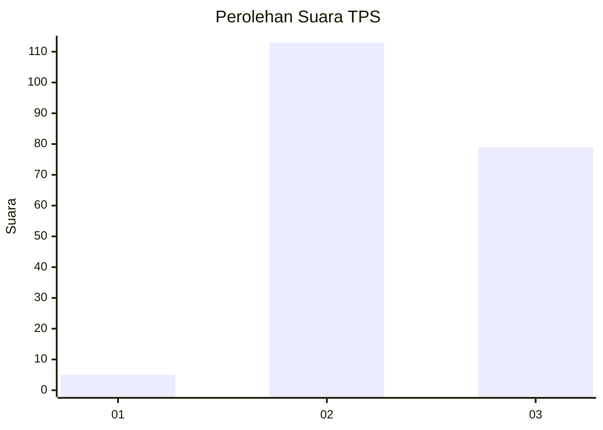
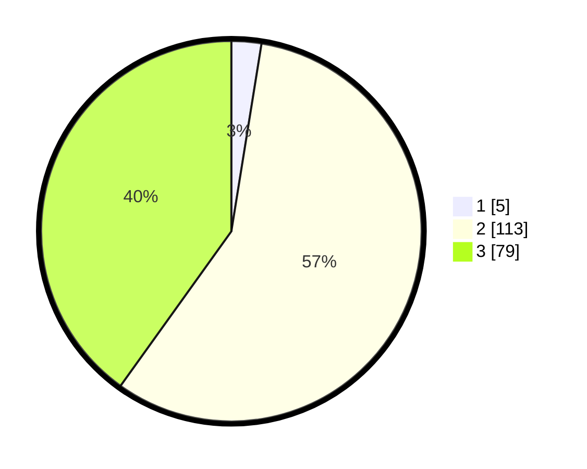

# Hasil

## Grafik

## Tabel

| No. | Nama Paslon    | Suara | Suara (raw) | Persentase |
|:--- |:-------------- | -----:| -----------:| ----------:|
| 1   | ANIES MUHAIMIN | 5     | [5][p-1]    | 2,54       |
| 2   | PRABOWO GIBRAN | 113   | [113][p-2]  | 57,36      |
| 3   | GANJAR MAHFUD  | 79    | [79][p-3]   | 40,10      |

[p-1]: https://github.com/gigit-pemilu/pemilu-2024/blob/main/pilpres/hitung-suara/sub/33-jawa-tengah/sub/25-batang/sub/14-pecalungan/sub/2001-pecalungan/sub/002-tps/sub/paslon-1.txt
[p-2]: https://github.com/gigit-pemilu/pemilu-2024/blob/main/pilpres/hitung-suara/sub/33-jawa-tengah/sub/25-batang/sub/14-pecalungan/sub/2001-pecalungan/sub/002-tps/sub/paslon-2.txt
[p-3]: https://github.com/gigit-pemilu/pemilu-2024/blob/main/pilpres/hitung-suara/sub/33-jawa-tengah/sub/25-batang/sub/14-pecalungan/sub/2001-pecalungan/sub/002-tps/sub/paslon-3.txt

## Foto C Plano

https://sirekap-obj-formc.kpu.go.id/0527/pemilu/ppwp/33/25/14/20/01/3325142001002-20240214-233920--f00cf3b6-ba8e-40bc-b543-5535c4a74de1.jpg

https://sirekap-obj-formc.kpu.go.id/0527/pemilu/ppwp/33/25/14/20/01/3325142001002-20240214-234141--537b1a8b-51d6-4aad-9e09-144e529132c3.jpg

https://sirekap-obj-formc.kpu.go.id/0527/pemilu/ppwp/33/25/14/20/01/3325142001002-20240214-234227--9da7873e-dd6f-4f37-828c-3c3ae9caf44b.jpg

## Metadata

| Key        | Value               |
| ---------- | ------------------- |
| Time Stamp | 2024-02-15 22:00:27 |

