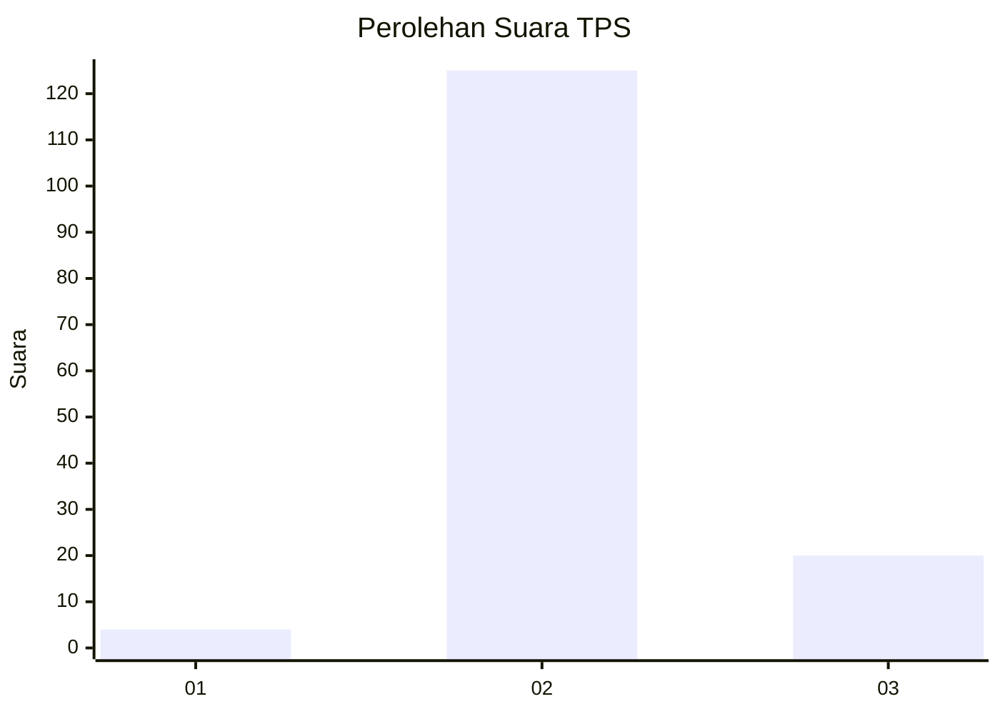
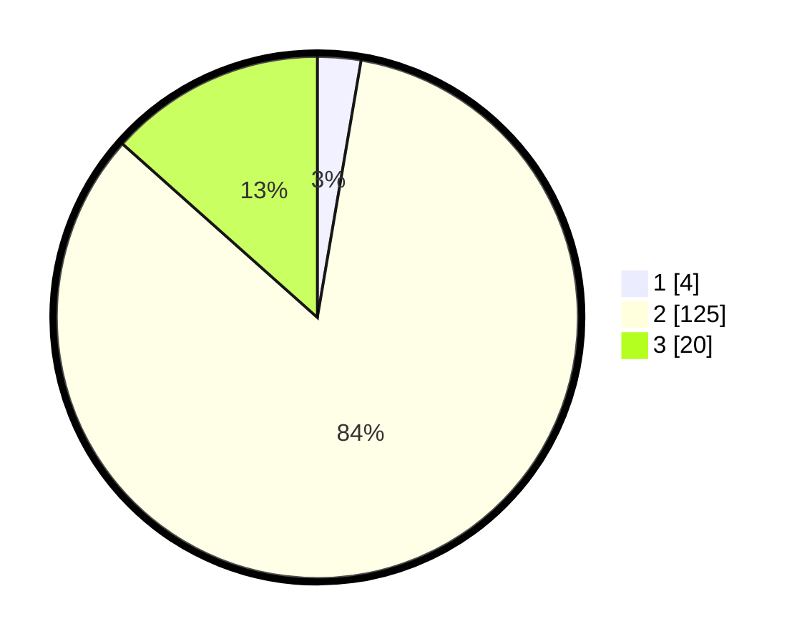

# Hasil

## Grafik

## Tabel

| No. | Nama Paslon    | Suara | Suara (raw) | Persentase |
|:--- |:-------------- | -----:| -----------:| ----------:|
| 1   | ANIES MUHAIMIN | 4     | [4][p-1]    | 2,68       |
| 2   | PRABOWO GIBRAN | 125   | [125][p-2]  | 83,89      |
| 3   | GANJAR MAHFUD  | 20    | [20][p-3]   | 13,42      |

[p-1]: https://github.com/gigit-pemilu/pemilu-2024/blob/main/pilpres/hitung-suara/sub/33-jawa-tengah/sub/25-batang/sub/14-pecalungan/sub/2006-pretek/sub/017-tps/sub/paslon-1.txt
[p-2]: https://github.com/gigit-pemilu/pemilu-2024/blob/main/pilpres/hitung-suara/sub/33-jawa-tengah/sub/25-batang/sub/14-pecalungan/sub/2006-pretek/sub/017-tps/sub/paslon-2.txt
[p-3]: https://github.com/gigit-pemilu/pemilu-2024/blob/main/pilpres/hitung-suara/sub/33-jawa-tengah/sub/25-batang/sub/14-pecalungan/sub/2006-pretek/sub/017-tps/sub/paslon-3.txt

## Foto C Plano

https://sirekap-obj-formc.kpu.go.id/8ea4/pemilu/ppwp/33/25/14/20/06/3325142006017-20240215-010554--e59f09df-2142-4b8c-ac69-aff2a46d28a1.jpg

https://sirekap-obj-formc.kpu.go.id/8ea4/pemilu/ppwp/33/25/14/20/06/3325142006017-20240215-010635--cba007b2-fd7b-4b4f-8132-1296a456fe12.jpg

https://sirekap-obj-formc.kpu.go.id/8ea4/pemilu/ppwp/33/25/14/20/06/3325142006017-20240214-185704--269b7b45-8639-4087-8ced-cb8dd479ce4c.jpg

## Metadata

| Key        | Value               |
| ---------- | ------------------- |
| Time Stamp | 2024-02-15 22:00:27 |

