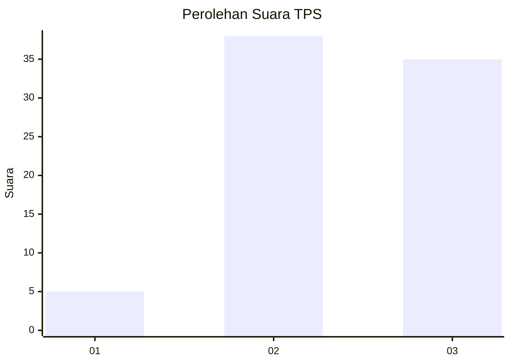
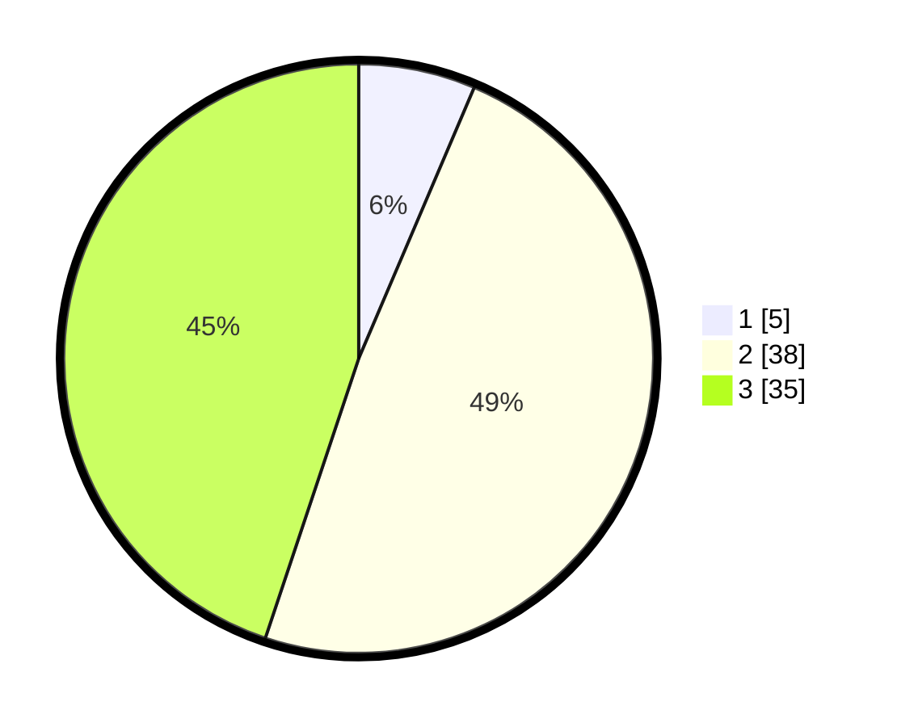

# Hasil

## Grafik

## Tabel

| No. | Nama Paslon    | Suara | Suara (raw) | Persentase |
|:--- |:-------------- | -----:| -----------:| ----------:|
| 1   | ANIES MUHAIMIN | 5     | [5][p-1]    | 6,41       |
| 2   | PRABOWO GIBRAN | 38    | [38][p-2]   | 48,72      |
| 3   | GANJAR MAHFUD  | 35    | [35][p-3]   | 44,87      |

[p-1]: https://github.com/gigit-pemilu/pemilu-2024/blob/main/pilpres/hitung-suara/sub/33-jawa-tengah/sub/25-batang/sub/14-pecalungan/sub/2007-selokarto/sub/012-tps/sub/paslon-1.txt
[p-2]: https://github.com/gigit-pemilu/pemilu-2024/blob/main/pilpres/hitung-suara/sub/33-jawa-tengah/sub/25-batang/sub/14-pecalungan/sub/2007-selokarto/sub/012-tps/sub/paslon-2.txt
[p-3]: https://github.com/gigit-pemilu/pemilu-2024/blob/main/pilpres/hitung-suara/sub/33-jawa-tengah/sub/25-batang/sub/14-pecalungan/sub/2007-selokarto/sub/012-tps/sub/paslon-3.txt

## Foto C Plano

https://sirekap-obj-formc.kpu.go.id/69c5/pemilu/ppwp/33/25/14/20/07/3325142007012-20240215-010500--bc4f64ef-a3ac-49d0-b900-f330b35488ee.jpg

https://sirekap-obj-formc.kpu.go.id/69c5/pemilu/ppwp/33/25/14/20/07/3325142007012-20240215-010538--c81d5900-bf91-4086-a226-7f8eead36f23.jpg

https://sirekap-obj-formc.kpu.go.id/69c5/pemilu/ppwp/33/25/14/20/07/3325142007012-20240215-010615--e225109c-a260-4f11-87e3-0264ceeb2538.jpg

## Metadata

| Key        | Value               |
| ---------- | ------------------- |
| Time Stamp | 2024-02-15 22:00:27 |

