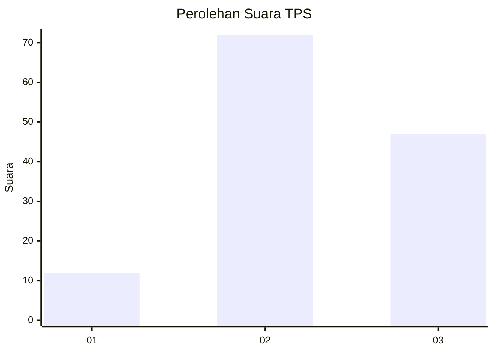
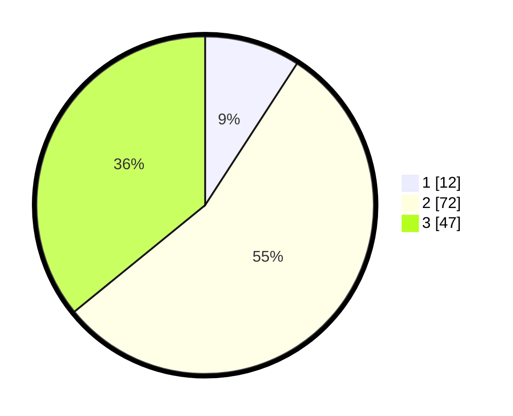

# Hasil

## Grafik

## Tabel

| No. | Nama Paslon    | Suara | Suara (raw) | Persentase |
|:--- |:-------------- | -----:| -----------:| ----------:|
| 1   | ANIES MUHAIMIN | 12    | [12][p-1]   | 9,16       |
| 2   | PRABOWO GIBRAN | 72    | [72][p-2]   | 54,96      |
| 3   | GANJAR MAHFUD  | 47    | [47][p-3]   | 35,88      |

[p-1]: https://github.com/gigit-pemilu/pemilu-2024/blob/main/pilpres/hitung-suara/sub/33-jawa-tengah/sub/25-batang/sub/14-pecalungan/sub/2008-gemuh/sub/004-tps/sub/paslon-1.txt
[p-2]: https://github.com/gigit-pemilu/pemilu-2024/blob/main/pilpres/hitung-suara/sub/33-jawa-tengah/sub/25-batang/sub/14-pecalungan/sub/2008-gemuh/sub/004-tps/sub/paslon-2.txt
[p-3]: https://github.com/gigit-pemilu/pemilu-2024/blob/main/pilpres/hitung-suara/sub/33-jawa-tengah/sub/25-batang/sub/14-pecalungan/sub/2008-gemuh/sub/004-tps/sub/paslon-3.txt

## Foto C Plano

https://sirekap-obj-formc.kpu.go.id/15c9/pemilu/ppwp/33/25/14/20/08/3325142008004-20240215-001521--ce9a3feb-2ff5-4b70-8456-567fa3e4fed7.jpg

https://sirekap-obj-formc.kpu.go.id/15c9/pemilu/ppwp/33/25/14/20/08/3325142008004-20240215-002009--2a11dadd-b33b-4a3d-aeb2-67b773a5ee5b.jpg

https://sirekap-obj-formc.kpu.go.id/15c9/pemilu/ppwp/33/25/14/20/08/3325142008004-20240214-230800--8de9fec4-7084-4987-8c86-7e0f93583e93.jpg

## Metadata

| Key        | Value               |
| ---------- | ------------------- |
| Time Stamp | 2024-02-15 22:30:27 |

