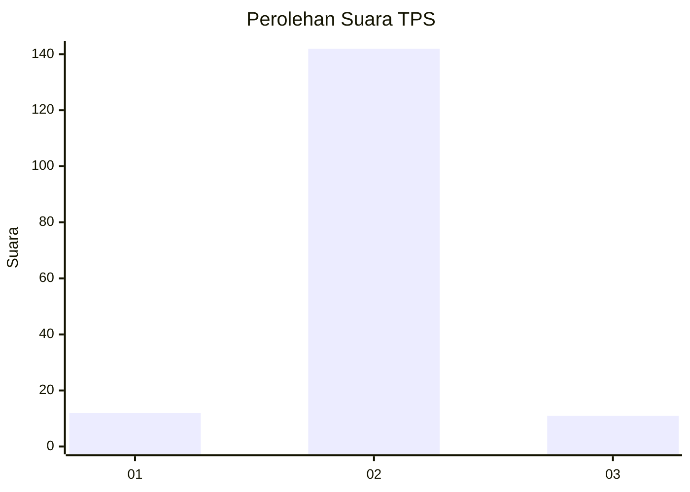
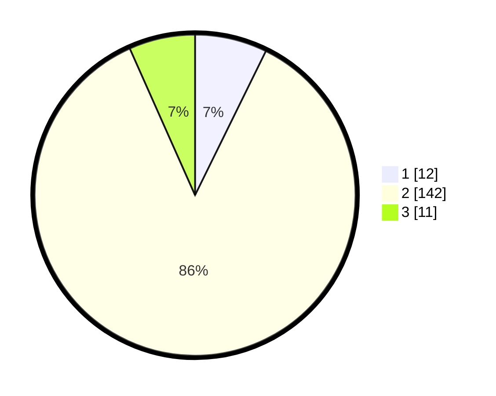

# Hasil

## Grafik

## Tabel

| No. | Nama Paslon    | Suara | Suara (raw) | Persentase |
|:--- |:-------------- | -----:| -----------:| ----------:|
| 1   | ANIES MUHAIMIN | 12    | [12][p-1]   | 7,27       |
| 2   | PRABOWO GIBRAN | 142   | [142][p-2]  | 86,06      |
| 3   | GANJAR MAHFUD  | 11    | [11][p-3]   | 6,67       |

[p-1]: https://github.com/gigit-pemilu/pemilu-2024/blob/main/pilpres/hitung-suara/sub/33-jawa-tengah/sub/25-batang/sub/14-pecalungan/sub/2008-gemuh/sub/005-tps/sub/paslon-1.txt
[p-2]: https://github.com/gigit-pemilu/pemilu-2024/blob/main/pilpres/hitung-suara/sub/33-jawa-tengah/sub/25-batang/sub/14-pecalungan/sub/2008-gemuh/sub/005-tps/sub/paslon-2.txt
[p-3]: https://github.com/gigit-pemilu/pemilu-2024/blob/main/pilpres/hitung-suara/sub/33-jawa-tengah/sub/25-batang/sub/14-pecalungan/sub/2008-gemuh/sub/005-tps/sub/paslon-3.txt

## Foto C Plano

https://sirekap-obj-formc.kpu.go.id/91b3/pemilu/ppwp/33/25/14/20/08/3325142008005-20240215-005202--3d26d7cc-524b-4405-a686-b9ee6a08a4e2.jpg

https://sirekap-obj-formc.kpu.go.id/91b3/pemilu/ppwp/33/25/14/20/08/3325142008005-20240215-005325--719e8e56-b71a-46f4-be76-a5059db486c6.jpg

https://sirekap-obj-formc.kpu.go.id/91b3/pemilu/ppwp/33/25/14/20/08/3325142008005-20240215-005504--a345abb8-873c-4484-9df7-c7d536105768.jpg

## Metadata

| Key        | Value               |
| ---------- | ------------------- |
| Time Stamp | 2024-02-15 22:30:27 |

