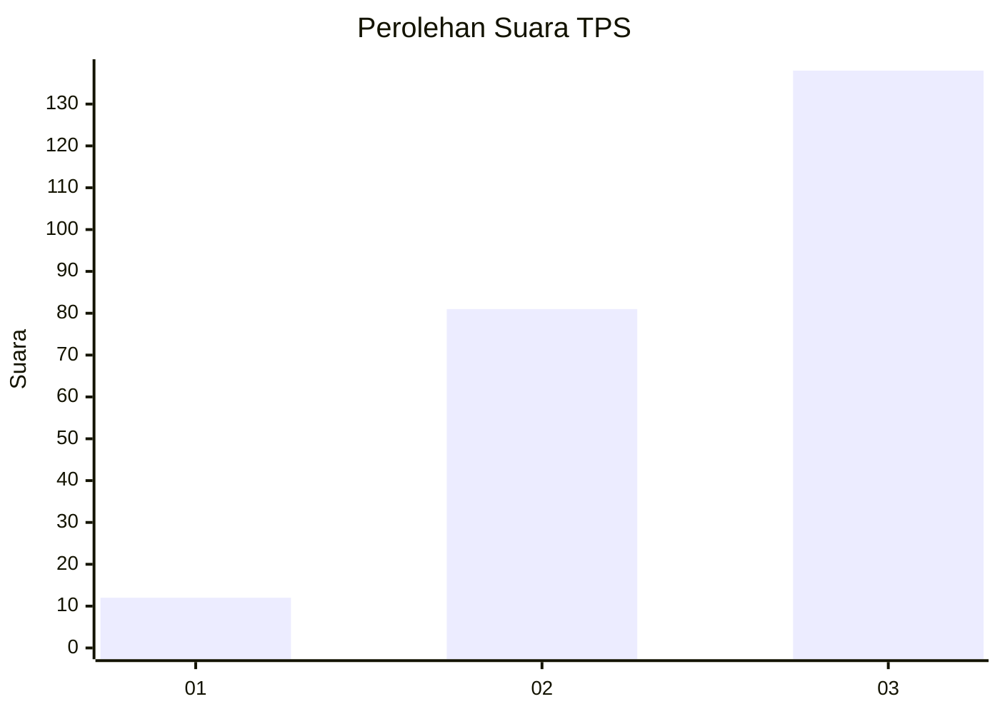
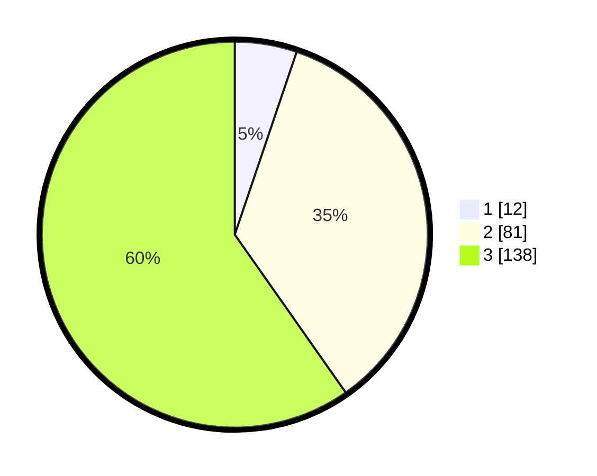

# Hasil

## Grafik

## Tabel

| No. | Nama Paslon    | Suara | Suara (raw) | Persentase |
|:--- |:-------------- | -----:| -----------:| ----------:|
| 1   | ANIES MUHAIMIN | 12    | [12][p-1]   | 5,19       |
| 2   | PRABOWO GIBRAN | 81    | [81][p-2]   | 35,06      |
| 3   | GANJAR MAHFUD  | 138   | [138][p-3]  | 59,74      |

[p-1]: https://github.com/gigit-pemilu/pemilu-2024-33-jawa-tengah/blob/main/pilpres/hitung-suara/sub/33-jawa-tengah/sub/26-pekalongan/sub/01-kandangserang/sub/2001-klesem/sub/001-tps/sub/paslon-1.txt
[p-2]: https://github.com/gigit-pemilu/pemilu-2024-33-jawa-tengah/blob/main/pilpres/hitung-suara/sub/33-jawa-tengah/sub/26-pekalongan/sub/01-kandangserang/sub/2001-klesem/sub/001-tps/sub/paslon-2.txt
[p-3]: https://github.com/gigit-pemilu/pemilu-2024-33-jawa-tengah/blob/main/pilpres/hitung-suara/sub/33-jawa-tengah/sub/26-pekalongan/sub/01-kandangserang/sub/2001-klesem/sub/001-tps/sub/paslon-3.txt

## Foto C Plano

https://sirekap-obj-formc.kpu.go.id/4860/pemilu/ppwp/33/26/01/20/01/3326012001001-20240215-003905--9cc64f72-b022-48b7-9065-f4140d23b4cc.jpg

https://sirekap-obj-formc.kpu.go.id/4860/pemilu/ppwp/33/26/01/20/01/3326012001001-20240218-174151--a3b02c39-63c1-4cd1-8e62-42f5dfe0ab68.jpg

https://sirekap-obj-formc.kpu.go.id/4860/pemilu/ppwp/33/26/01/20/01/3326012001001-20240215-004506--3108c42d-b013-41a7-ad33-92205f82d959.jpg

## Metadata

| Key        | Value               |
| ---------- | ------------------- |
| Time Stamp | 2024-02-19 06:16:00 |

