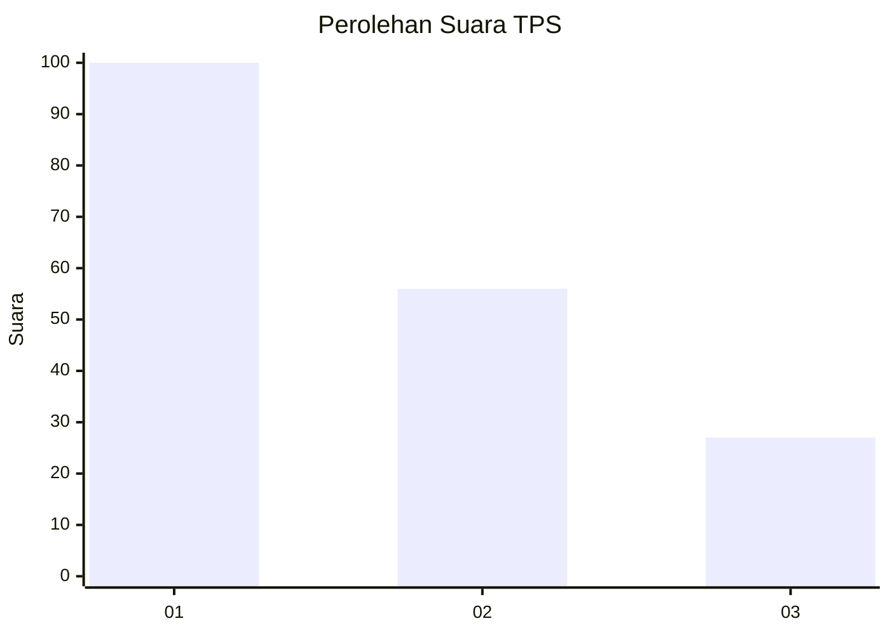
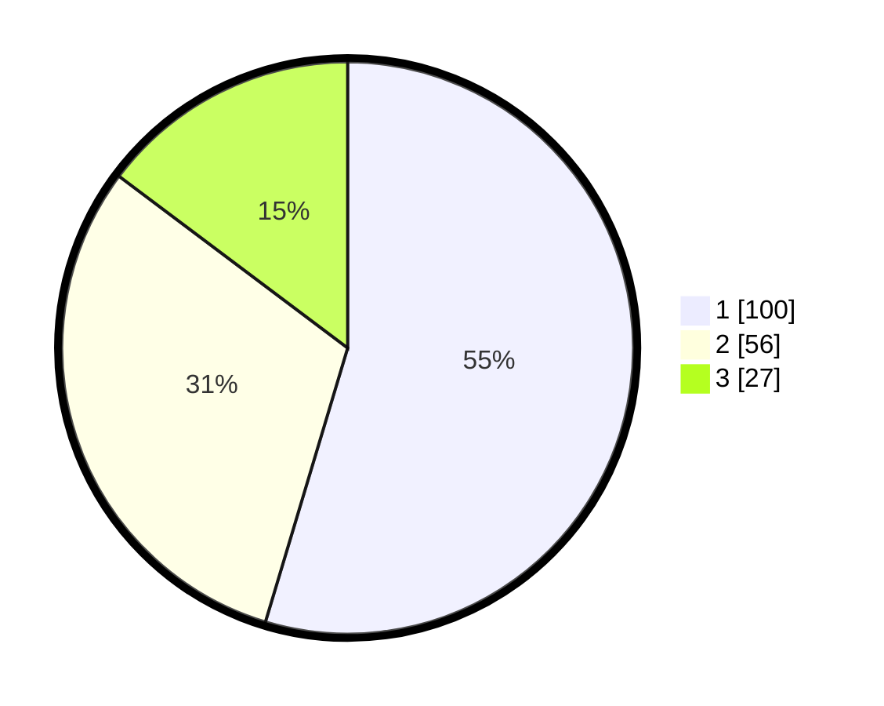

# Hasil

## Grafik

## Tabel

| No. | Nama Paslon    | Suara | Suara (raw) | Persentase |
|:--- |:-------------- | -----:| -----------:| ----------:|
| 1   | ANIES MUHAIMIN | 100   | [100][p-1]  | 54,64      |
| 2   | PRABOWO GIBRAN | 56    | [56][p-2]   | 30,60      |
| 3   | GANJAR MAHFUD  | 27    | [27][p-3]   | 14,75      |

[p-1]: https://github.com/gigit-pemilu/pemilu-2024/blob/main/pilpres/hitung-suara/sub/33-jawa-tengah/sub/26-pekalongan/sub/02-paninggaran/sub/2004-lumeneng/sub/005-tps/sub/paslon-1.txt
[p-2]: https://github.com/gigit-pemilu/pemilu-2024/blob/main/pilpres/hitung-suara/sub/33-jawa-tengah/sub/26-pekalongan/sub/02-paninggaran/sub/2004-lumeneng/sub/005-tps/sub/paslon-2.txt
[p-3]: https://github.com/gigit-pemilu/pemilu-2024/blob/main/pilpres/hitung-suara/sub/33-jawa-tengah/sub/26-pekalongan/sub/02-paninggaran/sub/2004-lumeneng/sub/005-tps/sub/paslon-3.txt

## Foto C Plano

https://sirekap-obj-formc.kpu.go.id/405f/pemilu/ppwp/33/26/02/20/04/3326022004005-20240215-054630--6c10639a-1176-4f47-9826-9e811965f2b7.jpg

https://sirekap-obj-formc.kpu.go.id/405f/pemilu/ppwp/33/26/02/20/04/3326022004005-20240215-054833--ea2a5d4d-bfe6-4259-a01d-ca5b5270ec33.jpg

https://sirekap-obj-formc.kpu.go.id/405f/pemilu/ppwp/33/26/02/20/04/3326022004005-20240215-055014--279c98f8-72ab-408d-99e2-7e78f0d0f437.jpg

## Metadata

| Key        | Value               |
| ---------- | ------------------- |
| Time Stamp | 2024-02-17 01:07:28 |

