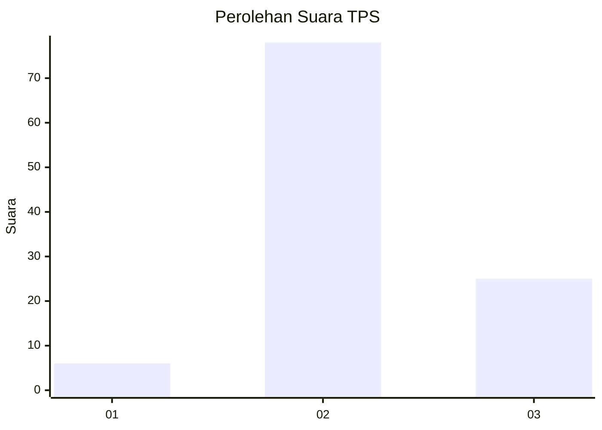
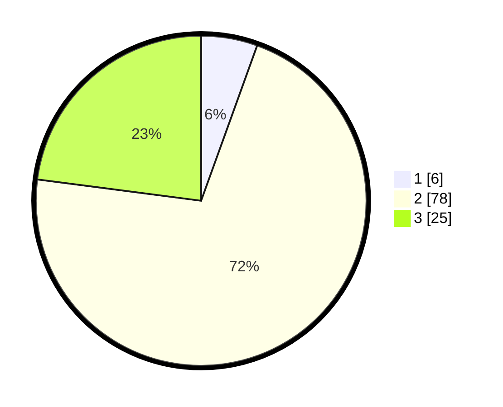

# Hasil

## Grafik

## Tabel

| No. | Nama Paslon    | Suara | Suara (raw) | Persentase |
|:--- |:-------------- | -----:| -----------:| ----------:|
| 1   | ANIES MUHAIMIN | 6     | [6][p-1]    | 5,50       |
| 2   | PRABOWO GIBRAN | 78    | [78][p-2]   | 71,56      |
| 3   | GANJAR MAHFUD  | 25    | [25][p-3]   | 22,94      |

[p-1]: https://github.com/gigit-pemilu/pemilu-2024/blob/main/pilpres/hitung-suara/sub/33-jawa-tengah/sub/26-pekalongan/sub/02-paninggaran/sub/2014-tenogo/sub/002-tps/sub/paslon-1.txt
[p-2]: https://github.com/gigit-pemilu/pemilu-2024/blob/main/pilpres/hitung-suara/sub/33-jawa-tengah/sub/26-pekalongan/sub/02-paninggaran/sub/2014-tenogo/sub/002-tps/sub/paslon-2.txt
[p-3]: https://github.com/gigit-pemilu/pemilu-2024/blob/main/pilpres/hitung-suara/sub/33-jawa-tengah/sub/26-pekalongan/sub/02-paninggaran/sub/2014-tenogo/sub/002-tps/sub/paslon-3.txt

## Foto C Plano

https://sirekap-obj-formc.kpu.go.id/046d/pemilu/ppwp/33/26/02/20/14/3326022014002-20240215-050600--20c5d368-d88d-43e3-99b9-33e70c1eff9c.jpg

https://sirekap-obj-formc.kpu.go.id/046d/pemilu/ppwp/33/26/02/20/14/3326022014002-20240214-221124--aadb5a2e-70d4-4b56-bcac-ffccffd21990.jpg

https://sirekap-obj-formc.kpu.go.id/046d/pemilu/ppwp/33/26/02/20/14/3326022014002-20240214-221309--1a537f96-f530-41dd-b961-69f220fae766.jpg

## Metadata

| Key        | Value               |
| ---------- | ------------------- |
| Time Stamp | 2024-02-15 17:30:25 |

