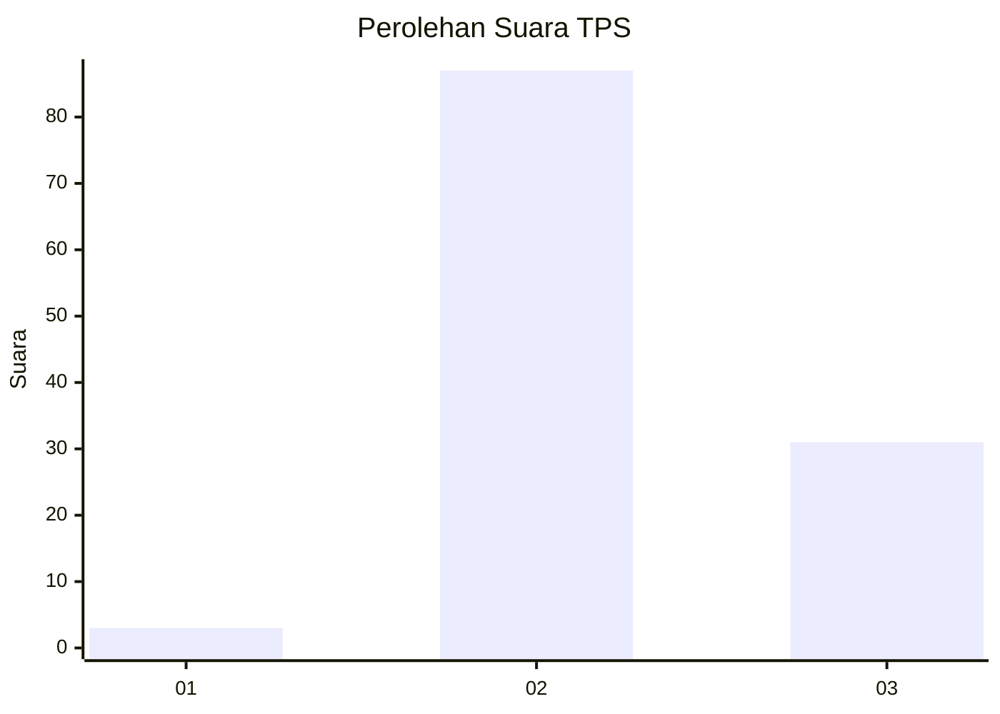
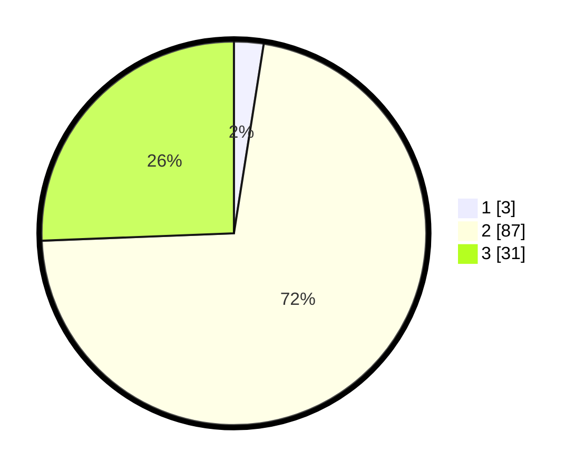

# Hasil

## Grafik

## Tabel

| No. | Nama Paslon    | Suara | Suara (raw) | Persentase |
|:--- |:-------------- | -----:| -----------:| ----------:|
| 1   | ANIES MUHAIMIN | 3     | [3][p-1]    | 2,48       |
| 2   | PRABOWO GIBRAN | 87    | [87][p-2]   | 71,90      |
| 3   | GANJAR MAHFUD  | 31    | [31][p-3]   | 25,62      |

[p-1]: https://github.com/gigit-pemilu/pemilu-2024-33-jawa-tengah/blob/main/pilpres/hitung-suara/sub/33-jawa-tengah/sub/26-pekalongan/sub/03-lebakbarang/sub/2003-depok/sub/002-tps/sub/paslon-1.txt
[p-2]: https://github.com/gigit-pemilu/pemilu-2024-33-jawa-tengah/blob/main/pilpres/hitung-suara/sub/33-jawa-tengah/sub/26-pekalongan/sub/03-lebakbarang/sub/2003-depok/sub/002-tps/sub/paslon-2.txt
[p-3]: https://github.com/gigit-pemilu/pemilu-2024-33-jawa-tengah/blob/main/pilpres/hitung-suara/sub/33-jawa-tengah/sub/26-pekalongan/sub/03-lebakbarang/sub/2003-depok/sub/002-tps/sub/paslon-3.txt

## Foto C Plano

https://sirekap-obj-formc.kpu.go.id/68bf/pemilu/ppwp/33/26/03/20/03/3326032003002-20240215-100833--ad05e27b-4b9e-4cc9-8a10-1ce00bb3fc26.jpg

https://sirekap-obj-formc.kpu.go.id/68bf/pemilu/ppwp/33/26/03/20/03/3326032003002-20240215-101025--e2b02863-5f32-4614-98b1-4c91280e1669.jpg

https://sirekap-obj-formc.kpu.go.id/68bf/pemilu/ppwp/33/26/03/20/03/3326032003002-20240215-101207--3e252d5d-9366-418a-92ca-ef0efd29913d.jpg

## Metadata

| Key        | Value               |
| ---------- | ------------------- |
| Time Stamp | 2024-02-15 19:30:26 |

