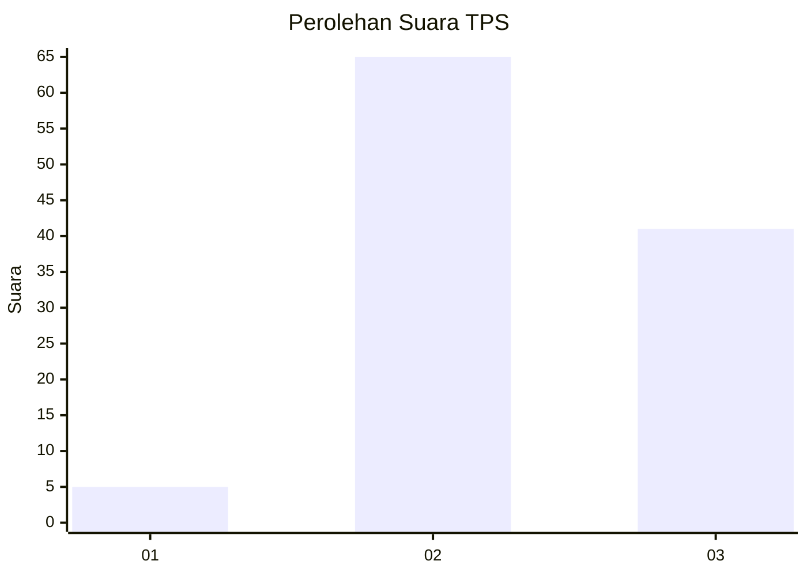
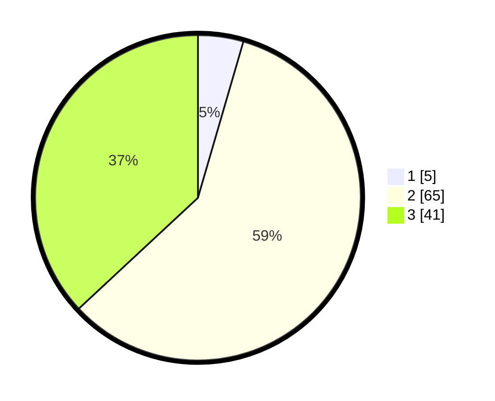

# Hasil

## Grafik

## Tabel

| No. | Nama Paslon    | Suara | Suara (raw) | Persentase |
|:--- |:-------------- | -----:| -----------:| ----------:|
| 1   | ANIES MUHAIMIN | 5     | [5][p-1]    | 4,50       |
| 2   | PRABOWO GIBRAN | 65    | [65][p-2]   | 58,56      |
| 3   | GANJAR MAHFUD  | 41    | [41][p-3]   | 36,94      |

[p-1]: https://github.com/gigit-pemilu/pemilu-2024/blob/main/pilpres/hitung-suara/sub/33-jawa-tengah/sub/26-pekalongan/sub/03-lebakbarang/sub/2011-mendolo/sub/003-tps/sub/paslon-1.txt
[p-2]: https://github.com/gigit-pemilu/pemilu-2024/blob/main/pilpres/hitung-suara/sub/33-jawa-tengah/sub/26-pekalongan/sub/03-lebakbarang/sub/2011-mendolo/sub/003-tps/sub/paslon-2.txt
[p-3]: https://github.com/gigit-pemilu/pemilu-2024/blob/main/pilpres/hitung-suara/sub/33-jawa-tengah/sub/26-pekalongan/sub/03-lebakbarang/sub/2011-mendolo/sub/003-tps/sub/paslon-3.txt

## Foto C Plano

https://sirekap-obj-formc.kpu.go.id/f872/pemilu/ppwp/33/26/03/20/11/3326032011003-20240214-221510--6ce883c7-09cf-4e8d-84db-d6d9939d5ae0.jpg

https://sirekap-obj-formc.kpu.go.id/f872/pemilu/ppwp/33/26/03/20/11/3326032011003-20240214-221858--44f7d693-3ec3-40b8-81f7-24de5d1f2e57.jpg

https://sirekap-obj-formc.kpu.go.id/f872/pemilu/ppwp/33/26/03/20/11/3326032011003-20240214-222239--7fe3f4fc-54c2-4e5a-b337-f38d8876770f.jpg

## Metadata

| Key        | Value               |
| ---------- | ------------------- |
| Time Stamp | 2024-02-15 18:00:26 |

