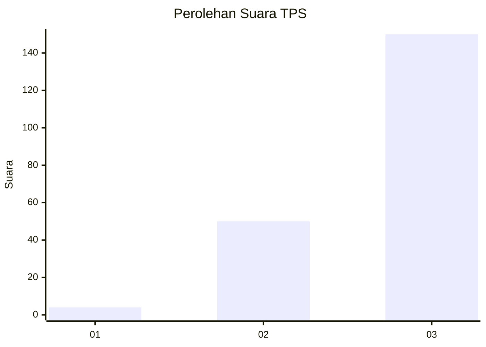
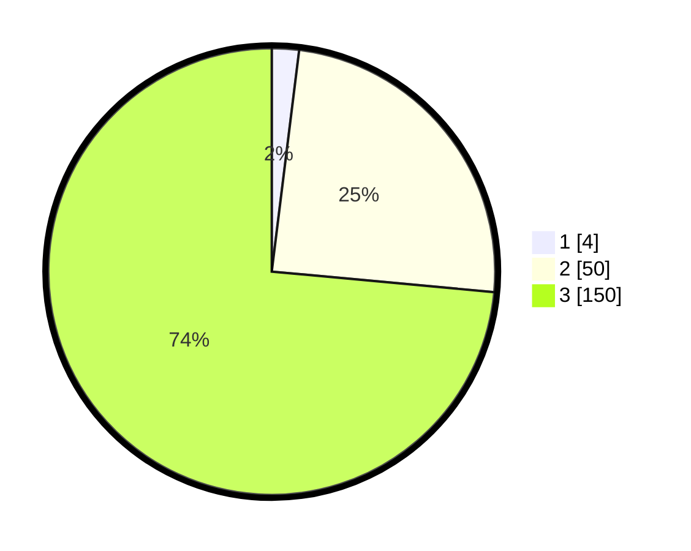

# Hasil

## Grafik

## Tabel

| No. | Nama Paslon    | Suara | Suara (raw) | Persentase |
|:--- |:-------------- | -----:| -----------:| ----------:|
| 1   | ANIES MUHAIMIN | 4     | [4][p-1]    | 1,96       |
| 2   | PRABOWO GIBRAN | 50    | [50][p-2]   | 24,51      |
| 3   | GANJAR MAHFUD  | 150   | [150][p-3]  | 73,53      |

[p-1]: https://github.com/gigit-pemilu/pemilu-2024/blob/main/pilpres/hitung-suara/sub/33-jawa-tengah/sub/26-pekalongan/sub/05-talun/sub/2002-jolotigo/sub/006-tps/sub/paslon-1.txt
[p-2]: https://github.com/gigit-pemilu/pemilu-2024/blob/main/pilpres/hitung-suara/sub/33-jawa-tengah/sub/26-pekalongan/sub/05-talun/sub/2002-jolotigo/sub/006-tps/sub/paslon-2.txt
[p-3]: https://github.com/gigit-pemilu/pemilu-2024/blob/main/pilpres/hitung-suara/sub/33-jawa-tengah/sub/26-pekalongan/sub/05-talun/sub/2002-jolotigo/sub/006-tps/sub/paslon-3.txt

## Foto C Plano

https://sirekap-obj-formc.kpu.go.id/59a4/pemilu/ppwp/33/26/05/20/02/3326052002006-20240215-022320--0dd6f2e6-d3ff-480f-869e-05f77074f785.jpg

https://sirekap-obj-formc.kpu.go.id/59a4/pemilu/ppwp/33/26/05/20/02/3326052002006-20240215-023000--72ca0d4e-db72-4679-9c03-0c2d66114ae3.jpg

https://sirekap-obj-formc.kpu.go.id/59a4/pemilu/ppwp/33/26/05/20/02/3326052002006-20240215-022815--e37d6749-ea54-4297-ab42-cf1eeae95a72.jpg

## Metadata

| Key        | Value               |
| ---------- | ------------------- |
| Time Stamp | 2024-02-21 14:00:00 |

