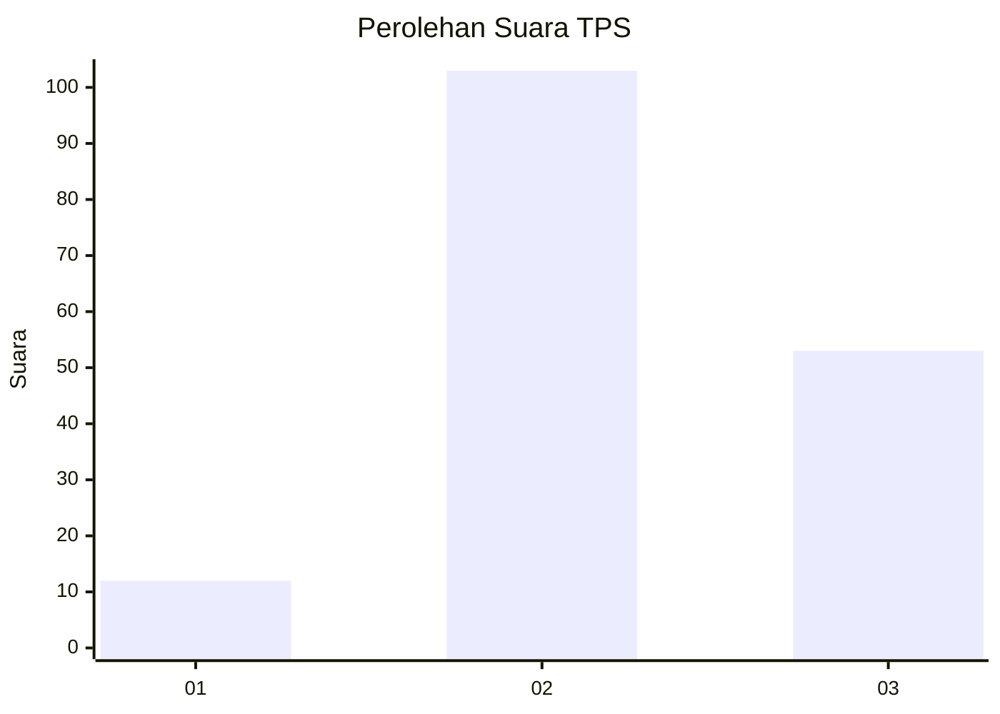
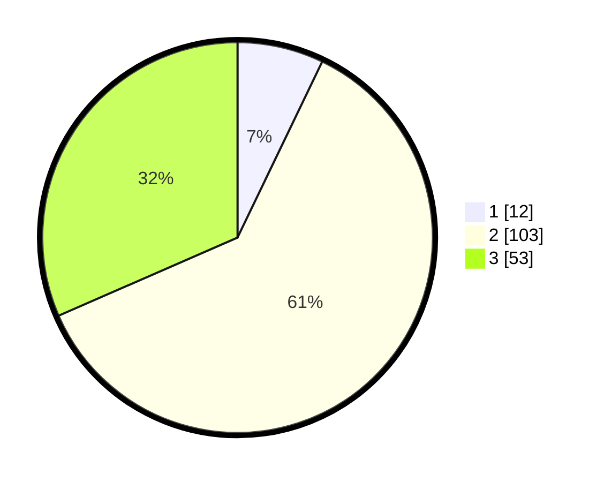

# Hasil

## Grafik

## Tabel

| No. | Nama Paslon    | Suara | Suara (raw) | Persentase |
|:--- |:-------------- | -----:| -----------:| ----------:|
| 1   | ANIES MUHAIMIN | 12    | [12][p-1]   | 7,14       |
| 2   | PRABOWO GIBRAN | 103   | [103][p-2]  | 61,31      |
| 3   | GANJAR MAHFUD  | 53    | [53][p-3]   | 31,55      |

[p-1]: https://github.com/gigit-pemilu/pemilu-2024/blob/main/pilpres/hitung-suara/sub/33-jawa-tengah/sub/26-pekalongan/sub/09-kesesi/sub/2001-windurojo/sub/007-tps/sub/paslon-1.txt
[p-2]: https://github.com/gigit-pemilu/pemilu-2024/blob/main/pilpres/hitung-suara/sub/33-jawa-tengah/sub/26-pekalongan/sub/09-kesesi/sub/2001-windurojo/sub/007-tps/sub/paslon-2.txt
[p-3]: https://github.com/gigit-pemilu/pemilu-2024/blob/main/pilpres/hitung-suara/sub/33-jawa-tengah/sub/26-pekalongan/sub/09-kesesi/sub/2001-windurojo/sub/007-tps/sub/paslon-3.txt

## Foto C Plano

https://sirekap-obj-formc.kpu.go.id/a601/pemilu/ppwp/33/26/09/20/01/3326092001007-20240215-090545--f54d9d33-1f20-4b8c-8bf7-a5f574702bb4.jpg

https://sirekap-obj-formc.kpu.go.id/a601/pemilu/ppwp/33/26/09/20/01/3326092001007-20240215-090744--9cf83ed6-7db5-46bb-8324-361ae9173b26.jpg

https://sirekap-obj-formc.kpu.go.id/a601/pemilu/ppwp/33/26/09/20/01/3326092001007-20240215-090919--72124e8d-f3ee-43c9-ae7f-717b842f7a06.jpg

## Metadata

| Key        | Value               |
| ---------- | ------------------- |
| Time Stamp | 2024-02-15 18:30:25 |

