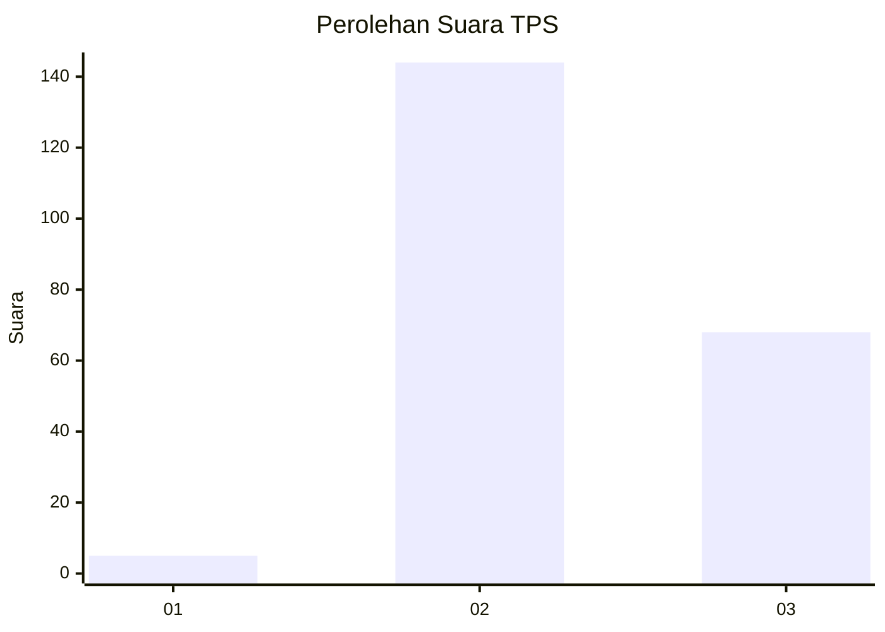
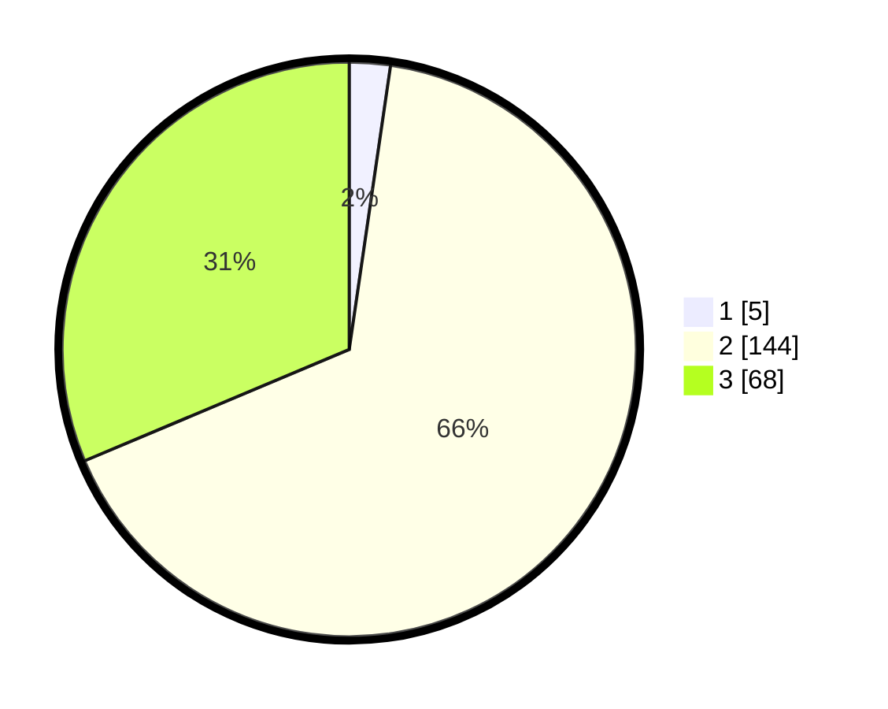

# Hasil

## Grafik

## Tabel

| No. | Nama Paslon    | Suara | Suara (raw) | Persentase |
|:--- |:-------------- | -----:| -----------:| ----------:|
| 1   | ANIES MUHAIMIN | 5     | [5][p-1]    | 2,30       |
| 2   | PRABOWO GIBRAN | 144   | [144][p-2]  | 66,36      |
| 3   | GANJAR MAHFUD  | 68    | [68][p-3]   | 31,34      |

[p-1]: https://github.com/gigit-pemilu/pemilu-2024/blob/main/pilpres/hitung-suara/sub/33-jawa-tengah/sub/26-pekalongan/sub/09-kesesi/sub/2001-windurojo/sub/008-tps/sub/paslon-1.txt
[p-2]: https://github.com/gigit-pemilu/pemilu-2024/blob/main/pilpres/hitung-suara/sub/33-jawa-tengah/sub/26-pekalongan/sub/09-kesesi/sub/2001-windurojo/sub/008-tps/sub/paslon-2.txt
[p-3]: https://github.com/gigit-pemilu/pemilu-2024/blob/main/pilpres/hitung-suara/sub/33-jawa-tengah/sub/26-pekalongan/sub/09-kesesi/sub/2001-windurojo/sub/008-tps/sub/paslon-3.txt

## Foto C Plano

https://sirekap-obj-formc.kpu.go.id/be59/pemilu/ppwp/33/26/09/20/01/3326092001008-20240219-155510--eb203e70-9cb0-4b94-a159-8299172b651d.jpg

https://sirekap-obj-formc.kpu.go.id/be59/pemilu/ppwp/33/26/09/20/01/3326092001008-20240219-154514--3952c029-9e27-408f-8973-4a2dec94f0f7.jpg

https://sirekap-obj-formc.kpu.go.id/be59/pemilu/ppwp/33/26/09/20/01/3326092001008-20240216-103529--d6e3cb64-b19e-47e8-8a6b-3127e211f1e2.jpg

## Metadata

| Key        | Value               |
| ---------- | ------------------- |
| Time Stamp | 2024-02-19 17:00:00 |

