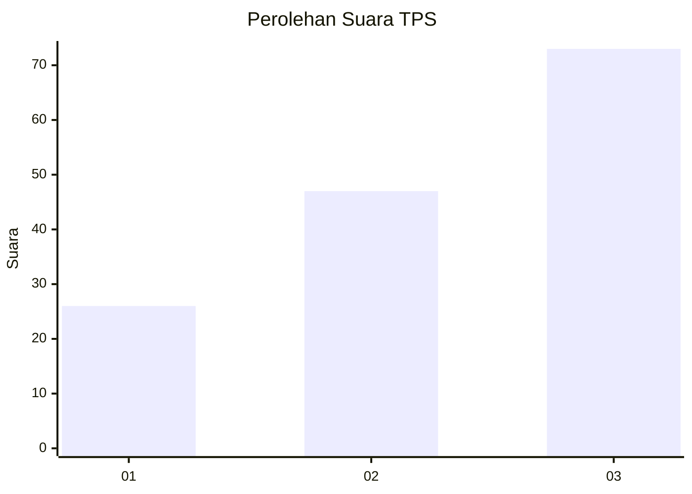
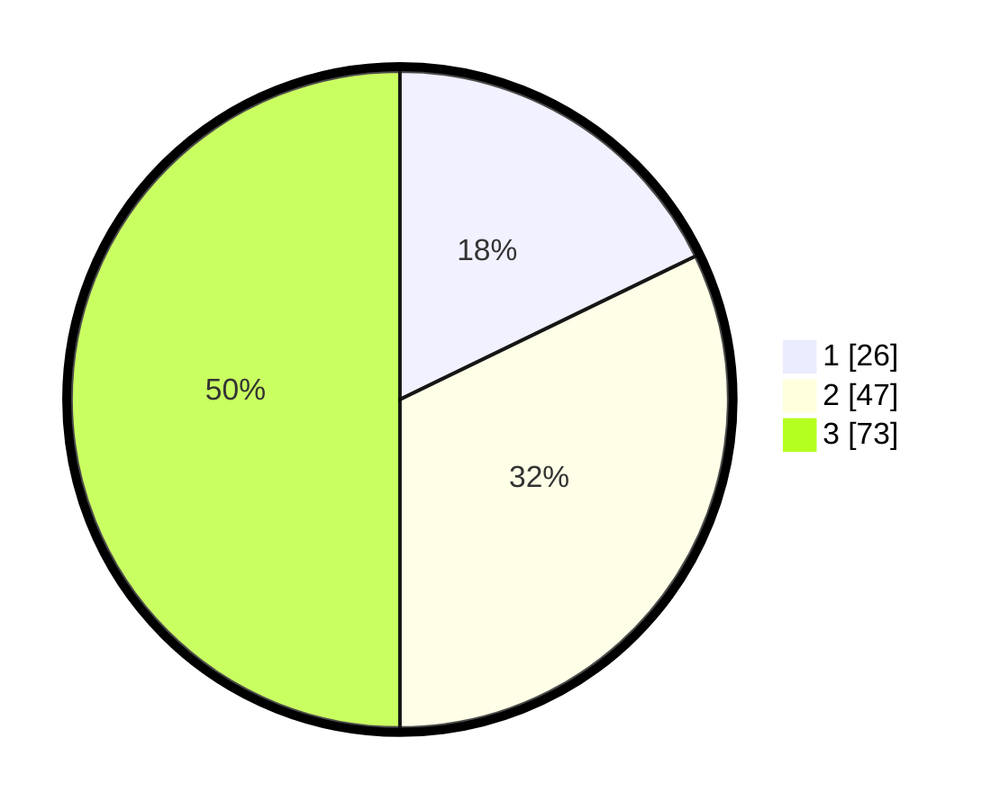

# Hasil

## Grafik

## Tabel

| No. | Nama Paslon    | Suara | Suara (raw) | Persentase |
|:--- |:-------------- | -----:| -----------:| ----------:|
| 1   | ANIES MUHAIMIN | 26    | [26][p-1]   | 17,81      |
| 2   | PRABOWO GIBRAN | 47    | [47][p-2]   | 32,19      |
| 3   | GANJAR MAHFUD  | 73    | [73][p-3]   | 50,00      |

[p-1]: https://github.com/gigit-pemilu/pemilu-2024-33-jawa-tengah/blob/main/pilpres/hitung-suara/sub/33-jawa-tengah/sub/26-pekalongan/sub/09-kesesi/sub/2005-langensari/sub/001-tps/sub/paslon-1.txt
[p-2]: https://github.com/gigit-pemilu/pemilu-2024-33-jawa-tengah/blob/main/pilpres/hitung-suara/sub/33-jawa-tengah/sub/26-pekalongan/sub/09-kesesi/sub/2005-langensari/sub/001-tps/sub/paslon-2.txt
[p-3]: https://github.com/gigit-pemilu/pemilu-2024-33-jawa-tengah/blob/main/pilpres/hitung-suara/sub/33-jawa-tengah/sub/26-pekalongan/sub/09-kesesi/sub/2005-langensari/sub/001-tps/sub/paslon-3.txt

## Foto C Plano

https://sirekap-obj-formc.kpu.go.id/daff/pemilu/ppwp/33/26/09/20/05/3326092005001-20240215-161751--b68eb4af-53d1-4c42-b4a6-56656144a48d.jpg

https://sirekap-obj-formc.kpu.go.id/daff/pemilu/ppwp/33/26/09/20/05/3326092005001-20240214-234029--543238fb-63da-4084-abc4-4feca5e9bfb1.jpg

https://sirekap-obj-formc.kpu.go.id/daff/pemilu/ppwp/33/26/09/20/05/3326092005001-20240214-234111--9a8fd5f5-f178-4191-b3ca-51a08cce9d76.jpg

## Metadata

| Key        | Value               |
| ---------- | ------------------- |
| Time Stamp | 2024-02-15 16:30:25 |

