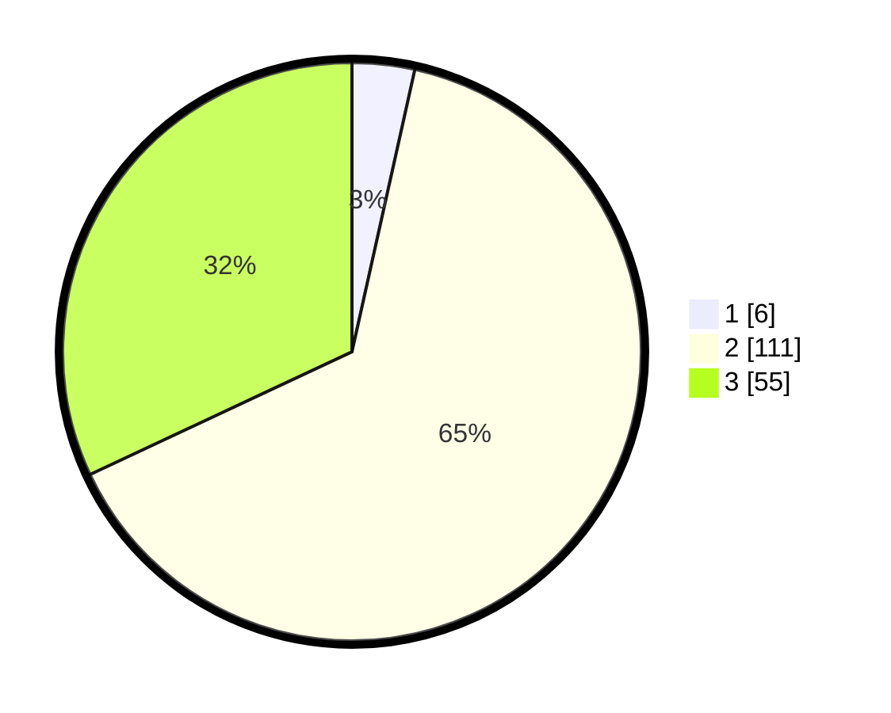

# Hasil

## Grafik

## Tabel

| No. | Nama Paslon    | Suara | Suara (raw) | Persentase |
|:--- |:-------------- | -----:| -----------:| ----------:|
| 1   | ANIES MUHAIMIN | 6     | [6][p-1]    | 3,49       |
| 2   | PRABOWO GIBRAN | 111   | [111][p-2]  | 64,53      |
| 3   | GANJAR MAHFUD  | 55    | [55][p-3]   | 31,98      |

[p-1]: https://github.com/gigit-pemilu/pemilu-2024/blob/main/pilpres/hitung-suara/sub/33-jawa-tengah/sub/26-pekalongan/sub/09-kesesi/sub/2011-kaibahan/sub/006-tps/sub/paslon-1.txt
[p-2]: https://github.com/gigit-pemilu/pemilu-2024/blob/main/pilpres/hitung-suara/sub/33-jawa-tengah/sub/26-pekalongan/sub/09-kesesi/sub/2011-kaibahan/sub/006-tps/sub/paslon-2.txt
[p-3]: https://github.com/gigit-pemilu/pemilu-2024/blob/main/pilpres/hitung-suara/sub/33-jawa-tengah/sub/26-pekalongan/sub/09-kesesi/sub/2011-kaibahan/sub/006-tps/sub/paslon-3.txt

## Foto C Plano

https://sirekap-obj-formc.kpu.go.id/9a7a/pemilu/ppwp/33/26/09/20/11/3326092011006-20240215-050640--e8fa8083-c5d7-4c18-a468-87165c6bd4e5.jpg

https://sirekap-obj-formc.kpu.go.id/9a7a/pemilu/ppwp/33/26/09/20/11/3326092011006-20240215-050749--3078a9bd-d6b3-4b7d-9f6e-6da19df9d2b2.jpg

https://sirekap-obj-formc.kpu.go.id/9a7a/pemilu/ppwp/33/26/09/20/11/3326092011006-20240215-050913--9f008a54-3d49-473a-8d6c-2cedc374a2b1.jpg

## Metadata

| Key        | Value               |
| ---------- | ------------------- |
| Time Stamp | 2024-02-21 14:00:00 |

