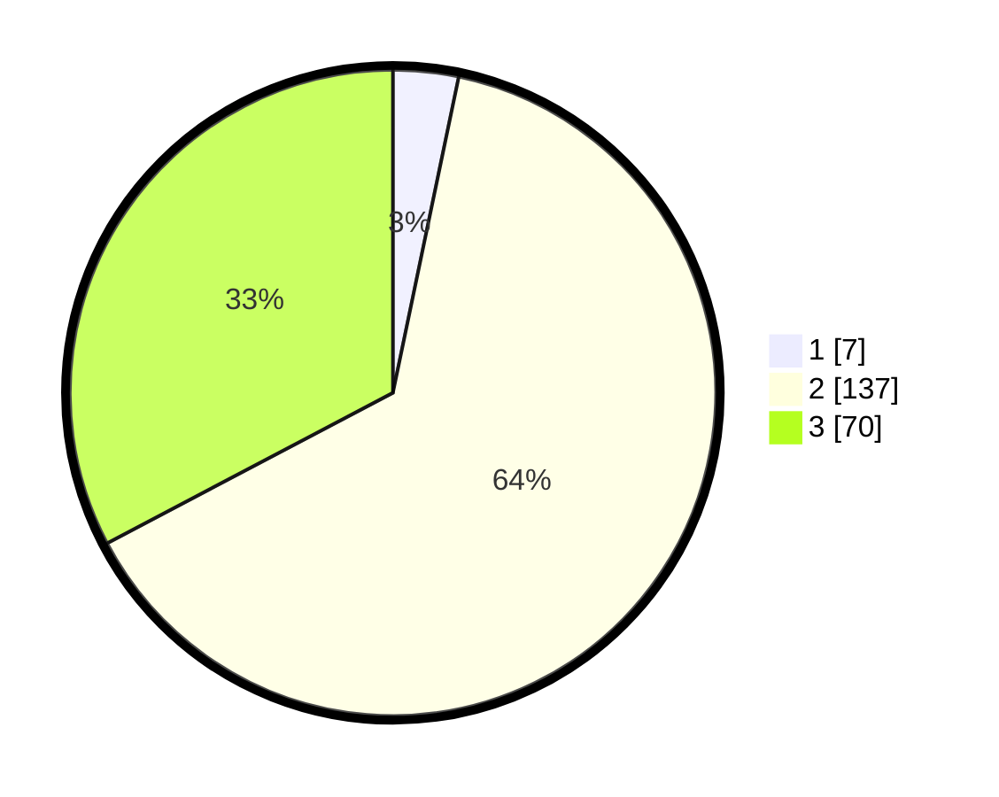

# Hasil

## Grafik

## Tabel

| No. | Nama Paslon    | Suara | Suara (raw) | Persentase |
|:--- |:-------------- | -----:| -----------:| ----------:|
| 1   | ANIES MUHAIMIN | 7     | [7][p-1]    | 3,27       |
| 2   | PRABOWO GIBRAN | 137   | [137][p-2]  | 64,02      |
| 3   | GANJAR MAHFUD  | 70    | [70][p-3]   | 32,71      |

[p-1]: https://github.com/gigit-pemilu/pemilu-2024/blob/main/pilpres/hitung-suara/sub/33-jawa-tengah/sub/26-pekalongan/sub/10-sragi/sub/2007-krsakageng/sub/006-tps/sub/paslon-1.txt
[p-2]: https://github.com/gigit-pemilu/pemilu-2024/blob/main/pilpres/hitung-suara/sub/33-jawa-tengah/sub/26-pekalongan/sub/10-sragi/sub/2007-krsakageng/sub/006-tps/sub/paslon-2.txt
[p-3]: https://github.com/gigit-pemilu/pemilu-2024/blob/main/pilpres/hitung-suara/sub/33-jawa-tengah/sub/26-pekalongan/sub/10-sragi/sub/2007-krsakageng/sub/006-tps/sub/paslon-3.txt

## Foto C Plano

https://sirekap-obj-formc.kpu.go.id/43e9/pemilu/ppwp/33/26/10/20/07/3326102007006-20240215-214807--aaa3b470-2ce4-4361-a9fd-ef2b02a184f4.jpg

https://sirekap-obj-formc.kpu.go.id/43e9/pemilu/ppwp/33/26/10/20/07/3326102007006-20240214-141756--5c6e44a4-418f-474b-836d-0486948b91f4.jpg

https://sirekap-obj-formc.kpu.go.id/43e9/pemilu/ppwp/33/26/10/20/07/3326102007006-20240214-141842--ec5bbea8-f15c-494a-8711-a7d2a61986bf.jpg

## Metadata

| Key        | Value               |
| ---------- | ------------------- |
| Time Stamp | 2024-02-15 22:30:27 |

