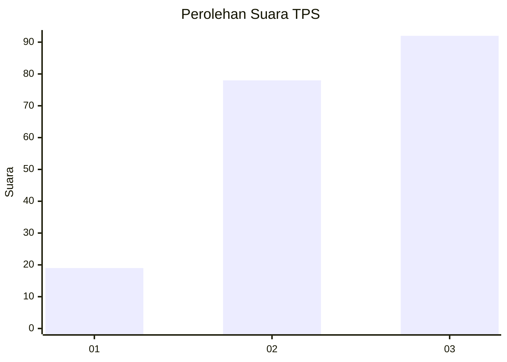
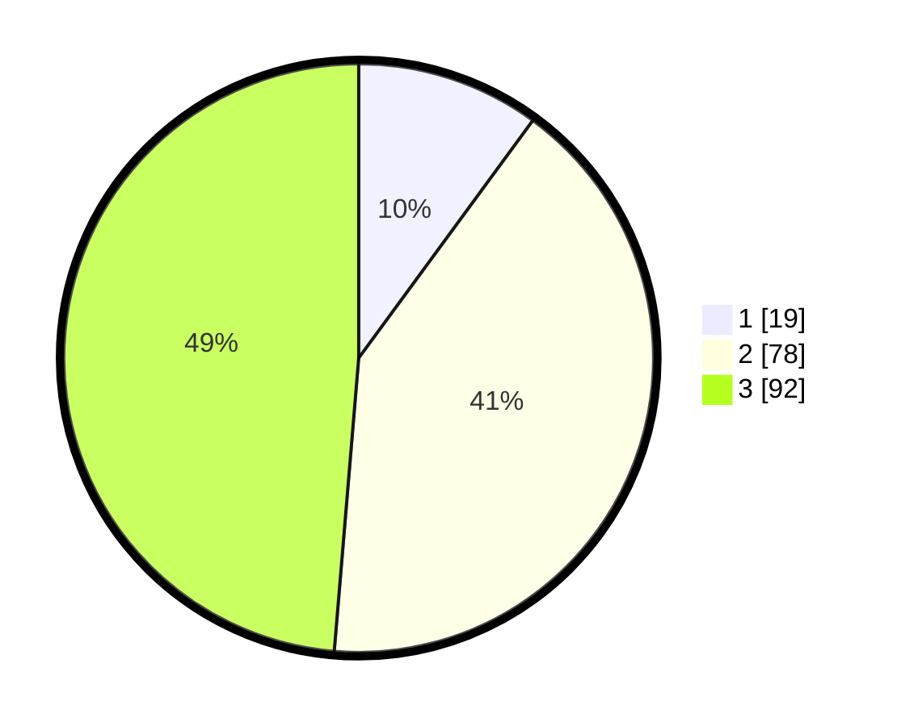

# Hasil

## Grafik

## Tabel

| No. | Nama Paslon    | Suara | Suara (raw) | Persentase |
|:--- |:-------------- | -----:| -----------:| ----------:|
| 1   | ANIES MUHAIMIN | 19    | [19][p-1]   | 10,05      |
| 2   | PRABOWO GIBRAN | 78    | [78][p-2]   | 41,27      |
| 3   | GANJAR MAHFUD  | 92    | [92][p-3]   | 48,68      |

[p-1]: https://github.com/gigit-pemilu/pemilu-2024/blob/main/pilpres/hitung-suara/sub/33-jawa-tengah/sub/26-pekalongan/sub/10-sragi/sub/2010-bulakpelem/sub/005-tps/sub/paslon-1.txt
[p-2]: https://github.com/gigit-pemilu/pemilu-2024/blob/main/pilpres/hitung-suara/sub/33-jawa-tengah/sub/26-pekalongan/sub/10-sragi/sub/2010-bulakpelem/sub/005-tps/sub/paslon-2.txt
[p-3]: https://github.com/gigit-pemilu/pemilu-2024/blob/main/pilpres/hitung-suara/sub/33-jawa-tengah/sub/26-pekalongan/sub/10-sragi/sub/2010-bulakpelem/sub/005-tps/sub/paslon-3.txt

## Foto C Plano

https://sirekap-obj-formc.kpu.go.id/f9b0/pemilu/ppwp/33/26/10/20/10/3326102010005-20240217-211016--cdca058e-d964-4a93-98c5-6485f911709e.jpg

https://sirekap-obj-formc.kpu.go.id/f9b0/pemilu/ppwp/33/26/10/20/10/3326102010005-20240217-205707--0fd97e22-5ced-4ac5-a8e3-b80301dcdecb.jpg

https://sirekap-obj-formc.kpu.go.id/f9b0/pemilu/ppwp/33/26/10/20/10/3326102010005-20240217-210637--daff2df3-77ac-4a4d-a16f-6542dcdfe8e9.jpg

## Metadata

| Key        | Value               |
| ---------- | ------------------- |
| Time Stamp | 2024-02-19 18:00:00 |

