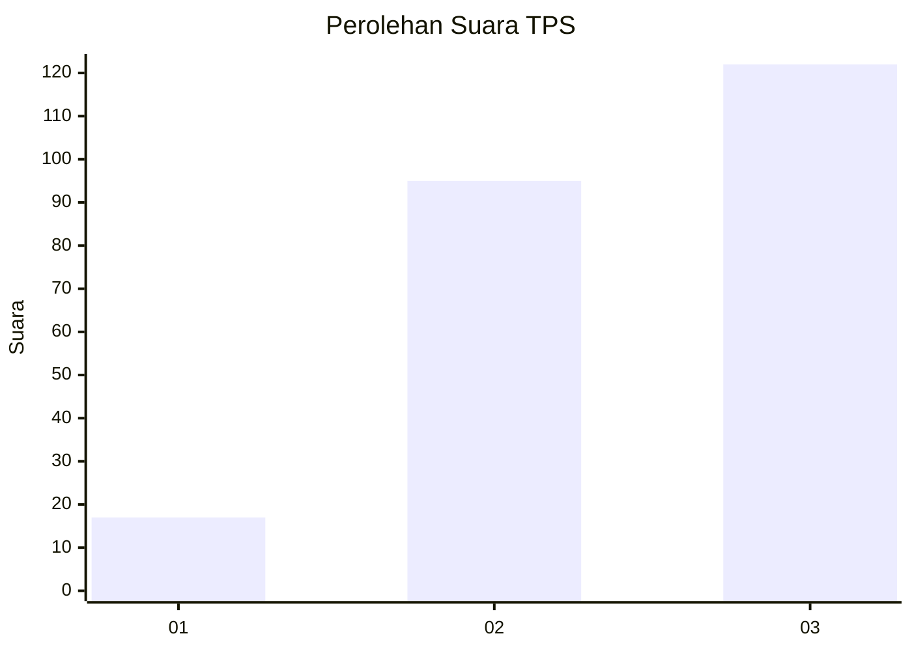
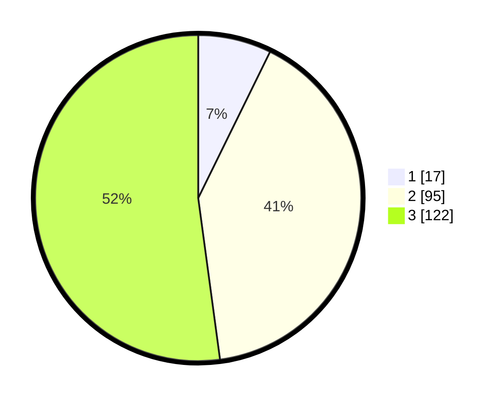

# Hasil

## Grafik

## Tabel

| No. | Nama Paslon    | Suara | Suara (raw) | Persentase |
|:--- |:-------------- | -----:| -----------:| ----------:|
| 1   | ANIES MUHAIMIN | 17    | [17][p-1]   | 7,26       |
| 2   | PRABOWO GIBRAN | 95    | [95][p-2]   | 40,60      |
| 3   | GANJAR MAHFUD  | 122   | [122][p-3]  | 52,14      |

[p-1]: https://github.com/gigit-pemilu/pemilu-2024/blob/main/pilpres/hitung-suara/sub/33-jawa-tengah/sub/26-pekalongan/sub/11-bojong/sub/2009-wangandowo/sub/001-tps/sub/paslon-1.txt
[p-2]: https://github.com/gigit-pemilu/pemilu-2024/blob/main/pilpres/hitung-suara/sub/33-jawa-tengah/sub/26-pekalongan/sub/11-bojong/sub/2009-wangandowo/sub/001-tps/sub/paslon-2.txt
[p-3]: https://github.com/gigit-pemilu/pemilu-2024/blob/main/pilpres/hitung-suara/sub/33-jawa-tengah/sub/26-pekalongan/sub/11-bojong/sub/2009-wangandowo/sub/001-tps/sub/paslon-3.txt

## Foto C Plano

https://sirekap-obj-formc.kpu.go.id/81b8/pemilu/ppwp/33/26/11/20/09/3326112009001-20240217-071754--095f3734-d237-4127-8ccb-7d6e11cd43a0.jpg

https://sirekap-obj-formc.kpu.go.id/81b8/pemilu/ppwp/33/26/11/20/09/3326112009001-20240217-071818--a90a0cae-f984-462b-86cf-c5624dfb83a4.jpg

https://sirekap-obj-formc.kpu.go.id/81b8/pemilu/ppwp/33/26/11/20/09/3326112009001-20240217-071824--4109ecfd-98d6-4e51-9f51-54b51d90ca2c.jpg

## Metadata

| Key        | Value               |
| ---------- | ------------------- |
| Time Stamp | 2024-02-19 06:16:00 |

