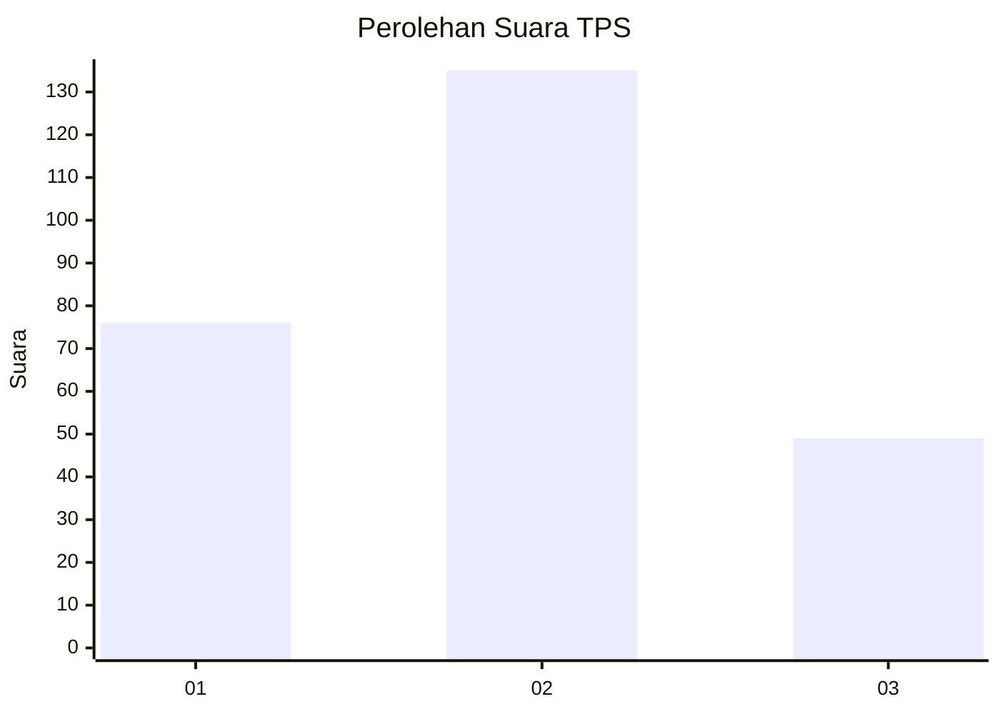
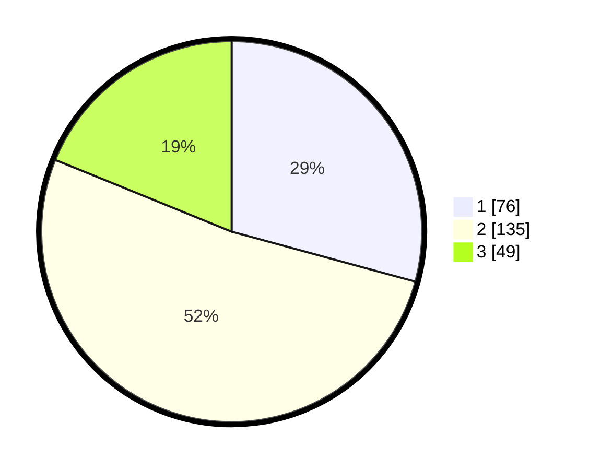

# Hasil

## Grafik

## Tabel

| No. | Nama Paslon    | Suara | Suara (raw) | Persentase |
|:--- |:-------------- | -----:| -----------:| ----------:|
| 1   | ANIES MUHAIMIN | 76    | [76][p-1]   | 29,23      |
| 2   | PRABOWO GIBRAN | 135   | [135][p-2]  | 51,92      |
| 3   | GANJAR MAHFUD  | 49    | [49][p-3]   | 18,85      |

[p-1]: https://github.com/gigit-pemilu/pemilu-2024/blob/main/pilpres/hitung-suara/sub/33-jawa-tengah/sub/26-pekalongan/sub/13-kedungwuni/sub/2010-podo/sub/014-tps/sub/paslon-1.txt
[p-2]: https://github.com/gigit-pemilu/pemilu-2024/blob/main/pilpres/hitung-suara/sub/33-jawa-tengah/sub/26-pekalongan/sub/13-kedungwuni/sub/2010-podo/sub/014-tps/sub/paslon-2.txt
[p-3]: https://github.com/gigit-pemilu/pemilu-2024/blob/main/pilpres/hitung-suara/sub/33-jawa-tengah/sub/26-pekalongan/sub/13-kedungwuni/sub/2010-podo/sub/014-tps/sub/paslon-3.txt

## Foto C Plano

https://sirekap-obj-formc.kpu.go.id/6782/pemilu/ppwp/33/26/13/20/10/3326132010014-20240214-155622--6b8499ab-cfb1-4944-9530-33e8303b8a2e.jpg

https://sirekap-obj-formc.kpu.go.id/6782/pemilu/ppwp/33/26/13/20/10/3326132010014-20240214-155753--f1584dfb-75e6-42e5-af79-d45d963397e7.jpg

https://sirekap-obj-formc.kpu.go.id/6782/pemilu/ppwp/33/26/13/20/10/3326132010014-20240214-155909--c2ee5662-c51c-45d6-888d-c8ee40c717b7.jpg

## Metadata

| Key        | Value               |
| ---------- | ------------------- |
| Time Stamp | 2024-02-15 00:41:44 |

