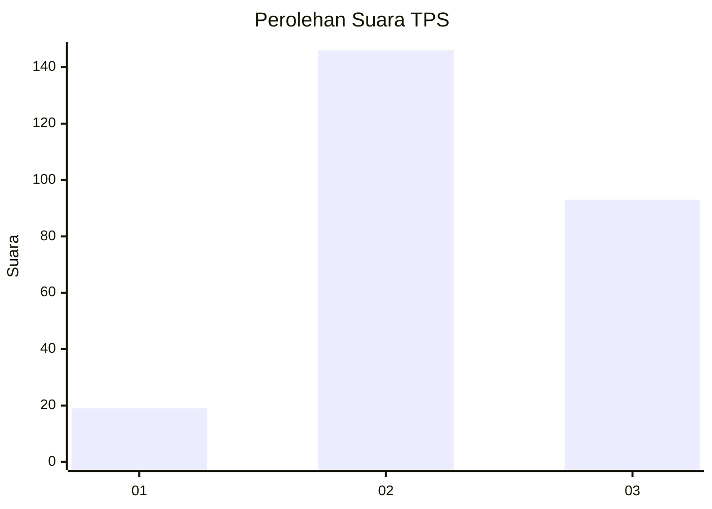
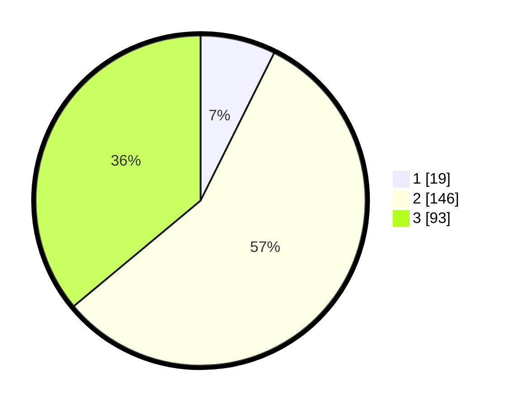

# Hasil

## Grafik

## Tabel

| No. | Nama Paslon    | Suara | Suara (raw) | Persentase |
|:--- |:-------------- | -----:| -----------:| ----------:|
| 1   | ANIES MUHAIMIN | 19    | [19][p-1]   | 7,36       |
| 2   | PRABOWO GIBRAN | 146   | [146][p-2]  | 56,59      |
| 3   | GANJAR MAHFUD  | 93    | [93][p-3]   | 36,05      |

[p-1]: https://github.com/gigit-pemilu/pemilu-2024-33-jawa-tengah/blob/main/pilpres/hitung-suara/sub/33-jawa-tengah/sub/26-pekalongan/sub/13-kedungwuni/sub/2018-tangkilkulon/sub/008-tps/sub/paslon-1.txt
[p-2]: https://github.com/gigit-pemilu/pemilu-2024-33-jawa-tengah/blob/main/pilpres/hitung-suara/sub/33-jawa-tengah/sub/26-pekalongan/sub/13-kedungwuni/sub/2018-tangkilkulon/sub/008-tps/sub/paslon-2.txt
[p-3]: https://github.com/gigit-pemilu/pemilu-2024-33-jawa-tengah/blob/main/pilpres/hitung-suara/sub/33-jawa-tengah/sub/26-pekalongan/sub/13-kedungwuni/sub/2018-tangkilkulon/sub/008-tps/sub/paslon-3.txt

## Foto C Plano

https://sirekap-obj-formc.kpu.go.id/fbf6/pemilu/ppwp/33/26/13/20/18/3326132018008-20240218-110758--04ff983d-7679-4673-a2f5-d379605238b1.jpg

https://sirekap-obj-formc.kpu.go.id/fbf6/pemilu/ppwp/33/26/13/20/18/3326132018008-20240218-111600--ba9b1fa6-b884-40fa-b9e5-3559a7579809.jpg

https://sirekap-obj-formc.kpu.go.id/fbf6/pemilu/ppwp/33/26/13/20/18/3326132018008-20240218-110508--91a612dc-f447-40f7-8a82-a9a4c2cd67bb.jpg

## Metadata

| Key        | Value               |
| ---------- | ------------------- |
| Time Stamp | 2024-02-19 06:16:00 |

