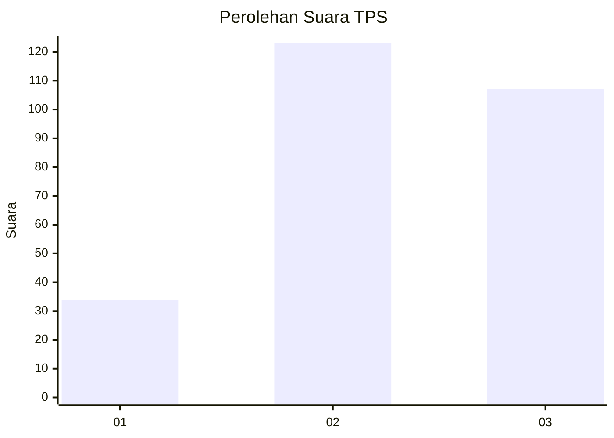
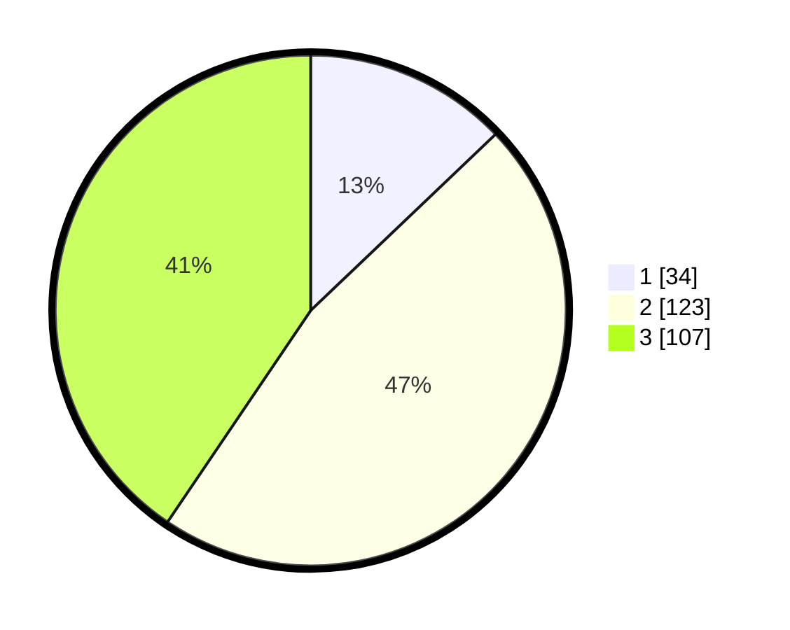

# Hasil

## Grafik

## Tabel

| No. | Nama Paslon    | Suara | Suara (raw) | Persentase |
|:--- |:-------------- | -----:| -----------:| ----------:|
| 1   | ANIES MUHAIMIN | 34    | [34][p-1]   | 12,88      |
| 2   | PRABOWO GIBRAN | 123   | [123][p-2]  | 46,59      |
| 3   | GANJAR MAHFUD  | 107   | [107][p-3]  | 40,53      |

[p-1]: https://github.com/gigit-pemilu/pemilu-2024/blob/main/pilpres/hitung-suara/sub/33-jawa-tengah/sub/26-pekalongan/sub/15-tirto/sub/2002-ngalian/sub/001-tps/sub/paslon-1.txt
[p-2]: https://github.com/gigit-pemilu/pemilu-2024/blob/main/pilpres/hitung-suara/sub/33-jawa-tengah/sub/26-pekalongan/sub/15-tirto/sub/2002-ngalian/sub/001-tps/sub/paslon-2.txt
[p-3]: https://github.com/gigit-pemilu/pemilu-2024/blob/main/pilpres/hitung-suara/sub/33-jawa-tengah/sub/26-pekalongan/sub/15-tirto/sub/2002-ngalian/sub/001-tps/sub/paslon-3.txt

## Foto C Plano

https://sirekap-obj-formc.kpu.go.id/0a4d/pemilu/ppwp/33/26/15/20/02/3326152002001-20240217-211253--c0142d72-937e-4720-b800-70a9b576efe9.jpg

https://sirekap-obj-formc.kpu.go.id/0a4d/pemilu/ppwp/33/26/15/20/02/3326152002001-20240217-212106--8057df4d-9e0e-40ee-9b20-accc8f584660.jpg

https://sirekap-obj-formc.kpu.go.id/0a4d/pemilu/ppwp/33/26/15/20/02/3326152002001-20240217-212527--ff4c3034-f577-4c98-89f2-41b173f46171.jpg

## Metadata

| Key        | Value               |
| ---------- | ------------------- |
| Time Stamp | 2024-02-19 06:16:00 |

