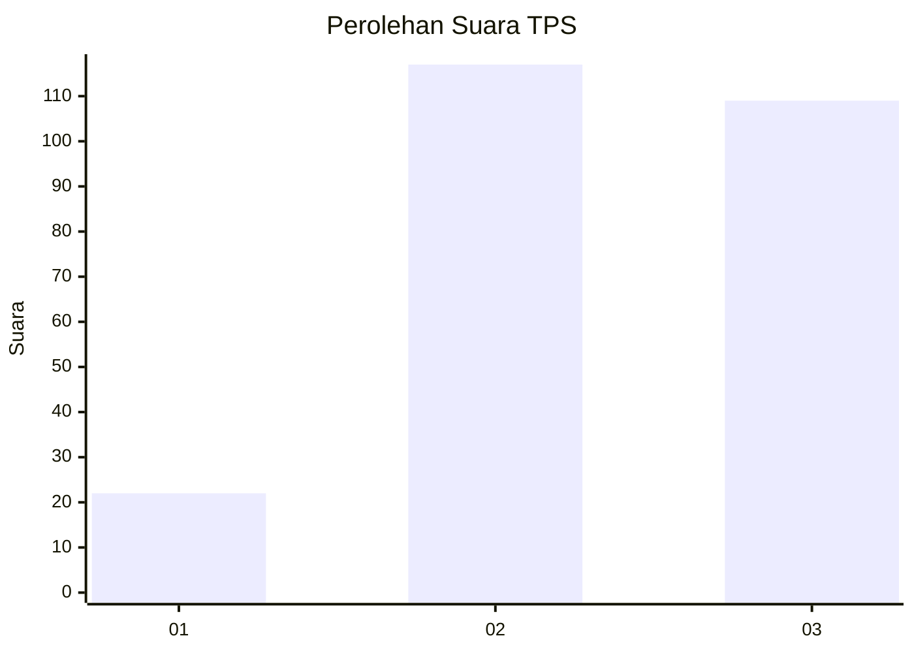
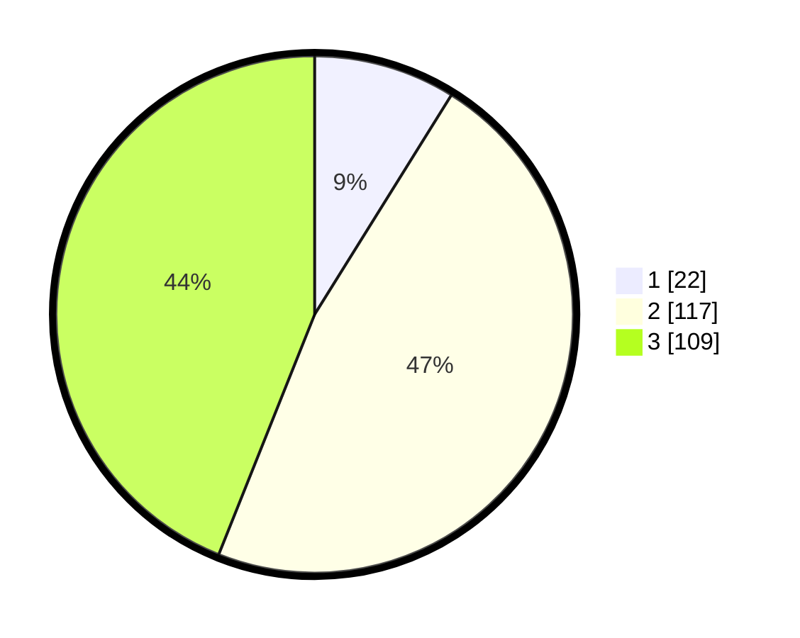

# Hasil

## Grafik

## Tabel

| No. | Nama Paslon    | Suara | Suara (raw) | Persentase |
|:--- |:-------------- | -----:| -----------:| ----------:|
| 1   | ANIES MUHAIMIN | 22    | [22][p-1]   | 8,87       |
| 2   | PRABOWO GIBRAN | 117   | [117][p-2]  | 47,18      |
| 3   | GANJAR MAHFUD  | 109   | [109][p-3]  | 43,95      |

[p-1]: https://github.com/gigit-pemilu/pemilu-2024/blob/main/pilpres/hitung-suara/sub/33-jawa-tengah/sub/26-pekalongan/sub/15-tirto/sub/2003-pandanarum/sub/005-tps/sub/paslon-1.txt
[p-2]: https://github.com/gigit-pemilu/pemilu-2024/blob/main/pilpres/hitung-suara/sub/33-jawa-tengah/sub/26-pekalongan/sub/15-tirto/sub/2003-pandanarum/sub/005-tps/sub/paslon-2.txt
[p-3]: https://github.com/gigit-pemilu/pemilu-2024/blob/main/pilpres/hitung-suara/sub/33-jawa-tengah/sub/26-pekalongan/sub/15-tirto/sub/2003-pandanarum/sub/005-tps/sub/paslon-3.txt

## Foto C Plano

https://sirekap-obj-formc.kpu.go.id/7826/pemilu/ppwp/33/26/15/20/03/3326152003005-20240217-155833--eec79017-36e7-40cb-ad02-4852ebcb8f49.jpg

https://sirekap-obj-formc.kpu.go.id/7826/pemilu/ppwp/33/26/15/20/03/3326152003005-20240217-160848--304289e4-fbdf-4b3f-99dd-d181cc9821f3.jpg

https://sirekap-obj-formc.kpu.go.id/7826/pemilu/ppwp/33/26/15/20/03/3326152003005-20240217-161241--2c5c97e6-1d6c-4378-b317-3f0ecdd997b8.jpg

## Metadata

| Key        | Value               |
| ---------- | ------------------- |
| Time Stamp | 2024-02-19 19:00:00 |

