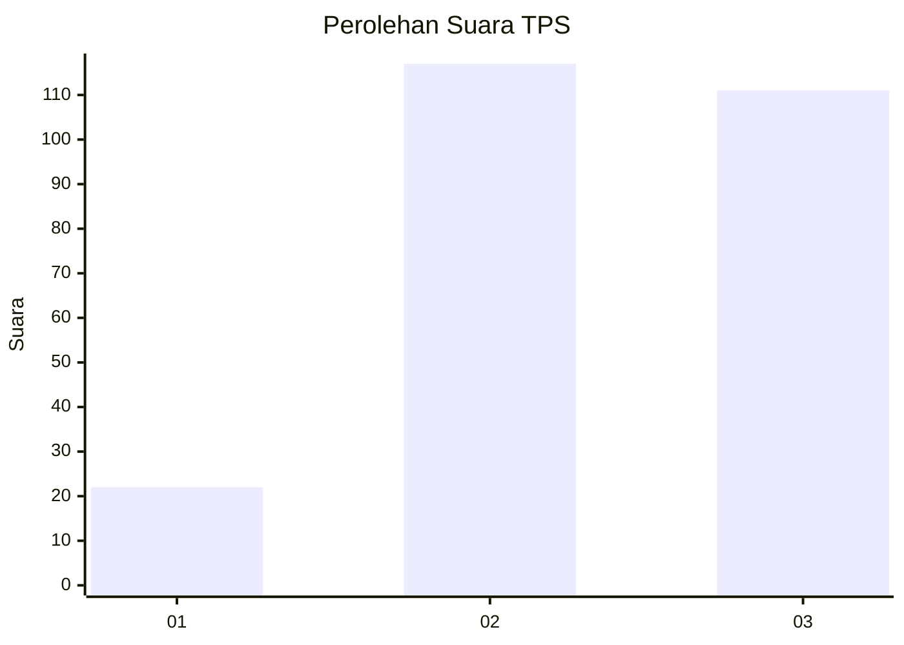
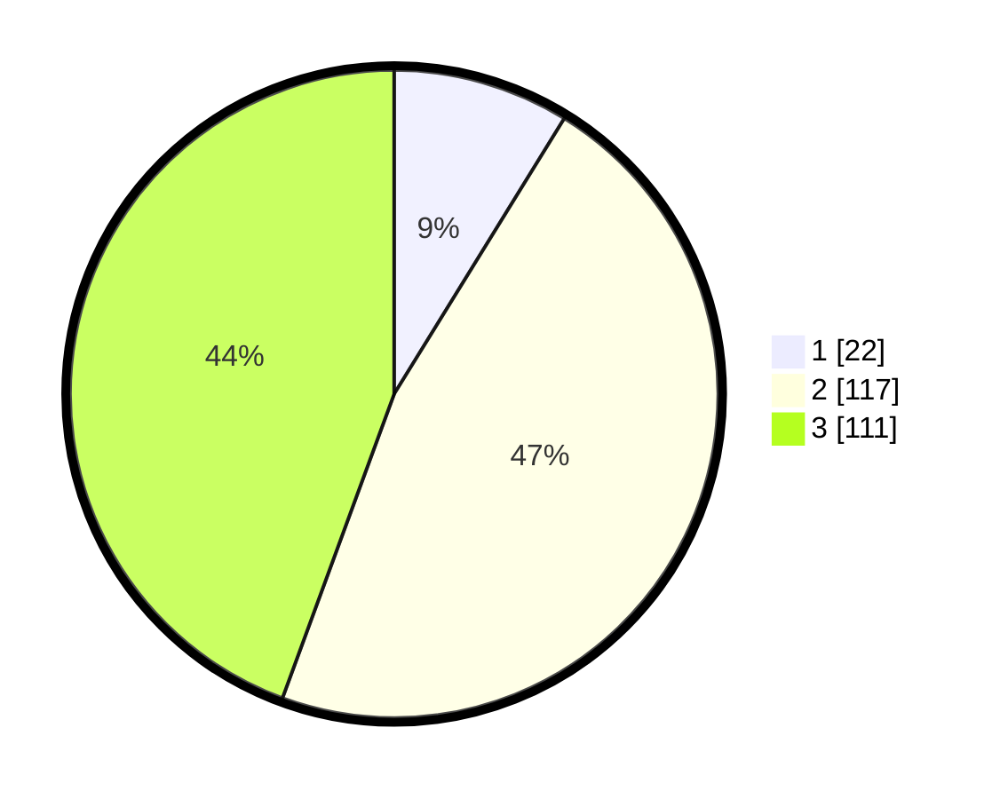

# Hasil

## Grafik

## Tabel

| No. | Nama Paslon    | Suara | Suara (raw) | Persentase |
|:--- |:-------------- | -----:| -----------:| ----------:|
| 1   | ANIES MUHAIMIN | 22    | [22][p-1]   | 8,80       |
| 2   | PRABOWO GIBRAN | 117   | [117][p-2]  | 46,80      |
| 3   | GANJAR MAHFUD  | 111   | [111][p-3]  | 44,40      |

[p-1]: https://github.com/gigit-pemilu/pemilu-2024/blob/main/pilpres/hitung-suara/sub/33-jawa-tengah/sub/26-pekalongan/sub/15-tirto/sub/2004-karanganyar/sub/014-tps/sub/paslon-1.txt
[p-2]: https://github.com/gigit-pemilu/pemilu-2024/blob/main/pilpres/hitung-suara/sub/33-jawa-tengah/sub/26-pekalongan/sub/15-tirto/sub/2004-karanganyar/sub/014-tps/sub/paslon-2.txt
[p-3]: https://github.com/gigit-pemilu/pemilu-2024/blob/main/pilpres/hitung-suara/sub/33-jawa-tengah/sub/26-pekalongan/sub/15-tirto/sub/2004-karanganyar/sub/014-tps/sub/paslon-3.txt

## Foto C Plano

https://sirekap-obj-formc.kpu.go.id/1153/pemilu/ppwp/33/26/15/20/04/3326152004014-20240218-013308--2bcd137d-3b2a-4f5e-82ba-d9a72fefc16e.jpg

https://sirekap-obj-formc.kpu.go.id/1153/pemilu/ppwp/33/26/15/20/04/3326152004014-20240218-013055--d55d24ea-d374-4b47-90d4-0df8de51be24.jpg

https://sirekap-obj-formc.kpu.go.id/1153/pemilu/ppwp/33/26/15/20/04/3326152004014-20240214-215546--32312704-f6a3-4cde-8193-75a8dc03d484.jpg

## Metadata

| Key        | Value               |
| ---------- | ------------------- |
| Time Stamp | 2024-02-19 19:00:00 |

