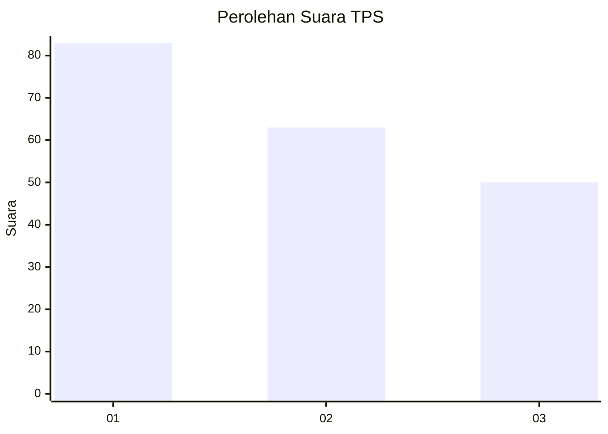
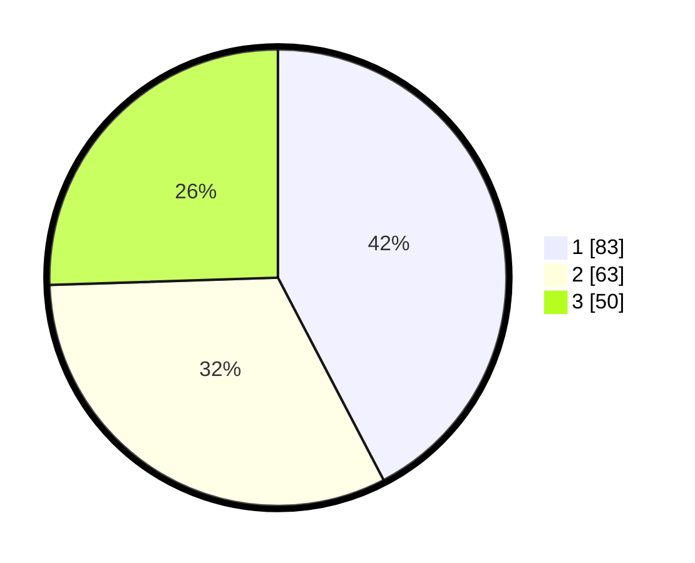

# Hasil

## Grafik

## Tabel

| No. | Nama Paslon    | Suara | Suara (raw) | Persentase |
|:--- |:-------------- | -----:| -----------:| ----------:|
| 1   | ANIES MUHAIMIN | 83    | [83][p-1]   | 42,35      |
| 2   | PRABOWO GIBRAN | 63    | [63][p-2]   | 32,14      |
| 3   | GANJAR MAHFUD  | 50    | [50][p-3]   | 25,51      |

[p-1]: https://github.com/gigit-pemilu/pemilu-2024-33-jawa-tengah/blob/main/pilpres/hitung-suara/sub/33-jawa-tengah/sub/26-pekalongan/sub/16-wiradesa/sub/1010-gumawang/sub/004-tps/sub/paslon-1.txt
[p-2]: https://github.com/gigit-pemilu/pemilu-2024-33-jawa-tengah/blob/main/pilpres/hitung-suara/sub/33-jawa-tengah/sub/26-pekalongan/sub/16-wiradesa/sub/1010-gumawang/sub/004-tps/sub/paslon-2.txt
[p-3]: https://github.com/gigit-pemilu/pemilu-2024-33-jawa-tengah/blob/main/pilpres/hitung-suara/sub/33-jawa-tengah/sub/26-pekalongan/sub/16-wiradesa/sub/1010-gumawang/sub/004-tps/sub/paslon-3.txt

## Foto C Plano

https://sirekap-obj-formc.kpu.go.id/360b/pemilu/ppwp/33/26/16/10/10/3326161010004-20240215-012217--0940ca3f-fbcf-4219-b9dd-704b489564de.jpg

https://sirekap-obj-formc.kpu.go.id/360b/pemilu/ppwp/33/26/16/10/10/3326161010004-20240215-012412--f743d7b6-2662-4a99-bd46-b8659603ccfa.jpg

https://sirekap-obj-formc.kpu.go.id/360b/pemilu/ppwp/33/26/16/10/10/3326161010004-20240215-012559--21ca7fb3-b47a-410d-91fc-eaefc93ad4dd.jpg

## Metadata

| Key        | Value               |
| ---------- | ------------------- |
| Time Stamp | 2024-02-19 19:00:00 |

