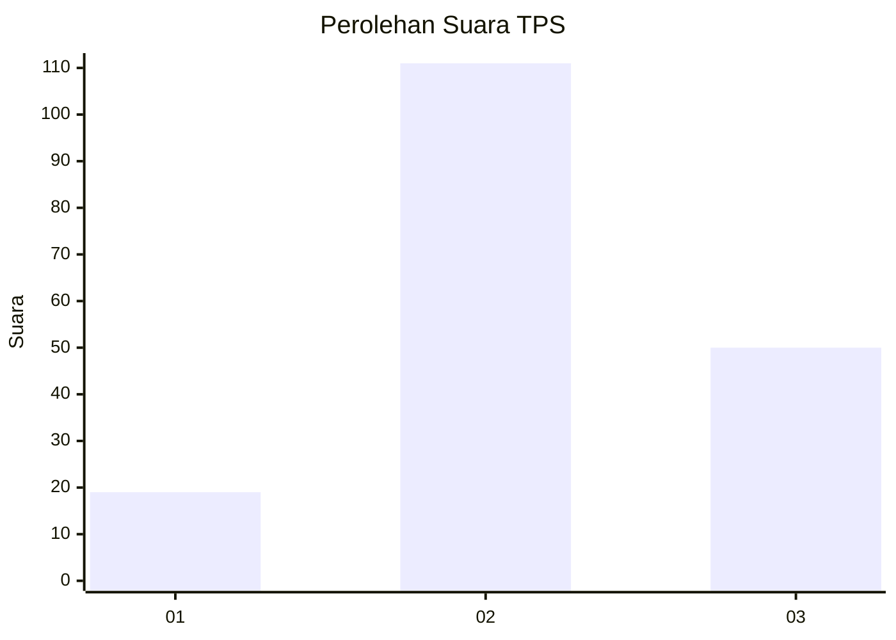
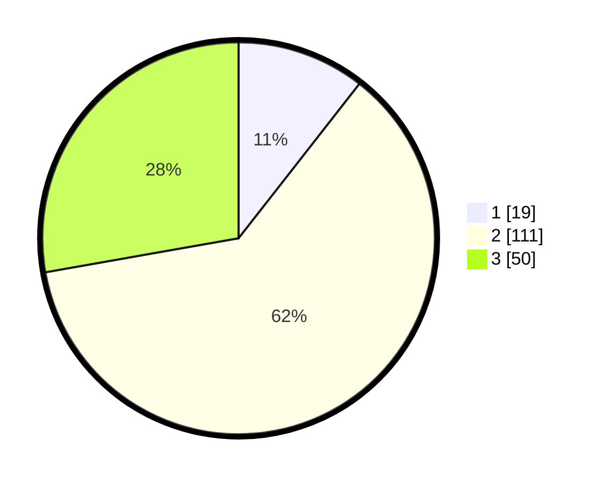

# Hasil

## Grafik

## Tabel

| No. | Nama Paslon    | Suara | Suara (raw) | Persentase |
|:--- |:-------------- | -----:| -----------:| ----------:|
| 1   | ANIES MUHAIMIN | 19    | [19][p-1]   | 10,56      |
| 2   | PRABOWO GIBRAN | 111   | [111][p-2]  | 61,67      |
| 3   | GANJAR MAHFUD  | 50    | [50][p-3]   | 27,78      |

[p-1]: https://github.com/gigit-pemilu/pemilu-2024-33-jawa-tengah/blob/main/pilpres/hitung-suara/sub/33-jawa-tengah/sub/26-pekalongan/sub/16-wiradesa/sub/1010-gumawang/sub/008-tps/sub/paslon-1.txt
[p-2]: https://github.com/gigit-pemilu/pemilu-2024-33-jawa-tengah/blob/main/pilpres/hitung-suara/sub/33-jawa-tengah/sub/26-pekalongan/sub/16-wiradesa/sub/1010-gumawang/sub/008-tps/sub/paslon-2.txt
[p-3]: https://github.com/gigit-pemilu/pemilu-2024-33-jawa-tengah/blob/main/pilpres/hitung-suara/sub/33-jawa-tengah/sub/26-pekalongan/sub/16-wiradesa/sub/1010-gumawang/sub/008-tps/sub/paslon-3.txt

## Foto C Plano

https://sirekap-obj-formc.kpu.go.id/b8c3/pemilu/ppwp/33/26/16/10/10/3326161010008-20240214-221931--ab02a62f-1a6e-49b5-b9b9-bd768038f9ed.jpg

https://sirekap-obj-formc.kpu.go.id/b8c3/pemilu/ppwp/33/26/16/10/10/3326161010008-20240214-222212--b913e968-14dc-460c-9d71-19f1178086c3.jpg

https://sirekap-obj-formc.kpu.go.id/b8c3/pemilu/ppwp/33/26/16/10/10/3326161010008-20240214-222319--f7b0a9c7-04e7-4fc4-8c7b-04e38c7f7608.jpg

## Metadata

| Key        | Value               |
| ---------- | ------------------- |
| Time Stamp | 2024-02-15 12:00:28 |

