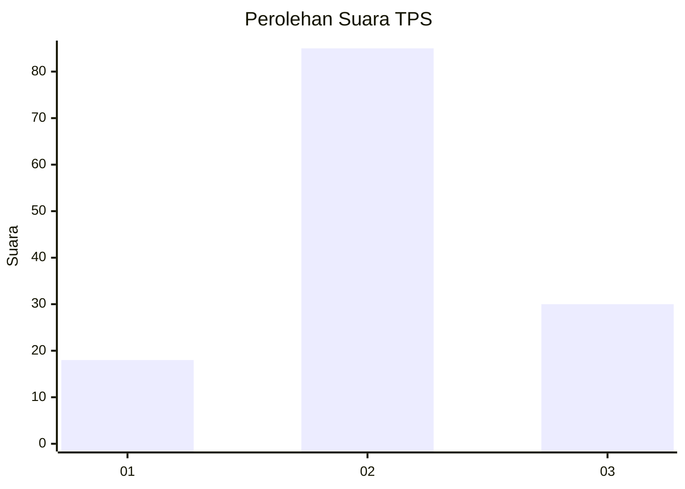
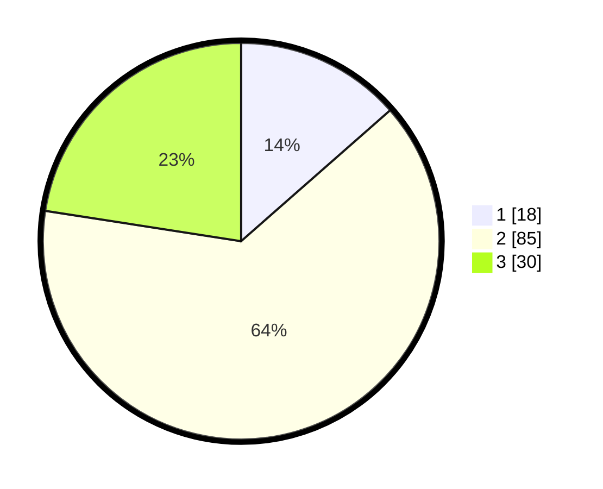

# Hasil

## Grafik

## Tabel

| No. | Nama Paslon    | Suara | Suara (raw) | Persentase |
|:--- |:-------------- | -----:| -----------:| ----------:|
| 1   | ANIES MUHAIMIN | 18    | [18][p-1]   | 13,53      |
| 2   | PRABOWO GIBRAN | 85    | [85][p-2]   | 63,91      |
| 3   | GANJAR MAHFUD  | 30    | [30][p-3]   | 22,56      |

[p-1]: https://github.com/gigit-pemilu/pemilu-2024-33-jawa-tengah/blob/main/pilpres/hitung-suara/sub/33-jawa-tengah/sub/26-pekalongan/sub/16-wiradesa/sub/2001-kadipaten/sub/009-tps/sub/paslon-1.txt
[p-2]: https://github.com/gigit-pemilu/pemilu-2024-33-jawa-tengah/blob/main/pilpres/hitung-suara/sub/33-jawa-tengah/sub/26-pekalongan/sub/16-wiradesa/sub/2001-kadipaten/sub/009-tps/sub/paslon-2.txt
[p-3]: https://github.com/gigit-pemilu/pemilu-2024-33-jawa-tengah/blob/main/pilpres/hitung-suara/sub/33-jawa-tengah/sub/26-pekalongan/sub/16-wiradesa/sub/2001-kadipaten/sub/009-tps/sub/paslon-3.txt

## Foto C Plano

https://sirekap-obj-formc.kpu.go.id/8ba5/pemilu/ppwp/33/26/16/20/01/3326162001009-20240214-220609--707fc5d1-5d29-4125-974d-3500e8878fab.jpg

https://sirekap-obj-formc.kpu.go.id/8ba5/pemilu/ppwp/33/26/16/20/01/3326162001009-20240214-220619--ed8d13a4-dfae-4415-8ef0-3445d9c3802b.jpg

https://sirekap-obj-formc.kpu.go.id/8ba5/pemilu/ppwp/33/26/16/20/01/3326162001009-20240214-220622--61c75b7e-2733-4f9c-9190-5ad89d41609f.jpg

## Metadata

| Key        | Value               |
| ---------- | ------------------- |
| Time Stamp | 2024-02-15 12:00:28 |

