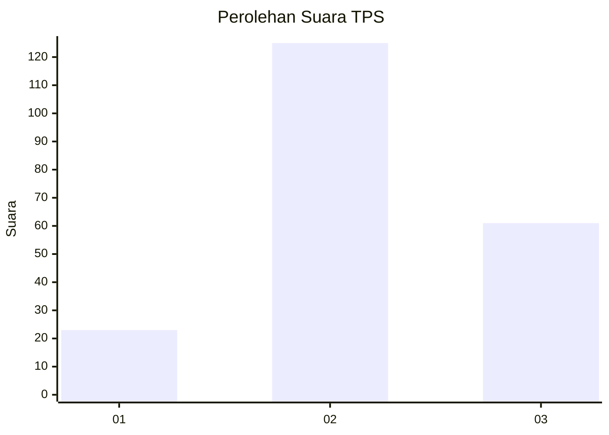
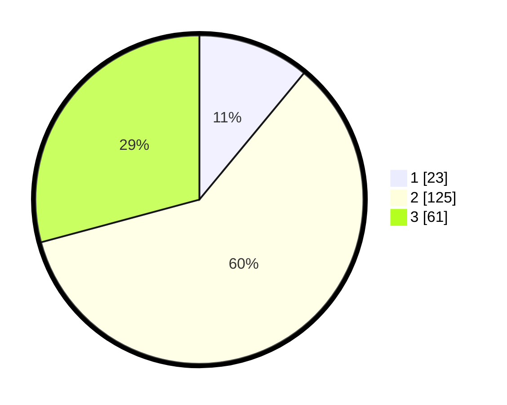

# Hasil

## Grafik

## Tabel

| No. | Nama Paslon    | Suara | Suara (raw) | Persentase |
|:--- |:-------------- | -----:| -----------:| ----------:|
| 1   | ANIES MUHAIMIN | 23    | [23][p-1]   | 11,00      |
| 2   | PRABOWO GIBRAN | 125   | [125][p-2]  | 59,81      |
| 3   | GANJAR MAHFUD  | 61    | [61][p-3]   | 29,19      |

[p-1]: https://github.com/gigit-pemilu/pemilu-2024-33-jawa-tengah/blob/main/pilpres/hitung-suara/sub/33-jawa-tengah/sub/26-pekalongan/sub/18-karangdadap/sub/2001-logandeng/sub/001-tps/sub/paslon-1.txt
[p-2]: https://github.com/gigit-pemilu/pemilu-2024-33-jawa-tengah/blob/main/pilpres/hitung-suara/sub/33-jawa-tengah/sub/26-pekalongan/sub/18-karangdadap/sub/2001-logandeng/sub/001-tps/sub/paslon-2.txt
[p-3]: https://github.com/gigit-pemilu/pemilu-2024-33-jawa-tengah/blob/main/pilpres/hitung-suara/sub/33-jawa-tengah/sub/26-pekalongan/sub/18-karangdadap/sub/2001-logandeng/sub/001-tps/sub/paslon-3.txt

## Foto C Plano

https://sirekap-obj-formc.kpu.go.id/164f/pemilu/ppwp/33/26/18/20/01/3326182001001-20240215-023314--0eb39b4e-8d7c-4604-a535-d63c31e77c55.jpg

https://sirekap-obj-formc.kpu.go.id/164f/pemilu/ppwp/33/26/18/20/01/3326182001001-20240215-023600--d531b97f-ad2a-4ff7-8309-cb5322878c85.jpg

https://sirekap-obj-formc.kpu.go.id/164f/pemilu/ppwp/33/26/18/20/01/3326182001001-20240215-023723--b7e98fe7-dc8d-4b8d-97fc-fbc1f02ffb42.jpg

## Metadata

| Key        | Value               |
| ---------- | ------------------- |
| Time Stamp | 2024-02-15 12:00:28 |

